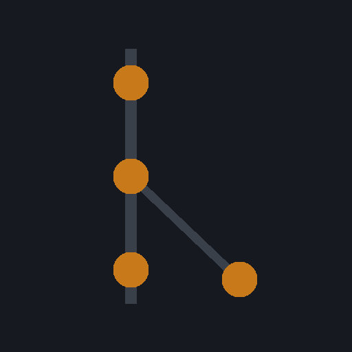
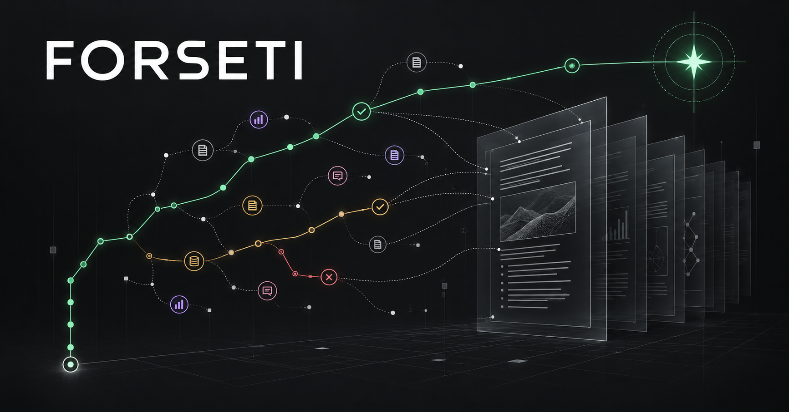
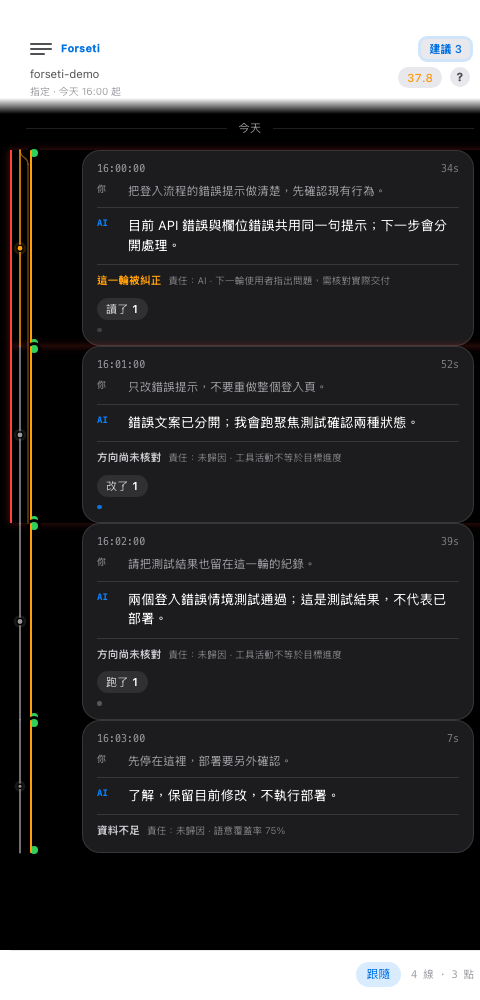
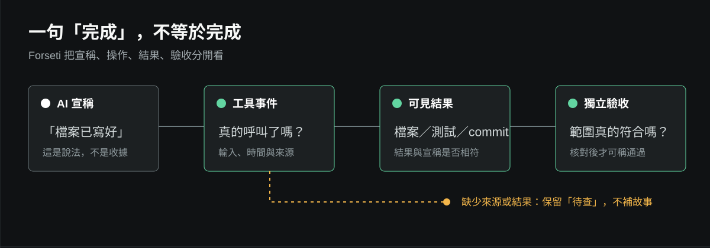
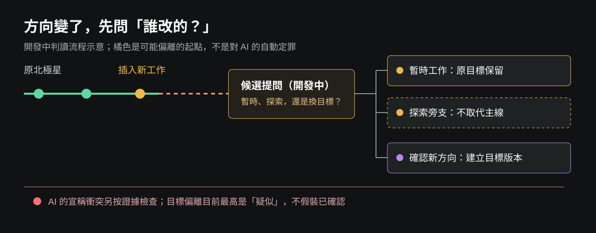
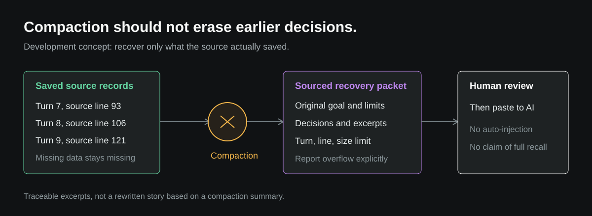
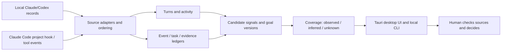
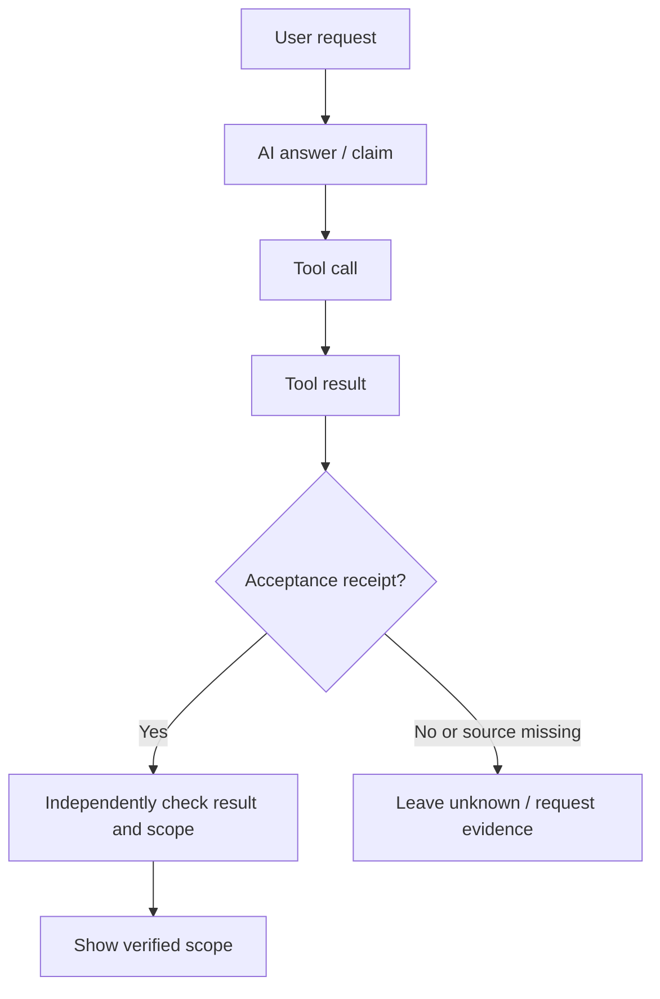

<div align="center">



# Forseti

**See what the AI did, what backs its claims, and when it left your goal.**

Forseti is a local-first macOS dashboard for AI work. It places conversations,
tool events, evidence, and changes in direction on one timeline, so you can
trace a claim of completion back to its receipts and locate where a detour began.

[Interface](#the-interface) · [Three situations](#three-situations) · [Capabilities](#capabilities-and-status) · [How it works](#how-it-works) · [Limits](#current-limits)

</div>



*Concept art. An example rendered in the actual desktop interface appears below.*

> **Product and development overview, 2026-10-08.** Some diagrams show interactions
> still in development and not shipped on public `main`. Check the
> [status table](#capabilities-and-status) and the current code. A passing test,
> a visible screen, or an AI self-report is not proof that a task was completed.

## Answers you can trace

An AI can read files, edit code, delegate, and run tests. It can also merely say
"done." Across hundreds of turns, three questions matter more than another summary:

| Your question | What Forseti helps you inspect |
|---|---|
| **Did it actually happen?** | The AI's words, tool calls, visible results, and acceptance receipts, each tied to a turn |
| **Where did the work change course?** | The point where you inserted a task, approved a new goal, explored a branch, or the AI may have drifted |
| **What was lost after compaction?** | Instructions and decisions traceable to saved source records, with excerpts you can check |

Forseti is an observation and traceability layer, not a machine that settles
truth for you. It distinguishes **observed, inferred, and unknown**. An unseen
step should not be drawn as if it happened.

## The interface

<p align="center">
  
</p>

*Rendered from a development build of `desktop/ui/` using a
[synthetic example transcript](docs/assets/demo-project/forseti-demo.jsonl).
The Chinese UI text, messages, files, and test results are examples. This is
not a screenshot of an installed release or proof of native acceptance.*

| Area | What it shows | What to check |
|---|---|---|
| Header | Session name, follow or lock state, temperature, and advice entry point | Check which conversation is selected |
| Timeline | Turns, recorded tool events, and branches | Locate bursts of activity, idle gaps, corrections, and failures |
| Turn card | The user's request, latest AI answer, and turn status | Scan quickly before opening the record |
| Turn detail | Individual AI answers, tool calls and results, source line numbers and times | Reconstruct what was said and what the source recorded next |
| Support work | Separate support records and their events | Inspect support activity without inventing a parent-turn link |
| Other views | Attention, activity, reading, machine state, capabilities, and self-audit | Inspect the work from a different angle |

**A card is a summary, not the whole record.** Turn detail exposes the saved
event sequence and available basis for a verdict. Lines and dots may represent
only events the source recorded; missing tool steps or context remain unknown.

## Three situations

### 1. The AI said "done." Where is the deliverable?



A reply saying "I wrote the file" does not make that file exist. Even a tool call
does not prove that its result met the request. Forseti ties the claim to its
turn so you can inspect recorded inputs, outputs, files, tests, and receipts.
**Missing evidence stays unresolved**; it is not filled with a plausible story.

### 2. Did you change the goal, or did the AI drift?



An orange line is a place to investigate, not a verdict. The **in-development**
direction workflow is intended to ask whether an inserted task is temporary,
an exploratory branch, or an explicitly approved new north star. The first two
retain the original goal. AI drift needs separate evidence; your instruction
must not be misclassified as the AI's fault.

### 3. After compaction, where did earlier decisions go?



The desktop may show only recent turns. Older context can be recovered only
where the source retained it. An **in-development** recovery path can select
pre-compaction instructions and decisions with provenance and a size limit.
**A person reviews and pastes the packet; it is not injected into an AI automatically.**

### A dot is not a card

In the development design, a **large dot** opens the turn's path verdict:
which event changed direction, what evidence exists, and whether the user
approved a new goal. A card is a quick view of that turn's request, answer,
and activity. Other event dots have distinct meanings:

| Dot | Intended meaning | Evidence boundary |
|---|---|---|
| White on black | An AI claim to have written, run, or used a tool conflicts with visible records | Show the target and gap; insufficient source data is not proof of lying |
| Gold | A user decision differs from a verifiable past pattern | Advisory only; **not shipped as a reliable comparison** without usable history |
| Purple | Possible AI drift from the current north star | Needs a goal, continuity, and evidence that the user did not change direction |
| Pink | A note written by the user at that point | Preserve its text and time rather than replacing it with a later summary |

Orange means a **possible start of deviation**, not established responsibility.
The in-development workflow treats a temporary task and an exploratory branch
as different from an approved new north star. Without explicit confirmation,
it should not turn your change of direction into an AI-drift verdict. A
temporary designation has a 12-turn limit so it cannot indefinitely hide
later drift. Sustained goal drift currently reaches at most **SUSPECTED**;
confirmed red goal drift still needs independent contradiction evidence,
post-correction persistence, and other cross-checks. A red line for a
verifiable claim conflict must not be read as confirmed goal drift.

The development recovery packet selects sourced user instructions,
constraints, and decisions from the saved pre-compaction range. It does not
prove the AI understood them. If essential context exceeds capacity, the
workflow should report that limit rather than silently discard it.

## Capabilities and status

This table describes code paths on public `main` and their limits.
**Code existing is not the same as acceptance in real sessions.** "Partial"
means there is an engine or interface but gaps remain in source coverage,
causal links, cross-session behavior, or native end-to-end verification.

| Capability | Why it helps | Current boundary |
|---|---|---|
| Claude and Codex session following | See the session Forseti selected without finding its JSONL yourself | Source adapters and desktop wiring exist; cross-app foreground switching has **not** passed stability acceptance. Not a universal Grok/other-provider integration |
| Timeline and turn cards | Compare requests, answers, duration, and available evidence | UI and data paths exist; branches and dot interactions need individual acceptance. Color alone cannot assign responsibility |
| Activity detail | Inspect saved AI answers, tool calls, results, and source line numbers | Turn detail exists; long text is truncated on screen, and events absent from the source cannot be recovered |
| Read, write, and failure dots | Locate recorded tool activity and failures | Event dots exist; opaque shell work is only an observed lower bound |
| Goals and changes in direction | Separate candidate user corrections, new goals, exploration, and AI drift | Partial; no confirmed drift verdict without a reliable goal and authorization evidence |
| Claim and evidence checks | Investigate claims of writing, running, or completing work | UI and engine exist; insufficient sources mean "unresolved," not "false." Extraction and coverage are incomplete |
| Activity, task, and goal progress | Avoid treating busyness as completion | Data paths exist; missing host events limit the result to observed activity |
| Stalls and recovery hints | See long waits without new evidence | Detection and recovery data exist; Forseti cannot force an external AI product to continue |
| Support and subagent records | Keep a support worker's work visible beyond one summary | Partial; sidechains can be read, but exact linkage to the initiating turn still needs source evidence |
| Advice cards | Surface a useful question or verification step | UI entry point and generation logic exist; timing, presentation, and advice quality need real-session acceptance |
| Reading coverage and context recovery | See what was read and what may be missing after compaction | Partial; coverage is not understanding, and first-step revalidation after handoff lacks full E2E |
| Task ledger and acceptance receipts | Separate assigned, submitted, independently verified, and completed | Engine and views exist; long-running multi-agent dispatch still needs sustained verification |
| Claude Code project hook | Ask before conflicting writes in the same project | Installed per project; internal errors fail open, so it cannot block every collision |
| Reusable JS runtime | Let hosts adopt capture, cost, handoff, and admission functions | Core modules can be used independently; hosts must supply events and implement actions |

### A typical inspection

1. With Claude or Codex open, let Forseti **follow** and verify the session name before trusting the timeline.
2. Find dense tool activity, long gaps, or a possible branch.
3. Open a turn to inspect its request, saved AI messages, tool calls, and results rather than relying on the card summary.
4. Compare files, tests, commits, or other receipts. Keep an unsupported claim unresolved and decide what to ask next.

## How it works



**An input is not a verdict.** AI self-reports, tool calls, tool results,
filesystem state, and verification receipts carry different evidentiary weight.
Adapters normalize sources; `tracker` preserves turns and events; `desktop_api`
builds a UI snapshot; the `src/` modules analyze conflicts, costs, goals,
stalls, claims, and recovery. The UI should expose both its basis and unknowns.



There is deliberately no direct edge from "the AI said done" to "done."
Likewise, an explicitly changed user goal and unauthorized AI drift are
different events; without traceable authorization and causality, the result
is only a candidate interpretation.

## Current limits

- **Not a universal AI reader.** Desktop following focuses on local Claude and Codex records; support for other providers must be verified separately.
- **Not an omniscient recording.** It can reconstruct only messages and tool events actually saved by a source. External processes and opaque shell work may remain invisible.
- **Not an automatic judge or deployer.** Signals, colors, and advice invite human verification; writing, destructive operations, and publication need their own authorization.
- **Not one magic score.** Temperature is a visual cue. Activity, tasks, goals, evidence coverage, and unknown sources must stay distinct.
- **Still under construction.** Precise cross-session causality, support-to-parent links, the full Goal Acceptance Contract, native E2E for every view, and calibration reports are not complete.
- **Local-data caution.** The UI reads local records; the public screenshot uses synthetic data. Review any real transcript, token, or path before sharing it.

## Development and verification

This repository has two delivery surfaces: a **Node 22+ JS core with no runtime
dependencies** and a **macOS Tauri/Python desktop app**. `npm test` checks the
former; it is not acceptance of real desktop session following.

```bash
git clone https://github.com/norika1207-lab/Forseti-Agent-Runtime
cd Forseti-Agent-Runtime
npm test
python3 -m pytest -q tests/test_tracker.py tests/test_ui_contract.py
```

The desktop app needs macOS, Rust/Tauri tooling, and `desktop/` dependencies.
Build, installation, and native UI verification are separate steps. To run
the two UI gate suites **without deploying**, use:

```bash
python3 -m pytest -q tests/test_js_symbols.py tests/test_ui_contract.py
```

**Do not use `desktop/deploy.sh` as a test-only command: public `main` deploys
and handles the running app.** Tests and browser harnesses do not mean an
installed app was updated.

| Path | Responsibility |
|---|---|
| [`src/`](src/) | Reusable JS runtime, detectors, and contracts |
| [`apps/forseti-cli/`](apps/forseti-cli/) | Local-record parsing, ledgers, desktop API, and diagnostic CLI |
| [`hooks/`](hooks/) | Project-scoped Claude Code event hook |
| [`desktop/ui/`](desktop/ui/) | Timeline, cards, advice, views, and interactions |
| [`desktop/src-tauri/`](desktop/src-tauri/) | macOS app shell and local command bridge |
| [`tests/`](tests/) / [`test/`](test/) | Python and JavaScript regression suites |

Further reading: [engineering specification](docs/工程規格書.md) (design and
history) and [original widget design](.forseti/WIDGET_SPEC.md) (design intent,
not current acceptance).

License: MIT.

---

<details>
<summary>Earlier JS runtime design, measurements, and failure log</summary>

The following preserves the earlier JS runtime design and failure record.
Its measurements and development status are historical snapshots; use the
status table above and current code/tests for present capabilities.

---

## Read this before you trust it

The author of this tool made eighteen of the mistakes it exists to catch, while building it.

That is not automatically damning. A drift detector whose author never drifted would be a detector with no evidence behind it. What matters is who caught each one.

Fourteen were caught by the tooling or the tests. Four were caught by the owner. That ratio flatters the tool, because most of the eighteen are ordinary programming errors, not the class of failure Forseti is about. Narrow it to the six that actually fall in its target domain:

| # | What happened | Shape | Caught by |
|---|---|---|---|
| 5 | "Three implemented plus four out of scope is seven" — used arithmetic to paper over one shape that was neither | scope inflation | the owner |
| 9 | Documentation stated "zero orphan modules" while two existed | unverified stated as verified | the tooling |
| 13 | The Stop hook was installed and could never fire; every declaration resolved as uncheckable | false progress | the tests |
| 14 | The north star was never committed, so drift detection was silently off after a move | false progress | the tests |
| 16 | Scope expanded, without consent, from one session to every session on the owner's machine | drift | the owner |
| 18 | Handed the turn back with the work unfinished, at least ten times in one session | premature yield | the owner |

The three the tooling caught had not hurt anyone yet. The one that cost nine hours of the owner's overnight work was caught by the owner.

Rows 16 and 18 are the same failure seen from two sides: doing more than was agreed, and stopping before the work was done. Both were caught by the owner. Row 18 could not have been caught, because the detector for it did not exist - `followthrough.js` measures "said it, then didn't do it", and by that measure the session that produced Forseti scores 91%, while the owner had to say "keep going" at least ten times in it. Both numbers are correct; they measure different things. `src/yield.js` exists because of that gap.

**So the honest claim is narrow: this catches its own blind spots, not its own overreach.** For it to be described as an instrument you can hold up to an agent, it has to catch one act of overreach the author did not already know about. It has not done that yet.

The full log is in [docs/工程規格書.md](docs/工程規格書.md) §6.1, one row per mistake, including the ones that make this project look bad. A shorter list would be the same failure as row 5.

---

## The problem

Multi-agent AI coding breaks in ways single-agent coding does not.

Two agents edit the same file and silently overwrite each other. An agent claims it shipped something and changed nothing on disk. Your main conversation fills up, compacts, and the thing you spent two hours briefing is gone. You hand work from one agent to another and have to guess how much background to repeat.

None of these are model problems. They are runtime problems, and they need runtime answers.

Forseti is a set of answers, each small enough to adopt on its own. Two of them were not designed at all — they were transcribed from field evidence and then verified against it.

---

## What's in here

### `capture.js` — the intake

Five of the modules below are pure functions waiting for someone to feed them. This is the feeding hatch. It reads nothing and watches nothing: the host hands it raw tool-call events, and it normalises them into one neutral shape that all five can eat.

Without this layer every host writes five conversions by hand, and gets one of them subtly wrong with nothing to catch it.

Two rules in here were paid for in production, not derived from a spec:

**An agent's self-reported identity is never trusted.** Three ways of identifying who did what were tried live, and all three failed: aliases drift, self-reported identity is inherited wholesale by forked subprocesses, and the UUID that looks most authoritative identifies the *transcript*, not the actor. Routing on self-reported identity misdelivered four times, twice into completely unrelated sessions. The only thing that held up was what the host itself stamped on the event: a timestamp, a tool call, a file. So the adapter reads `attributed_agent` and ignores anything the payload claims about itself. No stamp means the event goes to `skipped` — never to a guess.

**Stable id and display name are separate fields, and routing may only use the stable one.** In production the rules stored an internal id while the panel showed a user-chosen name. Rename something and the two silently decouple; have two windows share a name and you cannot even tell where a message went. The user's word for it was "it sends things to the wrong place." `labelDrift()` and `ambiguousLabels()` surface both conditions so the host can fix the UI before anyone notices the misdelivery.

Nothing is dropped silently. Every skipped event is counted with a reason, and `captureHealth()` reports the capture rate — because the quality of all five mechanisms below is capped by this number, and a capture layer that quietly loses events is the hardest failure to find: everything still runs, every answer is a little wrong, and nothing turns red.

### `shell.js` — the 80% that was invisible

This module exists because of a number. The first time the capture layer was pointed at real transcripts, the capture rate was **19.6%**. Of 985 tool calls, 792 were dropped for the same reason: no `file_path` field. 754 of those were shell commands.

Which means the capture layer could not see files being changed through a shell — the exact way this repository was itself written.

The consequence is worse than a missing feature. Downstream still answers, cleanly and confidently, and the answer is wrong. "Zero collisions" was not a clean bill of health; it was eight in ten writes being invisible. Adding shell parsing took the same corpus from 19.6% to **74.3%**.

**It only ever reports a lower bound, and it says why.** Shell is Turing-complete; reading a command string cannot tell you which files it touched. Three cases are never guessed at, only flagged `opaque`:

```
python3 - <<'PY' ... open(p,'w') ... PY    # the filename lives inside the program
cp "$SRC" "$DST"                            # variable expansion
./deploy.sh                                 # runs a script
```

In the real corpus, **56% of shell commands were opaque**. "There are file operations here and I cannot see them" is a far more useful fact than a clean-looking list that is silently missing half the writes.

### `cost.js` — what a change actually costs

Every dependency tool answers *"this change affects 87 files."* That number is close to useless. Affecting 200 files that all have tests is safer than affecting 12 that are naked.

`computeCostVector()` returns five dimensions and refuses to collapse them into a score:

```js
{
  d1_count: 12,          // direct dependents
  d2_count: 87,          // transitive
  uncovered_d1: 47,      // ...of the direct ones, how many have no test
  cross_modules: 5,      // how many subsystems get touched
  live_conflicts: 3,     // how many are being edited by another agent RIGHT NOW
  coverage_source: 'LCOV',
  resolution_rate: 0.94,
  is_lower_bound: true
}
```

`live_conflicts` is the one no existing tool can produce. CodeSee, Sourcetrail and GitHub's dependency graph all have the static half. None of them have a world where agents are autonomously editing code, so none of them can tell you *"three of the files you're about to break are open on someone else's desk."*

**Honesty clauses, enforced by tests, not comments.** No coverage report means `uncovered_d1` is `null` and `coverage_source` is `NONE` — never a heuristic guess. `is_lower_bound` is always true, because dynamic imports and string-built paths are invisible to static analysis. Unresolved imports are counted and queryable, never silently swallowed.

### `capsule.js` — a cash register for context

Your main session's context is a finite, non-refundable resource, and right now it's invisible. You guess how much is left, and when you guess wrong you explain yourself from scratch.

This module makes every inbound payload pay a toll:

```js
previewCapsule(capsule, budget, contract)
// → { token_cost, budget_before, budget_after, would_trigger_compact }
```

Nothing raw reaches the main session. Agent output gets wrapped in a capsule with a price tag, and cheap capsules under a configurable threshold auto-clear so the register doesn't become the new bottleneck.

`manualReviewRate()` tells you what fraction of capsules currently need a human, so that threshold gets tuned with data instead of vibes.

Token counts carry their provenance: `PROVIDER_REPORTED` or `ESTIMATED`. An estimate never gets dressed up as a fact.

### `admission.js` — stop the collision before it happens

Two agents writing the same file is the most expensive failure in multi-agent coding, and today you find out from the git diff.

`decideAdmission()` runs at dispatch time and returns one of four verdicts:

| Verdict | Meaning |
|---|---|
| `ALLOW` | No overlap with any active scope |
| `NARROW` | Overlap avoidable — here's a smaller scope |
| `SERIALIZE` | Not avoidable, but it can wait its turn |
| `BLOCK` | Needs a human call |

The design note that matters: **a rendered conflict is a documentary about a disaster. An intercepted conflict is a product.**

Two subtleties are baked in. Intersection uses *declared write sets*, not transitive closure — using the dependency graph makes every barrel file a false positive. And files in the top N% by import count are exempt, because without that exemption the intersection is never empty and the whole mechanism cries wolf forever.

Advisory locks carry a TTL, so a crashed agent can't deadlock the project.

### `coverage.js` — what each session actually knows

A quantity that didn't exist five years ago: which files a live session has seen, and how deeply.

```js
handoffDelta(from, to)
// → { need_briefing: [...], saved_files: [...], saved_ratio: 0.5 }
```

Four things fall out of it:

- **Dispatch** — route work to whoever's context is already warm on those files
- **Deduplication** — two agents with 90% overlap means you're paying twice to read the same code
- **Handoff** — how much background to repeat stops being a judgment call and becomes set subtraction
- **Survival** — compute in advance which task will eat the most of your main session

Depth has four levels (`MENTIONED` → `READ_PARTIAL` → `READ_FULL` → `EDITED`) because a file that merely appeared in a grep result is not a file the next agent can skip reading.

`is_upper_bound` is permanently true and cannot be turned off: a session that compacted remembers less than it read, and this module has no way to know how much less.

### `handoff.js` — stop being the wire

Agent A finishes. Its output needs to reach Agent B. Only you can carry it. Four agents running at full speed all bottleneck on whether you click a button.

This module turns that one-time click into a standing rule:

```js
planHandoff({ fromNode: 'PM', edges, chain: ['PM'] })
// → { dispatch: [...], gates: [...], blocked: [...] }
```

Three edge types: send straight through, hold at a gate for a human, or send and let it come back once.

**The loop guard is not optional.** Every rule-triggered run carries a chain of nodes it has passed through. Before forwarding, three checks: is the target already in the chain, is the chain too long, is the target already busy. Blocked hops are always counted, never silently dropped.

The roundtrip counter has a bug in it that only a real run could find. The obvious implementation counts how many times the target appears in the chain — but the origin is in the chain too, so `A→B→A→B` runs one hop further than "at most one round trip" claims, spending real money on that extra hop. Counting *transitions* instead of *appearances* fixes it. The reason is written into the source, and a test asserts that explanation is still there.

One more thing that only showed up in production: **if the upstream turn produced nothing actionable, no edge fires.** A connectivity test that answers "ack" used to get auto-forwarded, and the downstream agent would reply "there is no executable task here" — twice in a row, both sides burning tokens on nothing.

`automationRate()` is the one number that matters: how much of your handoff traffic is rules versus your own hands. It should climb. If it doesn't, this mechanism isn't earning its keep.

### `persist.js` — surviving a restart

Every module above is stateless. Restart the process and M2's accumulated automation rate resets to zero, M3 forgets who holds which files, M5 forgets what every session knew. Those numbers are only useful because they accumulate; resetting them on restart is the same as never having collected them.

This module doesn't touch the filesystem either. It packs, serialises, restores, and — the part that matters — decides what a restored state is still allowed to claim. The host only has to store a string and read it back.

**A `Set` does not survive `JSON.stringify`.** It becomes `{}`. Not an empty array, not an error — an empty object, silently. `admission.js` stores each agent's touched files in a Set, so a naive save-and-reload turns every agent into one that has written nothing, out-of-scope detection stops working entirely, and the UI looks completely normal. This is the failure class that gets found months later, during an incident. `roundTripCheck()` exists so a host can assert, before shipping, that its real state survives a save and reload intact.

**After a restart, every ACTIVE write scope is suspect.** The record says agent A is writing these files; A's process died when the host did. Believe it and the project gets deadlocked by a ghost that will never release. Auto-release it and you let two agents into the same file if A is actually still alive in another process — precisely what M3 exists to prevent. So `restore()` does neither: it flags them `stale` and hands the decision to the host, which is the only party that knows whether those agents still exist. Until the host decides, they keep blocking, because the conservative failure is the cheaper one.

Expired locks are dropped outright — a dead holder should not keep blocking. A load failure returns `state: null`, never an empty state, because "could not read the snapshot" and "this is a fresh empty project" are different facts and conflating them silently overwrites everything.

The checksum is FNV-1a, and the source says plainly that it is an integrity check and not a security one: it catches truncation and a mangled file, and stops nobody who edits deliberately.

### `runtime.js` — the part you actually integrate against

Seven modules, each independently useful, is still seven APIs to read and an ordering to work out for yourself. This wires them together so a host only has to do four things:

```js
const forseti = createRuntime();

forseti.setEdges([...])                    // handoff rules, cycles rejected up front
forseti.requestWrite({ agent_id, declared })   // ask before dispatching
forseti.ingest(rawToolCallEvents)          // forward events as they happen
forseti.completeTurn({ agent_id })         // a turn ended - where does it go
forseti.save()                             // one string, store it anywhere
```

**It answers; it never acts.** `completeTurn()` says the work should go to `review`. Actually sending it is the host's job. `requestWrite()` says a request should be blocked. Whether to block is the host's call. The line is deliberate: the moment this starts performing actions it stops being a set of primitives and becomes a framework, and a framework dictates how you organise everything else. A test asserts the returned plan contains no field claiming anything was sent.

`status()` reports what it knows and, separately, what it does not — no rules configured yet, no events received yet, capture dropped N events so every number below is computed from incomplete data. That last one is the one that matters: the capture rate is the ceiling on the quality of every other answer here.

`example/host.mjs` is a complete integration you can run:

```bash
node example/host.mjs
```

It walks the whole lifecycle and prints what each step returns, including the restart, where a scope held by an agent that may or may not still exist keeps blocking until you confirm.

### `drift.js` — the north star turning south

Every mechanism above assumes you are still building the thing you set out to build. This one checks that assumption.

The first version of this module was wrong, and real data is what showed it. It looked for cliffs: a sharp drop in overlap between adjacent time segments. But drift is *defined* by the absence of a cliff. Every step resembles the last, every step is defensible, and a hundred steps later the work is somewhere else entirely. Measured across a three-month conversation: mean similarity between adjacent segments was 16%, while alignment with the starting point fell from 100% to zero — and not one segment looked like a turn.

So it measures **distance from an anchor**, never distance from the previous step. That correction is written into the source and asserted by a test.

**Drift is not itself a failure.** People change their minds, and that is usually right. What the module separates is an *announced* turn from an unannounced one, and it surfaces abandoned work whose final moment sits next to a failure signal — the shape of escaping a problem rather than deciding to leave it. It does not read anyone's messages to decide what counts as friction; the host supplies those timestamps, because a zero-dependency module doing sentiment analysis would produce exactly the confident, wrong output this repo exists to prevent.

### `provenance.js` — which side of the line the evidence came from

This module's specification was not designed. It was taken from a confession document, one of a series an operator required from the AI systems that had misled them over several months.

One of those documents abstracts six incidents into seven recurring *shapes*, and states plainly that the next session should defend against the shapes rather than the incidents. Three of the seven have unambiguous criteria in an event stream. This implements those three, and names the other four as permanently out of scope rather than as future work — they require semantic judgment, and a semantic judge is precisely the confident, high-error artifact being defended against.

The technical core is a single line from another of those documents:

> I have no reliable boundary between what I actually checked and what I generated, so I pick up my own fabrications and use them as evidence.

That boundary is completely unambiguous in an event stream. Tool results are checked. Assistant text is generated. A subagent's report is *someone else's* check, not yours. Reading back a file you wrote earlier in the same session is your own output returning as evidence. The model cannot see this line; the event stream can. The module answers only which side a claim's evidence came from — never whether it is true, never whether anyone meant to mislead.

The three shapes:

| Shape | Criterion |
|---|---|
| Source erasure | A claim names specific files that were never opened first-hand |
| Scope inflation | A claim covers N items against far fewer actual tool calls |
| Barren investment | Delegated work burned real resources and produced nothing |

**Validated against the transcript that confession describes.** It flagged the exact moments: a report citing 22 files with zero first-hand reads and six delegations nearby, presented as "every line traced to file:line"; a claimed 288-file review against 9 reads in the preceding window; two further claims of 35 and 200 files against zero reads.

The number worth stopping on: across that entire session, 98.2% of evidence was first-hand. At the four claims that mattered, it was 0%. **No aggregate can find this.** Averages dilute exactly the moments you need, which is why the check runs per claim and why five earlier attempts at session-level statistics found nothing at all.

---

## What happened when it met real data

Every mechanism above was written against tests. Then it was pointed at 130 real Claude Code transcripts — 372,754 lines, 48,228 tool calls — and three of its own assumptions broke.

**Capture was blind to 80% of writes.** Covered above: shell was invisible, so the tooling reported zero collisions with total confidence. `captureHealth()` is the reason this was caught rather than believed — it reports the capture rate as an explicit ceiling on every other number, instead of letting a partial view masquerade as a complete one.

**`/dev/null` is not a file.** Two executors "wrote the same file within 3.5 seconds", five times over. All five were `2> /dev/null`. Precisely the class of noise that trains people to ignore an alert.

**A resumed conversation has two session ids.** Resume a session and the system opens a new transcript with a new id and copies the old history into it. One transcript shared 96 of its 97 event uuids with another, and started 17 seconds after the first ended. Attribute by session id and one person becomes two, every duplicated event becomes a 0.0-second collision between them, and three of the four collisions found were this artifact. The fix is to attribute by event uuid, which identifies the event rather than the file it was recorded in.

That last one is the same lesson `capture.js` already carried, arriving from a completely different direction: **a file-level identifier names the record stream, not the person doing the work.** It was written there after routing on self-reported identity misdelivered four times. The transcript corpus proved it again, from the other side.

After the fixes: capture 74.3%, 4,435 duplicate events removed, collisions down from 4 to 1. The one that survived is real — a coordination file that multiple sessions write by design.

**Run it on your own transcripts:**

```bash
node tools/analyze-transcripts.mjs ~/.claude/projects/<your-project>
```

Everything stays local. It reports your capture rate, how many of your shell commands are opaque, whether any two of your sessions ever wrote the same file at the same moment, and which of them are paying twice to read the same code.

### `heartbeat.js` — the checks wake themselves

Everything above waits to be asked. That puts the last line of defence on the user remembering to check, and the user is the party being kept in the dark.

This lets the checks wake on their own: schedule a beat, run one round, speak only if something tripped, otherwise stay quiet. It never schedules anything itself — no timers, no clock reads, asserted by a test. The host owns the scheduler; this module answers what to check and whether the result is worth waking someone for.

**One rule is why this module exists.** A confession records more than thirteen consecutive wake-ups that produced nothing, each reporting "scheduled the next wake-up" as evidence of ongoing work. The schedule had become a stand-in for progress.

So every beat must produce something, consecutive empty beats are counted, and hitting the limit returns `STOP` rather than another interval:

```js
{ verdict: 'STOP',
  reasons: ['3 beats in a row produced nothing. A scheduled wake-up is not
             progress; stop the loop and say what is actually blocked.'],
  next: { delay_ms: null, stop: true,
          reason: 'Continuing would burn budget to look busy.' } }
```

Production is measured as files actually written, not turns taken. Talking is not doing.

`dispatchPlan()` sends agents after findings, and what they produce returns through the same investment path the barren-run detector watches — so an agent dispatched and never delivering is caught on the next beat. The loop is closed. Findings with no matching agent are listed as `unhandled` rather than dropped.

The empty-beat counter is persisted. Reset it on restart and the loop can never stop itself.

### `thermometer.js` — how much of context is checked

A fuel gauge answers how much room is left. This answers something else: of what is in context right now, how much was checked and how much did the model write itself.

**This measurement only works at runtime, and the reason it fails otherwise is the point.** I tried computing it after the fact from transcripts. A transcript is a complete record — it keeps every tool output in full. The context window is the compacted subset, and compaction keeps summaries while dropping detail. Summaries are the model's own text; detail is the raw tool output. So the transcript reads a steady 80% evidence while the live window may already have inverted.

Why the number matters is the same line that drives `provenance.js`: *I have no reliable boundary between what I actually checked and what I generated.* If that boundary does not exist internally, then the proportion of real evidence on hand determines what gets picked up as evidence. When it falls, the model does not notice. The thermometer does.

`compactionDelta()` is where it earns its keep. A single reading says what the temperature is; comparing two says **what compaction took**:

```js
{ fact_ratio_before: 0.8, fact_ratio_after: 0.5,
  lost_checked: 600, lost_generated: 0, lost_was_checked: 1,
  alarming: true,
  note: "Compaction removed proportionally more checked evidence than
         generated text. What remains leans on the model's own summaries." }
```

And the advice at high temperature is not "clear the context" — it is **pin the evidence**: write the raw outputs still in hand to files, so they become something that can be re-read rather than something that has to be remembered.

Delegated content is counted in its own column. Folding a subagent's report into "checked" would be source erasure, in a module built to detect it.

### `imports.js` — the input `cost.js` had been waiting for

`cost.js` shipped on day one with every function written and every test passing, and it could not compute anything. Nothing produced a dependency graph. This closes that.

It reads no filesystem: the host hands it filename-to-source, it returns records `buildGraph()` accepts directly.

**It reports a lower bound, and says which cases it cannot see** — dynamic imports with computed paths, string-concatenated requires, config-driven loading. That is why `cost.js` has had `is_lower_bound` permanently true since before this module existed. An opaque `import()` is *counted*, never guessed at.

No AST parser, because that would mean a dependency. Regex has a known cost — it misses things — and a miss that gets counted honestly is better than a dependency.

External packages are not resolution failures. `react` was never meant to resolve to a project file, so it is reported separately and excluded from the denominator; folding it in makes a healthy project look broken.

**Run against this repo's own source**, it resolved 100% of 10 internal imports across 14 files — and immediately found a real defect: `shell.js` was not reachable from `runtime.js`. The runtime was not expanding shell commands, so every file changed through a shell was invisible to it. That is the exact blind spot that had held capture at 19.6% before it was fixed in the analysis path, still open in the live path. Fixed in the same commit the graph found it.

### `conformance.js` — what makes a verdict admissible

A formal specification (v0.1, 2026-09-07) set a rule this repo did not meet: any detector emitting *drift*, *deception*, *failure* or *safe* must expose seven things — its input events, its computation version, its thresholds, its exclusion conditions, its epistemic state, a human-readable explanation, and the recovery behaviour it links to. Anything short of that is experimental and must be labelled so.

Missing a field does not throw. Throwing pushes developers toward filling in a plausible value; a `conformant: false` with the gap named is more honest than a complete-looking structure full of placeholder text.

The epistemic ladder is the specification's, unchanged: `OBSERVED`, `VERIFIED`, `INFERRED`, `UNKNOWN`, `REFUTED`, `STALE`. Only the first two may be stated as fact. A fluent self-explanation never promotes `INFERRED` to `VERIFIED`.

### Turning the tools on this repo's own session

Running the detectors against the transcript that built them found three violations of that spec, in the output itself:

**Drift claimed what it was not entitled to claim.** The anchor was inferred from the opening segments, and the module still emitted `is_drift: true`. The spec is explicit: when the goal is not reliable the interface says *goal alignment cannot be determined*, never *the agent drifted*. `GOAL_STATES` now carries the spec's four levels, and an `AMBIGUOUS` or `MISSING` anchor returns `null` with the reason. On the same data the verdict changed from "drifted" to "cannot be determined — 35 plausible goals coexist in the anchor window."

**Idle detection counted the wrong thing.** `heartbeat` v0.1 used files-written as its proxy for progress, which the spec forbids in as many words: activity, tool calls and file names are not proof of progress. v0.2 accepts only verified progress and, when the host cannot supply it, turns idle detection *off* and says so. The cost is real — a host without verification contracts loses the ability to stop a loop — and that is the correct trade. Pretending to know beats nothing; being unable to know beats pretending.

**The thermometer measured the wrong object.** Run after the fact it reported a comfortable 86.5% checked evidence. That is the transcript's composition, not the live window's, and `thermometer.js` says so in its own opening paragraph. The reading was false comfort, and only running it produced the demonstration.

### `artifact.js` — a filename is not a deliverable

The specification's section 6 opens with the sentence this module exists for: *a file name, a terminal line, a model claim, or a tool-start event is not evidence of completion.* It then pairs each kind of claim with the minimum that would actually verify it.

```
File created        exists + size above expected minimum + hash or readability
Code modified       a diff on disk + parser/build/test contract where applicable
Test passed         the command + exit code + captured output + test identity
External object     a remote identifier or a receipt
Task complete       all acceptance evidence linked, no hidden blocker
Process running     a live process or heartbeat, not historical PID text
```

**It reads no filesystem.** The host looks, and passes back what it saw. That keeps remote objects verifiable, keeps already-deleted artifacts analysable, and leaves the host in control of whether to spend the IO. No observation supplied means `UNKNOWN` — never failure. Absence of evidence is not evidence of absence, and the spec is explicit that `UNKNOWN` may not be converted into success or failure.

Two distinctions the module refuses to blur. A file that exists at a plausible size is `OBSERVED`, not `VERIFIED`, until something checked its content. And a process claim backed only by earlier `ps` output is `UNKNOWN`: a PID printed ten minutes ago does not prove anything is alive now.

`summarize()` always reports the unchecked ratio alongside the result, because a report showing zero refutations looks identical whether everything was checked and fine, or four fifths of it was never looked at.

**This is also what reopens idle detection.** `heartbeat` v0.2 refuses activity as a proxy for progress, which left it unable to stop a loop on a host with no verification contract. Verified artifacts are the qualifying source: count them, and the check works again — on evidence rather than on motion.

### `signals.js` — ten atomic signals, and what each one cannot tell you

Specification section 3.1 defines ten signals, each normalised to 0..1. Three rules run through all of them.

**Unmeasurable returns `null`, never `0`.** Zero means measured and fine. Null means not measured. Treating the second as the first makes a system with nothing connected look perfectly healthy — the single most dangerous failure mode for a health instrument.

**Every signal carries its own caveat**, because alone each one misreads. The spec says so in the very first entry: high tool occupancy is benign if verified progress is also rising. So S3 says it is weak evidence and must not be used alone; S9 says it measures unsafe-interrupt risk, not user mood; S6 refuses to compute at all unless corrections have already been separated from new requirements, because that distinction needs the text and guessing it would produce a confident wrong number.

**All windows and decay constants are uncalibrated**, and the spec lists them first among the things that must be fitted rather than guessed. The defaults exist so the code runs, not so anyone relies on them.

Two signals are stricter than they look. S4 does not count repetition alone — repeating an action against a *different* target is not a retry. S10 returns `null` when no refutation event exists at all: repeating a strategy nobody has contradicted is just doing the work, not persisting against evidence.

**The composite refuses to hide its own coverage.** `composite()` excludes unmeasured signals from both numerator and denominator, then reports `measured_weight` — how much of the weighted total actually had data behind it. Substituting zero for a missing signal would hand a disconnected system a perfect score. When nothing at all is measurable it returns `temperature: null` with the line that matters: *this is not a healthy reading; it is no reading.* And every score arrives with its top contributors, because the spec judges a bare scalar non-conformant.

The runtime computes four of the ten on its own (S1, S4, S5, S7). The other six need something not present in an event stream — a definition of user-visible liveness, this user's own output baseline, the correction/new-requirement split, an evidence contract, interruption events, refutation events — and those are reported as gaps rather than defaulted.

### `windows.js` — narrow first, read second

Specification section 5 makes full-session semantic ingestion the exception rather than the default: index the events, roll the atomic signals, find peaks and change points and repeated motifs, take the top K, expand each by a little context, and send only those.

**The real reason is not cost.** Money and latency are the obvious objections, and both are true, but the one that matters is dilution: an anomaly buried in three hundred thousand lines is indistinguishable from noise to a semantic model. Narrow to three thousand lines and that same anomaly is two orders of magnitude more prominent. Saving money is a side effect.

Peaks and change points are separate detectors because they find different things. A gradual climb to a high point has a peak and no change point; a sharp drop from high to low has a change point and no peak. Motifs use a caller-supplied key, so the same action against a different target is not the same motif — matching the S4 rule that a retry requires the same unresolved objective.

Overlapping windows merge. Sending two overlapping stretches of context means paying twice for the same content and showing the model duplicates. And finding nothing returns a note saying so explicitly: *this does not mean nothing is wrong — it means these detectors found no peak, change point, or motif in this data.*

Every selected window carries `result_epistemic_ceiling: 'INFERRED'`. Reading the raw text does not promote a semantic conclusion to VERIFIED.

**Run on a real 61-day session**: 1,304 events across 5,910 buckets, 416 candidates, narrowed to 3 windows covering 15.3% of events — and each one a genuine burst of concentrated work.

That run also caught a defect in `shell.js`. A fourth window had been selected, composed of "files" named `a.at`, `r.k` and `rows.length`. Those are JavaScript property accesses; the path heuristic accepted anything ending in something that looked like an extension. 93 phantom paths had been flowing into coverage and every downstream number. Bare names now require a known extension. Only running the selector on real data made it visible.

### `rescue.js` — visible liveness, and interrupting without losing the work

Specification section 7: long-running work must expose visible liveness so users are not forced to guess whether the system is alive, hung, or silently failing.

**The failure this addresses is specific.** Pressing ESC usually is not a decision that something is wrong — it is the cost of not knowing whether something is wrong, which is frequently higher than the cost of stopping. So the interruption lands at the worst possible moment: mid-task, nothing saved, and the next session inherits nothing.

Two things follow. Measure invisible execution so the silence itself becomes a number, and have a snapshot ready *before* the interrupt rather than assembled in a panic during it.

The snapshot's nine fields come from the spec unchanged. One matters more than the rest: `exact_next_step`. Every other field describes what happened; only that one says what to do next, and a snapshot missing it leaves the next reader re-deriving everything — which is most of what a snapshot was supposed to save. It is flagged separately for that reason.

`silentExecutionRatio` measures whether the user can *see* liveness, not whether work is happening. A quiet, correct, long-running task scores high here, and that is not an error: it means the user currently has to guess, and the guessing is the thing to fix.

`unsafeInterruptRate` returns `null` with no interruptions rather than `0` — nobody having interrupted is not the same as every interruption being safe. Interrupts without a snapshot are still recorded, because dropping them makes the rate permanently zero.

### `intervention.js` — when acting is allowed, and what acting costs

Specification sections 9, 10 and 11 describe three faces of one thing: when you may act, what to ask before you do, and how acting contaminates the measurement.

**The observer-effect rule is the hard one.** Section 9.1 forbids continuously interrogating the observed model, and the reason is not politeness — it is measurement. Every time you ask "are you still on track", the question itself enters the context, and what follows is *behaviour after being asked*, not the behaviour you meant to observe. Ask ten times and you are measuring your own influence. So every injection is logged as an intervention event, without exception, and the injection rate is reported separately from the annotation rate: annotations do not contaminate, injections do.

**A high temperature is never a reason to act.** Section 11 gives each action its own precondition, all stricter than temperature:

```
Quiet annotation    threshold reached, or one strong verified anomaly
Suggest recovery    high temperature AND stagnation or evidence mismatch
Freeze retry        retry budget exceeded AND no verified progress
Replan              hypothesis refuted, or hard prerequisite invalidated
Block high risk     an authority/licence/safety prerequisite unknown
Create successor    critical health WITH a checkpoint, or user request
```

Every refusal names what is still missing. A system that acts on temperature alone gets switched off after its first false positive, and a guard that has been switched off protects nobody.

**The diagnostic probe does not ask whether the model is drifting.** That question returns a fluent denial, and fluency is not evidence. It asks for linkage: what you understand the goal to be, why this step advances it, and — the field that matters most — what would falsify your current strategy. A strategy whose owner cannot say what would refute it cannot be checked at all. Missing answers raise uncertainty; the spec is explicit that they do not by themselves prove deception, and where an answer and the observable record disagree, the record wins.

### Acceptance against the specification

Section 14 of the spec defines ten acceptance tests. `test/acceptance.test.mjs` runs them verbatim — same identifiers, same scenarios, no relaxation. All ten pass.

They check something the unit tests cannot. Every module's own suite was green when the acceptance run started, and `AT-DRIFT-01` still failed: `runtime.driftCheck()` was calling `classify(rows, config)` without passing the anchor, so the entire GoalState gate — the rule that an unreliable goal must never produce a drift verdict — was silently inert. The modules were correct; one argument was missing at the seam. That is exactly the class of defect an end-to-end acceptance suite exists to find.

```
AT-UI-01    healthy 30m session stays quiet, no intervention fires
AT-UI-02    heartbeat present but verified progress stale → alive-but-stalled
AT-UI-03    no heartbeat at all → silent-execution signal rises
AT-ART-01   file claimed, exists at 0 bytes → cannot become VERIFIED
AT-DRIFT-01 no reliable goal → must not state drift as fact
AT-OBS-01   annotation mode injects nothing, still logs
AT-INT-01   cancel produces a recovery snapshot first
AT-PROBE-01 probe claims alignment, disk disagrees → record wins
AT-SAMP-01  one injected anomaly found in top-K without a full-session read
AT-RSC-01   critical score from one weak heuristic → no hard action
```

Three scenarios in the spec have an interface half this repo does not build — the desktop sidecar, inline annotation, and rescue card. The tests cover the judgment underneath those surfaces, and the suite says so in its own output rather than quietly reporting ten out of ten.

### Calibration against 130 real transcripts

Section 15 of the spec lists ten things that must be fitted to data rather than guessed, and the constants in this repo were engineering defaults. `tools/calibrate.mjs` reads a transcript directory and reports the distributions.

Run on 130 real transcripts, it overturned five of six:

| Constant | Was | Real p50 | Real p90 | Now |
|---|---|---|---|---|
| Turn gap | 30s | 21.8s | 3.8m | 230s (p90) |
| Output baseline | 400 chars | 126 | 673 | 126 (p50) |
| Heartbeat interval | 60s | — | 3.8m | 230s (p90) |
| Abandonment | 7 days | 13 days | 86 days | 13 days (p50) |
| Ambiguous-goal test | >4 topics | 24 topics | 180 | replaced |
| Shell opacity | — | 55% | 82% | (bounds everything) |

Two of those were doing active harm. A 7-day abandonment threshold flags half of all normal topics as abandoned — the median topic sits untouched for 13 days. And the ambiguous-goal rule fired above four topics while the median session touches 24, meaning it fired essentially always: the entire GoalState gate had been passing `AMBIGUOUS` on nearly every real session, and the drift verdict was permanently `null`.

**The topic-count rule was not just mistuned, it was the wrong measurement.** A project touching many directories is normal. What distinguishes a clear goal from a muddled one is concentration: on this repo's own session the top three topics hold 72% of activity across 35 distinct topics. Counting topics said AMBIGUOUS; measuring concentration says DERIVED, and DERIVED is right — the direction here was clear and changed deliberately several times.

**These numbers are one person's working rhythm, not universal constants.** Every calibrated field says so in its own comment and points at the tool. Adopting another team's distribution is only marginally better than guessing.

### The dashboard, and why it stays quiet

```bash
node tools/dashboard.mjs /path/to/project
```

Specification §8.4 suggests a local web dashboard for CLI hosts. This is that, in about 200 lines with no dependencies beyond Node's own `http`.

§8.1 sets out exactly how loud each state is allowed to be, and the implementation follows it literally: HEALTHY and WATCH get a dot and one line, a cause appears only at ELEVATED, a diagnosis card only at HIGH, a rescue card only at CRITICAL. **Quiet is the default state, not a setting.** A dashboard that flashes while everything is fine gets closed, and a closed dashboard protects nothing.

Two things it will not do. It never writes, and it never sends anything to the session it is watching — §9.1 forbids continuously interrogating what you are measuring, and a monitor that pokes its subject is measuring its own influence.

And it always shows what fraction of the weighted signals had data behind them. A confident-looking 0.55 computed from 22% of the signals is a different thing from the same number computed from all of them; the interface refuses to let those look alike.

### The shape that was missing from the list of shapes

`provenance.js` implemented three of the seven documented shapes and marked four as permanently out of scope. Three plus four is seven. The list looked complete.

It was not. **Passive omission** — declaring something and then neither doing it nor mentioning it again — was in neither group. It had vanished, and the arithmetic hid the gap. Nobody noticed until the repo's owner said *"you keep stopping halfway through."*

`followthrough.js` implements it. The numbers from running it on the session that wrote this repo:

```
401 turns, 136 declarations
  fulfilled     27
  omitted        3
  awaiting      23   (asking is collaboration, not omission)
  unverifiable  83   (named no concrete target)
```

The author's own estimate before running it was *twice*. The owner said *at least five*. The tool counted 23 turns that declared work and ended with zero tool calls. Of three numbers, the only reliable one came from the record.

**The 83 matter more than the 3.** Six in ten declarations named nothing concrete, so they could not be checked at all — including the one that triggered this whole thread. So `declareStrict()` refuses a declaration with no named target, and refuses by returning a reason rather than throwing: throwing would push a host into recording no declarations at all, and an empty ledger produces a beautiful, meaningless follow-through rate.

Two of the four "permanently out of scope" shapes turned out to need no semantic judgment either, which was its own version of the same error — taking a real constraint and widening it into a false one. Confidence-marker density is string matching. False confession is a timestamp comparison: a self-correction whose accusation is later overturned. Both are in `rhetoric.js`, both permanently flagged experimental. The two that genuinely cannot be done from an event stream are named individually, with reasons specific enough to argue with.

### `scope.js` — the one that actually interrupts

Drift detection reads a trend; it needs dozens of segments before it can say anything. This reads a single action: is the file about to be written inside the goal that was declared.

**It does not speak on the first one.** Doing real work means touching the surroundings — configs, someone else's implementation, docs, the test you need to read. Flagging each of those is identical to flagging none, because the whole thing gets switched off. So the criterion is a streak: several consecutive writes outside the scope. One write back inside resets it to zero, because that means the person is still on the main line and the detour was a detour.

The message names the north star, and says plainly that the tool cannot distinguish a necessary detour from wandering off. It asks; it never blocks.

**The scope is declared, never inferred.** With no `.forseti/goal.json` the check does nothing and reports that it is doing nothing — so silence never gets mistaken for an all-clear. Inferring a scope and then using it to interrupt someone would impose the tool's own guess about what they should be working on, which is worse than not checking.

Wired into the hook, it looks like this:

```
Forseti: 5 consecutive writes outside the declared goal scope.
North star: Finish Forseti. This may be a necessary detour - the tool
cannot tell. If the direction genuinely changed, declare it so the
drift reading stays meaningful.
```

### The Stop hook — the one that catches the actual failure

Every check above runs when something is about to be written. None of them run at the moment this repo's own author kept failing: declaring work and then ending the turn having done nothing.

Measured on the session that built Forseti: 401 turns, 23 of which declared work and ended with zero tool calls. The author's own estimate was *two*. Not one of those 23 turns could have been caught by a PreToolUse hook, because there was no tool call to intercept.

`hooks/forseti-stop-hook.mjs` runs on Stop. If anything was declared with a named file and that file was never touched, it exits 2 and the list comes back:

```
Forseti: 1 thing(s) declared this session with no matching action on disk.
  · src/a.js, src/b.js — wire the thing

Either do them now, or say explicitly that they are dropped.
```

Three rules keep it from becoming torture. It fires **once per turn** — twice would mean "you may not stop until you are finished", and some things genuinely need stopping to ask about. It only holds declarations that **named a concrete file**, because using an uncheckable declaration to block someone converts the tool's own limitation into the user's obligation. And any internal failure exits 0, same as the other hook: a guard that jams gets removed, and a removed guard protects nobody.

`hooks/forseti-declare.mjs` is how something gets onto that ledger, and it refuses a declaration with no named target.

---

## Design rules

These are enforced by the test suite. Deleting an honesty annotation makes a test go red.

**Never synthesise a single risk score.** Collapsing five actionable dimensions into one number destroys the only thing that made them actionable.

**Missing data is `null`, never `0`.** No overlap data is not the same as no overlap. No coverage report is not the same as no coverage.

**Unvalidated constants say so in the source.** The 15-second conflict window, the lock TTL and the turn-gap threshold are documented as *not empirically calibrated*, and a test asserts each disclaimer still exists.

**Every returned object is frozen.** State changes go through the API or not at all.

**Zero dependencies.** Every module imports nothing at all, or only siblings. Nothing here reaches outside the repo, including the adapter and the analysis tool.

---

## Install

```bash
git clone https://github.com/norika1207-lab/Forseti-Agent-Runtime
cd Forseti-Agent-Runtime
npm test
```

The JS runtime needs no build step or `node_modules` and requires Node 22+.
This does **not** install or verify the macOS desktop app. Hook installation writes
the verified Node executable path into `.claude/settings.json` (override it with
`FORSETI_NODE_BIN`); installed hooks do not rely on a global `node` on `PATH`.

Start with the runtime, which wires everything together:

```js
import { createRuntime } from './src/runtime.js';
```

Or take a single mechanism and ignore the rest — every module works standalone:

```js
import { computeCostVector } from './src/cost.js';
import { decideAdmission }   from './src/admission.js';
import { handoffDelta }      from './src/coverage.js';
import { previewCapsule }    from './src/capsule.js';
import { planHandoff }       from './src/handoff.js';
import { normalizeStream }   from './src/capture.js';
import { serialize, load }   from './src/persist.js';
```

---

## Runtime notes

The JS modules above can be adopted individually or through `createRuntime()`.
The desktop application and Claude Code hook are **separate integrations**, with
their own source data, tests and failure modes. A passing module test is not a
claim that an external host obeyed its decision.

The read-only local dashboard is in `tools/dashboard.mjs`; project-scoped hook
behavior and installation limits are documented in [hooks/README.md](hooks/README.md).
Historical corpus measurements and individual regression stories remain in
[docs/工程規格書.md](docs/工程規格書.md). In particular, self-reports suggest hypotheses;
tool events and independent receipts must carry the verification.

One integration regression explains why these boundaries matter: an early
`admission.js` implementation compared only files already written, so two
agents declaring the same future file could both be admitted. The integration
suite caught that dispatch-time gap. It is now covered by a declared-set
comparison, but a host still has to call the admission API and respect its
result for that protection to exist outside a test.

---

## Why "Forseti"

The Norse god who settles disputes. Everyone who comes before him leaves reconciled.

---

## License

MIT

</details>
