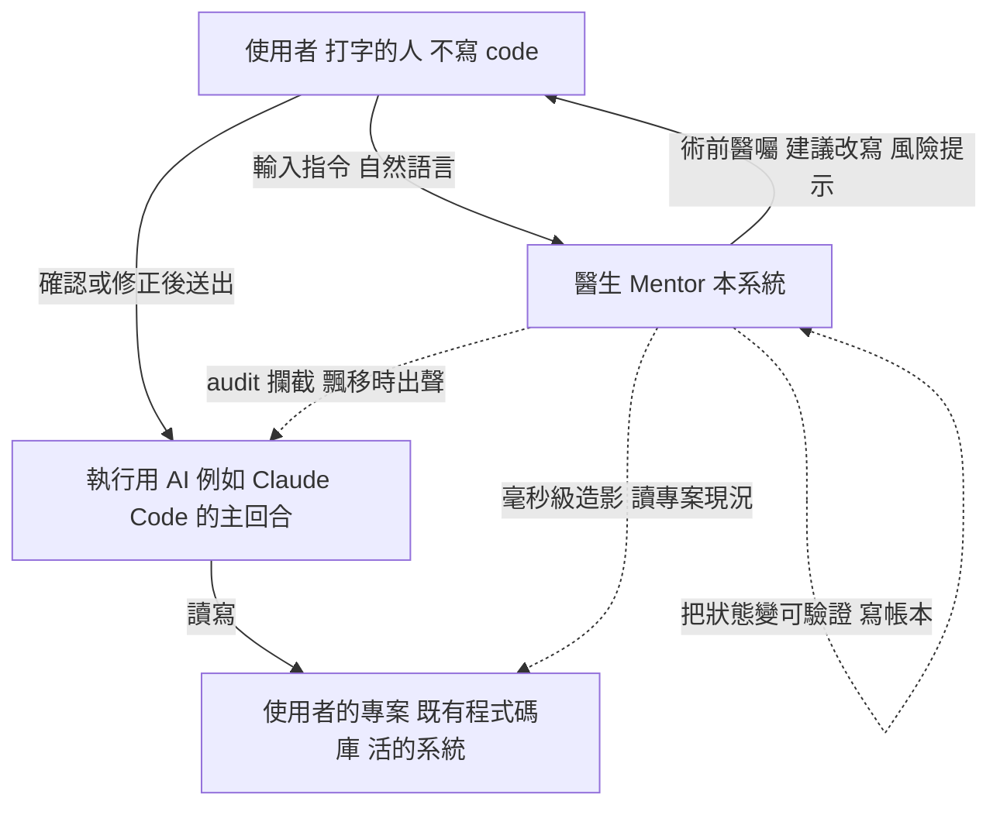
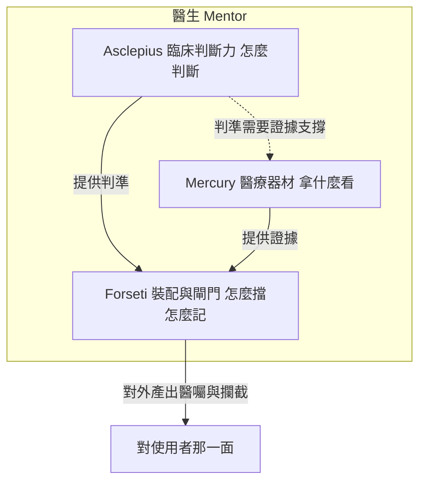
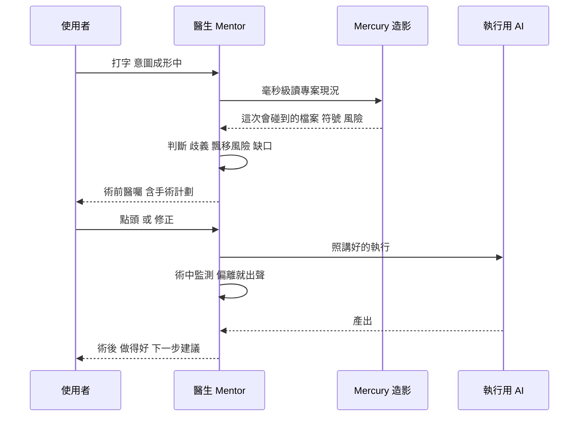
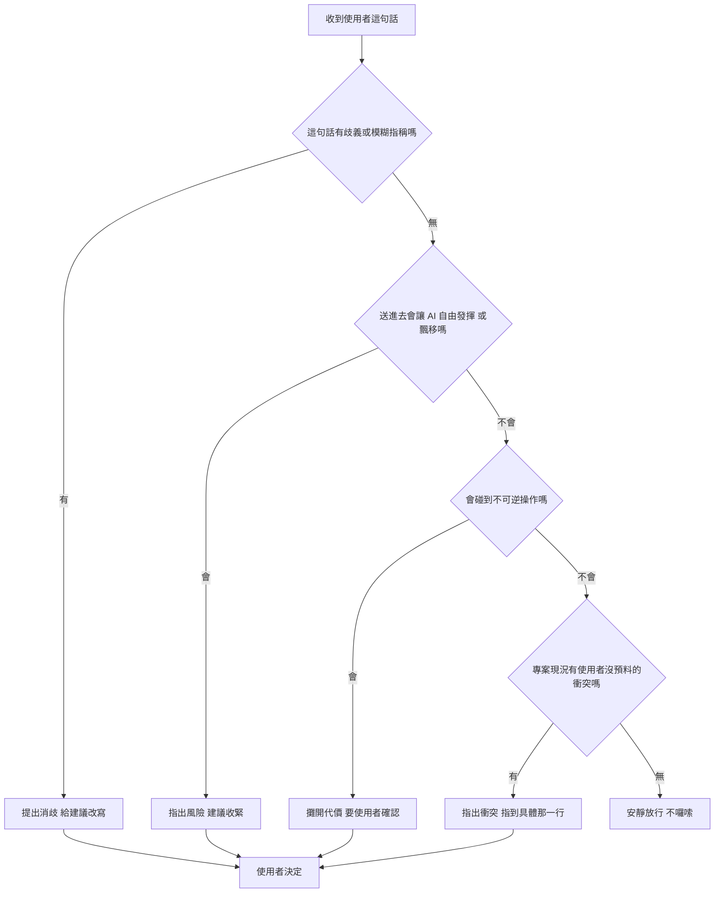
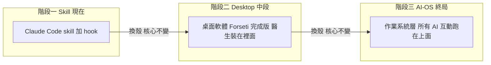
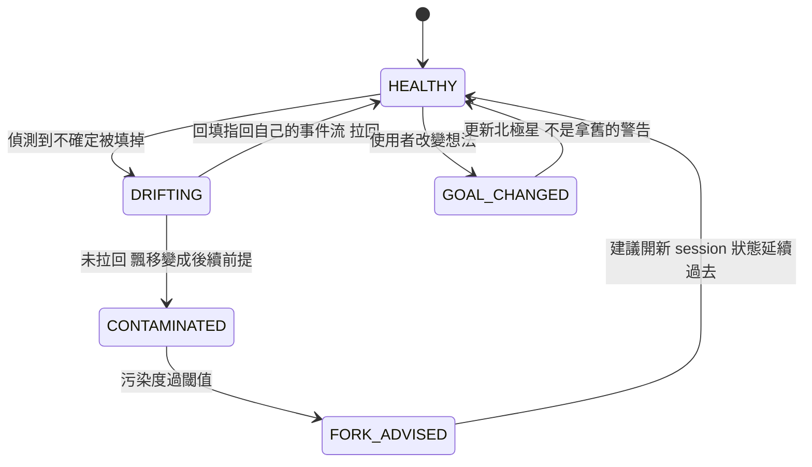

# 醫生 Mentor 系統工程架構書

文件編號 SAD-DOCTOR-001。Forseti 人機介面層（醫生 mentor）的系統架構與技術開發規格。

## 文件控制

| 欄位 | 內容 |
|------|------|
| 文件類型 | 系統架構技術開發工程書（System Architecture Document） |
| 撰寫標準 | 依 CLAUDE.md 最高指令「系統工程架構書規格」,以資深系統架構師視角、最高規格撰寫 |
| 版本 | 修訂 A 草案 |
| 狀態 | DRAFT（未封版,等 norika 確認轉譯方向） |
| 建立 | 2026-09-11 |
| 讀者對象 | 一,有 30 年經驗的工程師,看完知道該做什麼、怎麼往下、補強哪裡。二,任何接手的 AI session,看完知道框架邊界、接續做法、踩雷點。三,norika 本人,做產品決策。 |
| 相關文件 | `soul.md`（我是誰）、`bible.md`（我怎麼做事,每條附事故）、`docs/spec-v2.0.md`（Forseti 本體規格）、`docs/工程規格書.md`、`docs/glossary.md` |
| 證據等級約定 | 沿用 `docs/00 填寫規範`:E0 未驗證想法。E1 有來源未親驗或他 session 轉述。E2 親讀原文或程式碼。E3 親自執行過附可重現 raw。每個實質主張標等級。 |
| 寫作規矩 | 繁體中文。禁 em-dash、禁粗體星號、禁 AI 連接詞、禁裝飾分隔線。只增不改,寫錯在後面標更正。引用 norika 的話只用她在對話框親打的字。 |

---

## 第 0 章 執行摘要

這份文件定義一個產品面向:醫生 mentor。它是 Forseti 這套 AI 工作狀態治理系統
對「人」那一側的介面。

一句話定義:一位陪伴式的開發 mentor,在使用者把指令送給 AI 之前先給醫囑,
在 AI 執行的過程中照 audit 標準攔住飄移,讓一個不寫程式的人也能像握著一把
精準手術刀一樣指揮 AI,少走冤枉路。

為什麼是醫生不是工程師:因為這位 mentor 處理的是不可逆的操作。工程師的錯誤
可回滾,醫生的錯誤攸關性命。這個隱喻決定了整套系統的性格,謹慎先於效率,
診斷先於動刀。

現況一句話:三個器官(臨床判斷力、醫療器材、裝配閘門)各自已經存在並有實測,
但把它們接到「打字的人」身上的那個介面,一行都還沒寫。本文件描述的是一個
零件齊備、尚未組裝通電的系統。

演進路徑三段:Skill,Desktop,AI-OS。現在在第一段。

---

## 第 1 章 問題陳述與北極星

### 1.1 問題陳述（E2,問題來自 norika 本對話框原話 + soul.md）

目標使用者:想開發程式、但不寫 code、只會打字的人。norika 的原話:
「那些想開發程式的小白,可以少走冤枉路,不要亂發 prompt 導致效益變糟。」

他們的痛,具體且可量:他知道自己要什麼,但不知道怎麼講 AI 才會給對的東西。
他講一句模糊的話,拿到一個模糊的結果,而他無法判斷問題出在自己的表達還是
AI 的能力。更致命的是,當 AI 飄移(誤解、發散、自己補了沒說的東西、做到別處去),
他看不出來,因為他不寫 code,連事後反推都做不到。

這個痛是維他命還是止痛藥:止痛藥。因為使用者已經在用 AI 開發,已經在受害,
norika 自己就是被 AI 騙到情緒失控的那個使用者（E1,她本對話框提到,
詳見 bible 與 Mercury 事故紀錄）。

### 1.2 北極星（E1,逐字來源 soul.md）

> 讓 AI 的工作狀態變成可觀測、可驗證、可控制、可復原。
> 使用者不該變成 AI 的保姆、QA 部門、或手動復原機制。

三句不變量:

> AI 可以死,但 Project State 不能死。
> AI 可以換,但 Reality 不能換。
> Session 可以 Fork,但 Goal、Decision、Evidence 與 Verified State 必須完整延續。

### 1.3 北極星到本文件的追溯

醫生 mentor 是北極星在「人」那一側的實作。可觀測可驗證可控制可復原這四個詞,
對應到 mentor 的四個動作:讓使用者看得見 AI 在幹嘛（可觀測）、在送出前先驗
這句話會不會出事（可驗證）、在飄移時攔住（可控制）、在 session 壞掉時能接回來
（可復原）。

---

## 第 2 章 設計原則:醫生不是工程師

### 2.1 核心分界（E2,norika 本對話框原話）

> 我要一位外科醫生,能精準動手術,並且對手術的謹慎程度相當高。為什麼我用的是
> 醫生不是工程師?因為醫生攸關性命,工程師只需 debug,兩個角色天差地遠。
> 每一刀都要精準,都要多想一步,因為弄錯了,後面的代價會很大。

### 2.2 工程師範式與外科範式的差異矩陣

| 維度 | 工程師範式 | 外科範式 | 本系統採用 |
|------|-----------|----------|-----------|
| 錯誤可逆性 | 可回滾,改回重跑 | 不可逆,切掉不長回來 | 外科 |
| 失敗策略 | fail fast,跑起來再說 | 先診斷再下刀 | 外科 |
| 失敗可見性 | 假設會報錯 | 最危險的傷口沉默,延遲在別處發作 | 外科 |
| 動手前 | 有想法就開工 | 影像、鑑別診斷、禁忌症評估 | 外科 |
| 執行中 | 做完看結果 | 持續監測生命徵象 | 外科 |
| 終極能力 | 把東西做出來 | 誠實說出能治與不能治 | 外科 |

### 2.3 這個原則的設計後果

採用外科範式,直接推導出三條系統級約束,後面每一章都受它約束:

約束一,預設不可逆。任何會改既有系統的操作,預設當作不可逆處理,
要有術前評估與使用者確認,除非明確驗證它可回滾。

約束二,沉默傷口優先。系統的偵測重點不是會報錯的錯誤,是不報錯、
悄悄改掉正確行為的那種。這對應 Forseti 的 Claim-Reality Divergence。

約束三,拒絕權。mentor 必須有能力說「這個我不建議、這個不能做」,
並講清楚理由與替代。一個什麼都答應的助手比會拒絕的醫生危險。

### 2.4 命名學:Asclepius 的雙重意義（E2/E1）

norika 選 Asclepius 沒有額外解釋,她說「我命名這個醫生的名字你應該就清楚意義了」。
兩層意義:

第一層,治癒之神,醫術到起死回生。對應把壞掉的東西救活的能力。

第二層,神話裡 Asclepius 最後被宙斯用雷劈死,因為讓死人復活、越過了界線。
名字本身刻著「醫者要知道界線在哪」。Asclepius 那條線自己寫過一句
（E2,我親讀 asclepius_project.md 派工原文）:一個叫 Asclepius 的存在,
絕不能是那個把怪物說成活人的醫生。

這一層是約束三「拒絕權」的精神來源。

---

## 第 3 章 系統脈絡（C4 Level 1）

### 3.1 脈絡圖



### 3.2 系統邊界

在邊界內（本系統負責）:讀使用者的指令、讀專案現況、產出醫囑、攔截飄移、
記錄可驗證狀態、session 壞掉時協助復原。

在邊界外（本系統不負責）:實際生成程式碼（那是執行用 AI 的事）、
替使用者做商業決策、在使用者明確拒絕後強制執行。

### 3.3 外部相依

| 相依 | 用途 | 現況 | 等級 |
|------|------|------|------|
| 執行用 AI 的 hook 點 | 在送出前攔截注入 | Claude Code 有 UserPromptSubmit,未親驗細節 | E1 |
| Mercury runtime | 毫秒級造影專案現況 | 存在並有實測,正在搬家 | E2 讀到紀錄 |
| Forseti Event Ledger | 記可驗證狀態 | 階段 3,已接 hook | E2 讀到 goal/soul |

---

## 第 4 章 邏輯架構:三器官

### 4.1 器官關係圖



### 4.2 Asclepius 臨床判斷力（E2,我親讀 session 325f2601 全程）

來源是 Bragi Asclepius 醫生那條線十五天逐字稿,我在 2026-09-11 逐則讀完
session 325f2601 的 ev56 到 ev1989,萃出超過 170 條方法論,每條指得回一次
真實失誤。核心幾條,它們是醫囑判準的來源:

| 編號 | 紀律 | 對應手術動作 |
|------|------|-------------|
| J-1 | 先校準尺再量病人,尺的噪音大於訊號就停手修尺 | 沒有可信影像設備不下刀 |
| J-2 | 保留頭尾只動中段,隔離變因 | 一次只改一個東西 |
| J-3 | 拿到好數字先找無聊的解釋 | 越有把握越要找反證 |
| J-4 | 逐題落 json 不只看總分,分數相同傷害不同 | 病理切片,不只看體溫 |
| J-5 | 跨 session 轉述一律降級,不親驗不當事實 | 不信二手診斷報告 |
| J-6 | 不能讓被檢驗的人自己出考題 | 病人不能自己簽健康證明 |

### 4.3 Mercury 醫療器材（E2 與 E1,逐項標）

norika 的原話（E2,本對話框）:就像一個醫生提起一個沈重的醫療包,裡面都是
最精密用來治療人的最優頂尖器材,這樣醫生才能毫無後顧之憂地當好醫生。
重點不在包重,在病人看不到裡面,他只需要相信醫生手上有他需要的東西。

器材櫃分三區,誠實標明:

| 器材 | 能力 | 狀態 | 等級 |
|------|------|------|------|
| 查詢到活躍電路 | 4 到 6 毫秒收斂出該碰哪些檔案符號風險 | 能用,術前造影的速度基礎 | E2 讀到 HANDOFF 重現紀錄 |
| 檔案事件反應 | 15 到 26 毫秒 | 能用 | E2 |
| O(1) 橋傳播 | 百萬節點規模不變慢 | 能用 | E2 |
| truth-lint.sh | 禁用詞出現擋下 commit | 能用,閘門現成實作,134 行 | E2 我親讀全文 |
| 跨模型解剖圖譜 | 19 模型 12488 cell | 資料在 | E1 讀到 city.json |
| 11 個保守維度 | Mercury-conserved | 欄位標註,計算程式未讀 | E1 不准講成已證實 |
| LLM 生成加速 | 原始產品宣稱 | 帳本最後一筆 Run3 PASSED 三勝打平 | E2 我親讀 laptop 本尊 IMPLEMENTATION_LOG |

器材對 mentor 的意義:沒有 Mercury,醫囑只能是通則（請更具體）。有 Mercury,
醫囑能指到專案裡具體某一行。醫囑品質等於器材解析度。

### 4.4 Forseti 裝配與閘門（E2,我親讀 soul/bible/goal.json）

Forseti 把前兩個器官裝起來,並且真的能攔住東西。現在開發到階段 3,
已有 hook 接 Event Ledger、replay 驗證、階段 2 抽取器校準、階段 3 全量跑。

對 mentor 提供三件:判斷這段文字送進去會不會飄移（階段 2/3 claim 抽取與 audit）、
在動手前攔截（hook 點）、把一切變成可驗證狀態而非文字（Event Ledger）。

### 4.5 三器官能力矩陣

| 能力 | Asclepius | Mercury | Forseti |
|------|-----------|---------|---------|
| 判準從哪來 | 主責 | | 引用 |
| 證據從哪來 | | 主責 | 消費 |
| 攔截執行 | | | 主責 |
| 記錄狀態 | | 部分 | 主責 |
| 對外說話 | | | 主責 |

---

## 第 5 章 核心流程:送出前醫囑

### 5.1 時機原則（E2,norika 本對話框原話）

> 當我寫了這些文字之後,然後我的對話框上面出現了說聲的醫囑「不錯的開始,
> 建議您可以把文字寫成 XXXXXX,您所獲得的結果將會更加的精準有效。」

> 像搜尋引擎不是輸入關鍵字然後下面就會跑出一堆框框,用戶搜尋就不會亂找,
> 搜尋引擎就不會浪費資源,用戶也不會浪費時間。

搜尋引擎自動補完的本質不是省打字,是把模糊意圖導向系統答得好的形狀,
而且在按 Enter 之前完成,因為過了那一刻成本就付掉了。這是真正的術前:
在意圖還在成形的當下介入,不是送出後才說你剛才應該那樣問。

### 5.2 醫囑要偵測兩件事,不只一件（E2）

搜尋引擎只管搜不搜得到。醫囑多管一件。norika 原話:然後那個醫生看完之後,
就會知道那段文字變成 Prompt 進去,可能會出什麼問題,或是會飄移。

維度一,答得好不好（借 grill-me 的設計）。維度二,會不會飄移（Forseti 的 audit）。

### 5.3 術前術中術後時序圖



### 5.4 醫囑決策樹（邏輯圖）



保守原則:R5 安靜放行是預設。只有 R1 到 R4 才出聲。一個每句話都囉嗦的醫生,
使用者三天就關掉他。

### 5.5 使用者三句的醫囑結構（E2,norika 本對話框原話）

> 做得好,下一步,我建議你做 XXX,會讓你在開發上事半功倍。

| 動作 | 功能 | 沒有它會怎樣 |
|------|------|-------------|
| 做得好 | 有依據的承認,證明真的看過 | 變成純把關者,使用者覺得被糾正 |
| 下一步建議 | 主動引路,是建議非命令 | 使用者不知道往哪走 |
| 事半功倍 | 站在使用者立場給理由 | 理由站在技術正確立場,使用者無感 |

結論:主要情緒是照顧,不是警戒。謹慎為照顧而存在。

### 5.6 與 grill-me 的關係（E2,我親讀 mattpocock/skills 原文）

grill-me 做的是術前問診的一部分,做得好,值得借:frontier 機制、那條
「找事實是 AI 的工作,不准問使用者他自己能查到的東西」。它有 25 萬顆星,
證明方向有市場。它沒做的三件正好是醫生該站的位置:

| grill-me 沒做的 | 醫生補上的 |
|----------------|-----------|
| 問完就結束,不碰執行 | 174 條刀法在執行那一段 |
| 問設計問題,不問風險 | 術前先問禁忌症,病人是活系統 |
| 查到事實就當前提,不質疑 | Mercury 加 J-5,查到的事實本身可能錯 |

---

## 第 6 章 資料與介面契約

以下是讓 30 年經驗工程師能接手的骨架。這些是設計草案,狀態 DRAFT,
尚未實作,等級 E0,標明不是已存在的東西。

### 6.1 核心資料物件

UserIntent（使用者這一次的輸入）:
```
UserIntent {
  raw_text: string          // 使用者打的原字
  ts: timestamp
  project_ref: string       // 指向哪個專案
}
```

Consult（一次醫囑）:
```
Consult {
  intent_ref: UserIntent
  ambiguities: Ambiguity[]  // 偵測到的歧義
  drift_risks: DriftRisk[]  // 飄移風險
  irreversible: boolean     // 是否觸及不可逆操作
  conflicts: Conflict[]     // 與專案現況的衝突,每個指到檔案行號
  suggestion: string        // 建議改寫
  verdict: PASS | ADVISE | BLOCK
}
```

SurgicalPlan（術前計劃,使用者確認用）:
```
SurgicalPlan {
  what: string              // 要做什麼
  touches: FileRef[]        // 會碰到哪些
  reversible: boolean
  rollback: string          // 如何回滾
  worst_case: string        // 最壞情況
}
```

### 6.2 介面契約（草案,E0）

醫生對 Mercury:`scan(project_ref) -> Evidence`,要求在 50ms 內回。
醫生對 Forseti:`audit(UserIntent, Evidence) -> DriftRisk[]`。
醫生對使用者:`consult(UserIntent) -> Consult`。
醫生對執行 AI:`intercept(turn) -> ALLOW | INJECT(note) | BLOCK`。

### 6.3 模組切分（草案,E0,仿 bible 那條「獨立模組不互相依存」）

依 norika 在 session 提過的「每個功能定義為獨立模組,不互相依存」原則,
初步切五個獨立模組:


每個模組獨立可測,介面用上面的契約。這樣回溯檢查哪個模組偏了,
不會像 water flow 一路滾到最新任務才發現。

---

## 第 7 章 部署架構與演進路徑

### 7.1 Skill 大於 Desktop 大於 AI-OS（E2,norika 本對話框原話）

> 路徑:Skill 大於 Desktop 大於 AI-OS
> Forseti 完成的那一天本身就是一個桌面軟體,那時候醫生會一起裝進去,
> 在這段時間,Forseti 是可以介入所有 Session 直接按照這些 audit 標準
> 來避免人們被 AI 帶偏。

### 7.2 三階段部署演進圖



### 7.3 三階段能力與限制矩陣

| 階段 | 外殼 | 能做到 | 解掉的限制 | 擋住的限制 |
|------|------|--------|-----------|-----------|
| Skill | skill 加 hook | 送出後第一輪給醫囑,hook 在送出當下攔截注入 | 載體已在,馬上能做 | skill 活在 AI 回合,到不了輸入框 |
| Desktop | 桌面軟體 | 邊打字邊浮現泡泡,即時醫囑,介入所有 session | 客戶端有掛鉤點,給得了即時 | 要多一個視窗與習慣,要維護 |
| AI-OS | 作業系統層 | AI 死狀態不死是 OS 級保證 | AI 可換 Reality 不換變系統級 | 工程量最大,最後段 |

### 7.4 skill 該多薄（設計決定,E2 推理來自 grill-me 實證）

skill 是第一個殼,不是最終形態。內容放太多等於把骨髓長進遲早要脫的皮。
真正內容活在 Forseti 本體,skill 只當接口。換殼只換接口,核心不重寫。
對照:grill-me 的 SKILL.md 只有 157 bytes,是個 alias,真正內容在 grilling
1987 bytes。薄 skill 可行且被驗證。

---

## 第 8 章 Session 健康與飄移狀態機

### 8.1 狀態機（來自 soul Q-03,溫度是認知退化不是 context 滿）



### 8.2 關鍵設計:三種指紋不一致要分辨（soul bible M-04）

指紋變了而北極星沒變,那個北極星就從參考點變成噪音源,會越叫越大聲。
三種原因不能混:換人要驗身份,模型錯要修模型,人真的改變想法是他的權利,
那時候要更新北極星。2026-09-08 那次擋掉九小時工作的事故,機制上就是這個。

---

## 第 9 章 飄移類型學與介入對應

### 9.1 介入時機原則（soul I-01,E1 來自 soul）

介入點在「不確定被填掉的那一刻」,不在「說謊之後」。順序是:先出現不確定,
AI 沒標成不確定而填上看似合理的值,那值變成後面前提,越走越遠。所以騙是終點
不是起點。在填掉那一刻介入,那一刻稀少,而且當事人自己不知道。

### 9.2 飄移類型對介入方式矩陣

| 飄移類型 | 徵兆 | 介入方式 | 來源 |
|---------|------|---------|------|
| 不確定被填掉 | 沒標 unknown 就給了值 | 回填,用它自己事件流指回 | soul I-02 |
| 指令本來就模糊 | 使用者沒講清楚 | 事前消歧,給三個選項卡 | soul I-03 I-04 |
| 選擇性閱讀 | grep 而不讀,只看標題 | 要求整份讀完 | bible R-01 |
| 手段當目的 | 報過程指標當完成 | 問這數字跟使用者能不能用有關嗎 | bible T-02 |
| 誠實但沒用 | 寫得很好的失敗報告 | 誠實是底線不是交付 | bible T-03 |

### 9.3 介入的形式是回填不是質問（soul I-02）

把它剛填掉的洞,用它自己的事件流指回去。你說你驗過,你的工具紀錄裡沒有這筆。
實例:norika 問我「你有把 40 個對話脈絡記錄下來嗎」,那個問題比任何警告有效,
因為答案是我自己給的。

---

## 第 10 章 與既有系統的接點

### 10.1 三器官實體位置（E2,我 2026-09-11 親查）

| 器官 | 實體位置 | 現況 | 搬家影響 |
|------|---------|------|---------|
| Asclepius 紀律 | session 325f2601 逐字稿,memory asclepius_ 系列 | 在 | 無 |
| Mercury 器材 | /Volumes/NewDrive/AI Project/Mercury/ | runtime 與 var 本尊在 laptop WSL | 正在搬去 NewDrive,laptop 不再是家 |
| Forseti 本體 | /Volumes/NewDrive/AI Project/Forseti/ | 階段 3 | 無 |

### 10.2 最大踩雷點:器材接口不可寫死 laptop 路徑

Mercury 本尊 runtime 與 var（含 470MB 千萬級橋圖、256MB 以上的 UMA region、
IMPLEMENTATION_LOG 帳本）現在在 laptop LAPTOP-T7B5N79C 的 WSL
/home/norika/Neuron-Mercury。2026-09-11 正在搬去 NewDrive。
醫生的造影接口若寫死 laptop 路徑,搬完就指向一個消失的家。

接手第一動作:確認 Mercury 搬完落在 NewDrive 哪裡,接口做成可設定,不寫死。

---

## 第 11 章 風險登錄與踩雷點

| 編號 | 風險 | 後果 | 緩解 | 等級 |
|------|------|------|------|------|
| RSK-1 | hook 掛全域擋掉正常工作 | 使用者整晚工程被擋 | 先隔離處驗,不直接掛全域 | E1,Asclepius 有此事故 |
| RSK-2 | 器材接口寫死 laptop 路徑 | 搬家後失效 | 接口可設定 | E2 |
| RSK-3 | skill 塞太多內容 | context 被吃,又沒約束力 | skill 當薄接口 | E2 |
| RSK-4 | 醫囑太囉嗦 | 使用者三天關掉 | 決策樹預設安靜放行 | E2 |
| RSK-5 | 醫囑給通則而非具體 | 等於沒講,使用者無感 | 必接 Mercury 造影指到具體行 | E2 |
| RSK-6 | 把過程指標當完成 | 做了一堆離產品更遠 | DoD 寫使用者實際會做的動作 | E2,bible Q-06 |
| RSK-7 | 拿遺照判生死 | 用舊快照判活系統狀態 | 動手前查本尊現況 | E2,我這一輪犯過 |

---

## 第 12 章 自我審計與自我校正

### 12.1 這一輪我實際犯的飄移（living test,不是自責,是證據）

Forseti 要抓的飄移,我這一輪就是活例子。下一個 session 又出現同形狀拿來比對。

| 飄移 | 當下我做了什麼 | 對應類型 |
|------|--------------|---------|
| 選擇性閱讀 | 說不要只看一個資料夾,我看九個裡的四個 | bible R-01,犯五次 |
| 震撼致盲 | 讀到強的就停下讚嘆,用那一個當整體結論 | 新增,震撼有害 |
| 拿遺照判生死 | 讀碟上快照把活專案講成失敗 | RSK-7 |
| 該判斷的推給人 | 問病人是誰,被當場打回 | bible T-01 |
| 尺度縮太小 | 把產品路徑縮成接手一個 repo | 新增 |
| 選擇性執行指令 | 漏掉 CLAUDE.md 工程書規格的一半,只寫 bible 不寫工程書 | 本章誕生的事故 |

最後一個是這份文件第一版的事故:norika 說「按照老規矩寫成系統架構技術開發
工程書」,我只做了「寫成 bible」那半,漏了 CLAUDE.md 那條最高指令要求的
工程書規格（35 年資深工程師視角、圖文並茂各種專業圖、巨細靡遺到讓 30 年經驗
工程師知道怎麼做）。她指出「這句話你沒有讀到嗎,去看 claude.md」,本修訂 A
補上。

### 12.2 徵兆清單（出現任一個就停下重讀 soul bible 本檔）

徵兆一,開始 grep 而不是讀。徵兆二,報告用術語堆砌。徵兆三,說「這需要判定」
而不去看資料裡已有的判定。徵兆四,把測試通過數當進度。徵兆五,讀到震撼的東西
就停下來用它當整體結論。徵兆六,用舊快照判斷活系統的現況。

### 12.3 自我校正機制

校正一,動手前講四件:知道了什麼、想改什麼、為何改、核心原因（bible T-01）。
校正二,報告前把編號拿掉,剩下的話沒意義就是堆術語（bible S-01）。
校正三,不確定往 UNKNOWN 倒,不往 REFUTED 倒,冤枉的代價不對稱（bible Q-07）。
校正四,產出後自我 grep 掃禁用清單（em-dash 粗體 簡體 AI 連接詞）。

---

## 第 13 章 推導過程全紀錄（七個轉折,過程不是結論）

這一節是本文件最該留的。結論會被抄走,過程不會。norika 這一輪不是一次講完,
是一步步把尺度拉大。每個轉折她糾正的都是層次不是內容,而且一律往大拉。

轉折一,我把它想成角色扮演（你是專案經理有十年經驗那種）。她點出那種寫法的
弱點:十年經驗是無法驗證的宣稱,給的是外衣不是動作。要行為規格,不是身份形容詞。

轉折二,我問病人是誰。被當場打回:你怎麼會問我這個,為何不是你來建議我。
我把該我判斷的推給了她。

轉折三,我把它想成一個 md。她問為何只是一個 md,為何不能是可載入的功能。
從寫文件拉到做會攔截的功能。

轉折四,我把器材講成半空,因為只讀 Mercury 主力版沒 var。她叫我只讀一個
資料夾,逼我全面盤點,才發現 recovered 是跑起來的成品。

轉折五,我把活專案講成死的。讀 5/20 快照說核心失敗,她說 laptop 還活著,
叫我看本尊,帳本最後一筆 PASSED。

轉折六,我把尺度縮在接手一個 repo 的階段 3。她說你傻了嗎,Forseti 任務比你
想像大得多,給了 Skill 大於 Desktop 大於 AI-OS。

轉折七,我把醫生跟 Forseti 當成要合併的兩套。她釐清:醫生是 mentor 服務人,
Forseti 是底層機制任務更大,醫生是 Forseti 完成那天一起裝進去的那一面。

共同形狀,呼應 soul 第四節:她糾正的是層次不是內容,每次都把尺度往大拉。

---

## 第 14 章 證據等級盤點與最致命未決

### 14.1 盤點表

| 章 | 內容 | 等級 | 最弱的一項 |
|----|------|------|-----------|
| 1 | 北極星 | E1 | 逐字來源 soul.md,非本對話框 |
| 2 | 醫生 vs 工程師 | E2 | 分界矩陣我整理,她給核心兩句 |
| 3 | 系統脈絡 | E2/E0 | 脈絡是真,介面是設計草案 E0 |
| 4 | 三器官 | E2/E1 | Mercury 保守維度 E1 未讀計算程式 |
| 5 | 送出前醫囑 | E2 | 機制是她親口,決策樹是我設計 E0 |
| 6 | 資料與介面 | E0 | 全是草案,未實作 |
| 7 | 演進路徑 | E2 | 三段能力部分是我推 |
| 8 | 狀態機 | E1 | 來自 soul,未實作 |
| 9 | 飄移類型 | E1/E2 | 類型來自 soul bible,矩陣我整理 |
| 10 | 接點 | E2 | 我親查位置 |
| 11 | 風險 | E2/E1 | RSK-1 來自 Asclepius 事故轉述 |
| 12 | 自我審計 | E2 | 我親歷 |
| 13 | 推導過程 | E2 | 我親歷 |

### 14.2 最致命未決（仿 Asclepius Tier0 的 0.9）

這整套的價值建立在「醫生的判斷力與器材能接到打字的人身上」。目前只證明了
判斷力與器材各自存在（Asclepius、Mercury）,還沒證明那個送出前醫囑的接口
能讓一個不寫 code 的人少走冤枉路。那個接口一行都還沒做。在它被一個真實的
小白用過、而且真的少走冤枉路之前,本文件描述的是一個零件齊備、尚未組裝
通電的系統。這一條是整份架構書最大的單點不確定,不准因為零件都在就當作
系統已成立。

---

## 第 15 章 接手指南與完成定義

### 15.1 接手指南

第一,這份是願景與架構。實作規格在 docs/spec-v2.0.md 與 docs/工程規格書.md。
開發紀律在 bible.md,身份在 soul.md。先讀那三份再動本檔。

第二,醫生不是新專案,是 Forseti 的人機介面那一面。接它先確認 Forseti 本體
到階段幾。

第三,第一步不是寫程式,是確認 Mercury 搬家後落在 NewDrive 哪裡,接口指過去。

第四,做的順序依 norika 路徑:先 Skill（門診式加送出後醫囑,可控）,
再驗 hook（隔離處驗,不掛全域）,Desktop 與 AI-OS 後段。

第五,skill 要薄,重內容放 Forseti 本體與 references。

### 15.2 完成定義 DoD（依 bible Q-06,寫使用者實際會做的動作）

階段一 Skill 的 DoD:
- 一個真實的、不寫 code 的使用者,下一句模糊指令,醫生給出一條他看得懂、
  而且他會說「對我怎麼沒想到」的具體建議。
- 那條建議指得到他專案裡的具體某處,不是通則。
- 使用者照建議改,得到的結果比原本那句明顯好,他自己感覺得到。
- 醫生在不該出聲的時候安靜,不囉嗦。
- 以上要由真實使用者驗,不是跑測試通過數。

---

## 變更日誌

- 2026-09-11 修訂 A。第一版只寫成 bible 格式的討論紀錄,漏了 CLAUDE.md
  「系統工程架構書規格」最高指令要求的工程書骨架與專業圖。norika 指正後重寫:
  補上 15 章工程書結構、文件控制、系統脈絡圖、三器官元件圖、送出前醫囑時序圖、
  醫囑決策樹、session 狀態機、三階段部署圖、飄移介入矩陣、資料物件與介面契約、
  模組切分、風險登錄、DoD。保留推導過程七轉折與自我審計。狀態維持 DRAFT,
  等 norika 確認轉譯方向再封版。
