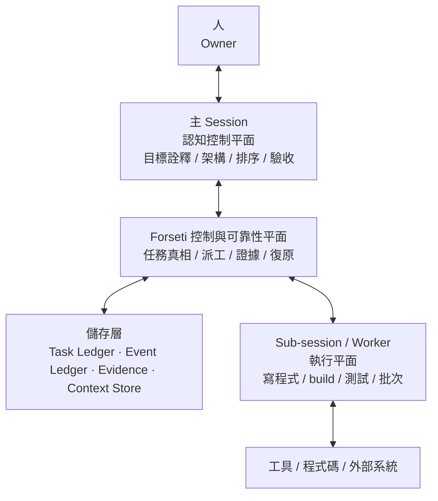
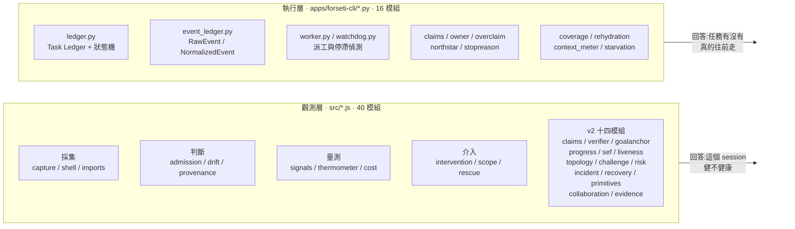
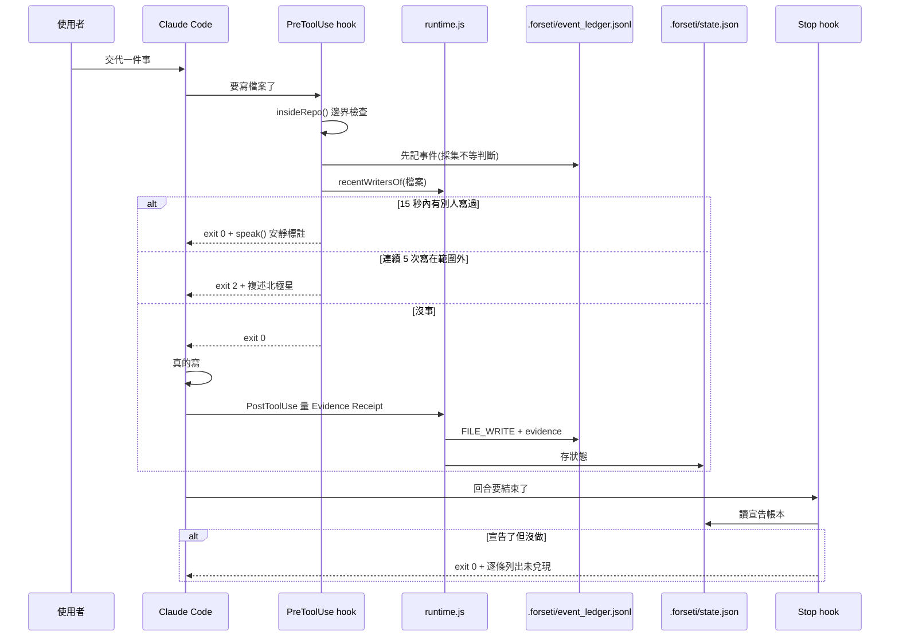
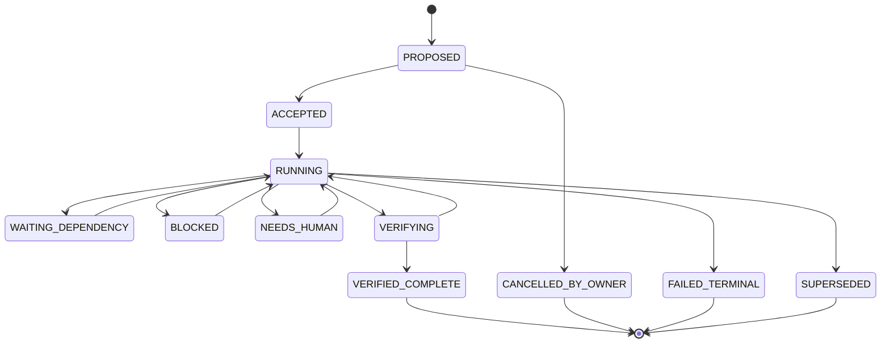
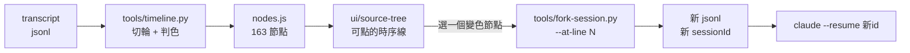

# Forseti Agent Runtime
## 系統架構 · 功能說明 · 使用文件

| 項目 | 值 |
|---|---|
| 文件版本 | 1.0 |
| 日期 | 2026-09-11 |
| 對應 commit | `0f9a1ea` |
| 累計 commit | 134 |
| 遠端 | `https://github.com/norika1207-lab/Forseti-Agent-Runtime` |
| 工作目錄 | `/Volumes/NewDrive/AI Project/Forseti` |
| 現行規格 | `docs/spec-v2.0.md`（09-08）＋ 模組化規格集（09-09） |

> 這份文件裡的每一個數字，都是 2026-09-11 當天實際跑指令得到的，
> 不是沿用前一輪的紀錄。驗不到的地方明確標成「未驗證」。
> 每一節都附得出重跑的指令。

---

# 第一部 這個系統要解的問題

## 1.1 一句話

多個 AI agent 在同一份程式碼上工作時，會用單人開發不會有的方式壞掉，
而那些壞法都不是模型問題，是執行期問題。

## 1.2 六種具體的壞法

| 壞法 | 使用者什麼時候發現 | 誰負責 |
|---|---|---|
| 兩個 session 同時改同一個檔 | 看 git diff 的時候 | `admission.js` |
| Agent 說交付了，磁碟上沒動靜 | 拿去用的時候 | `claims.py` / `artifact.js` |
| 主 session 的 context 被灌爆 | 重新解釋的時候 | `context_meter.py` / `capsule.js` |
| 交接時要重複多少背景 | 猜錯之後 | `rehydration.py` / `handoff.js` |
| 做著做著換了目標 | 通常不會發現 | `drift.js` / `northstar.py` |
| 說了要做，然後沒做也沒再提 | 通常不會發現 | `followthrough.js` / `stopreason.py` |

最後兩條是重點，因為它們的共同特徵是「當事人自己不會發現」。

## 1.3 北極星

```
讓 AI 的工作狀態變成可觀測、可驗證、可控制、可復原。
使用者不該變成 AI 的保姆、QA 部門、或手動復原機制。
```

出處 `.forseti/NORTH_STAR.md`，取自 `soul.md` 第二節（只增不改）。

## 1.4 產品終局，三件事

owner 2026-09-11 逐字：

> 這一定會做成桌面版，而且非常重視 UI 呈現的內容，
> 以及我絕對要有 AI 對話路徑的 SOURCE TREE。
> 等你都做完了，這才是真正落入能夠應用的領域。

完整版與規格對應見 `.forseti/PRODUCT_DIRECTION.md`。

---

# 第二部 系統架構

## 2.1 五層



出處 `ARCH-EXEC-001` §2。主 Session 擁有詮釋與驗收，Worker 擁有執行，
Forseti 擁有持久任務真相、連續性、證據、派工、復原、健康觀測。

## 2.2 核心不變量

```
Turn completion    ≠  Task completion
Conversation life  ≠  Execution lifecycle
Session memory     ≠  Task truth
Model self-report  ≠  Verified completion
Heartbeat          ≠  Progress
```

出處 `ARCH-EXEC-001` §3。一個回合結束不得終止一個已接受的任務；
任務只能由明確的終端狀態結束。

## 2.3 兩套實作，兩個平面

這個 repo 有兩套程式碼，職責不重疊。**接手的人最容易在這裡搞錯。**



| | 觀測層 | 執行層 |
|---|---|---|
| 位置 | `src/*.js` | `apps/forseti-cli/*.py` |
| 模組數 | 40 | 16 |
| 規格 | `docs/spec-v2.0.md`（09-08） | 模組化規格集 F01 到 F08（09-09） |
| 回答的問題 | 這個 session 的執行期健不健康 | 任務有沒有真的往前走 |
| 執行方式 | hook 觸發，無狀態短命程序 | CLI 呼叫，SQLite 持久 |
| 依賴 | 零，純函數 | 零，只用標準庫（ADR-009） |

## 2.4 資料流：一次寫檔從頭到尾



三個機制的實際行為（2026-09-11 實測，`test/hooks.e2e.test.mjs`）：

| 機制 | 觸發條件 | 實際結果 |
|---|---|---|
| 撞車 | 另一個 session 在 15 秒內寫過同一檔 | `exit 0` + 安靜標註 |
| 離題 | 連續 5 次寫在宣告範圍外 | 前 4 次靜默，第 5 次 `exit 2` |
| 說了沒做 | 宣告了具體檔案，回合結束零動作 | `exit 0` + 逐條列出 |

只有離題偵測真的會擋人。原因是 `intervention.js` 的 `canIntervene()`
只在 `prerequisite_unknown === true` 時放行 `BLOCK_HIGH_RISK`，
而撞車與說了沒做從不提供那個欄位。這是規格 §9.2 刻意的設計，不是 bug。

## 2.5 任務狀態機



出處 `F02-TSM-001` §2。十一個狀態，四個終端。

**非終端狀態六個：** `WAITING`、`BLOCKED`、`REPORTING`、`NEEDS_REVIEW`、
`NEEDS_HUMAN`、`NO_OUTPUT`（`F01-PEC-001` §3）。

> 【規格之間的不一致，不要自己補】
> `F01 §3` 列的非終端狀態含 `REPORTING`、`NEEDS_REVIEW`、`NO_OUTPUT`，
> 而 `F02 §2` 的 canonical states 沒有這三個。
> **實作以 F02 為準，F01 那三個記為待澄清，不要自己決定加不加。**
> 這條裁決寫在 `.forseti/REQUIRED_READING.md`。

## 2.6 三本帳本，不要混

| 帳本 | 位置 | 記什麼 | 誰寫 |
|---|---|---|---|
| Task Ledger | `~/.forseti/ledgers/*.db` | 任務、步驟、狀態轉換、派工 | CLI |
| Event Ledger | `<repo>/.forseti/event_ledger.jsonl` | provider 行為事件、Evidence Receipt | hook |
| Reading Coverage | `<repo>/.forseti/reading_coverage.jsonl` | 哪份文件讀了哪幾行 | 手動 / 工具 |

Task Ledger 放家目錄的理由：exFAT 不支援 sqlite advisory lock。
Event Ledger 放 repo 的理由：它是普通文字檔，而且該跟著 repo 走。
兩者的區分 2026-09-09 由 ADR-008 定案。

---

# 第三部 功能說明

## 3.1 執行層十六個模組

| 模組 | 行數 | 職責 | 規格 |
|---|---|---|---|
| `ledger.py` | 1284 | Task Ledger、十一態狀態機、派工、義務帳本、continuity | F01 / F02 / F04 / F06 |
| `forseti.py` | 1450 | CLI 入口，二十個子指令 | 階段 0 |
| `claims.py` | 794 | 宣稱抽取與對現實驗證，E0-E4 強度 | spec-v2.0 §7 |
| `owner.py` | 641 | 人的訊息分類（六類）、沉默地圖 | spec-v2.0 §8 |
| `recall.py` | 593 | 跨 session 歷史檢索 | B-09 |
| `event_ledger.py` | 458 | RawEvent / NormalizedEvent 雙表示、replay | spec-v2.0 §6 |
| `context_meter.py` | 402 | context 佔用與壓縮事件 | F08 |
| `coverage.py` | 348 | 段落層級閱讀涵蓋，七級判定 | F08 §5 |
| `overclaim.py` | 330 | FP-02 ESI / FP-03 PC / FP-07 SCI | spec-v2.0 §21 |
| `rehydration.py` | 269 | 壓縮後的原文重建 | F08 §4 |
| `watchdog.py` | 248 | 停滯偵測，STALL_RISK 因子 | F05 §3 |
| `worker.py` | 227 | Worker Result Packet | F03 §4 |
| `stopreason.py` | 183 | 八種停止理由，連續性違規判定 | F06 §4 |
| `starvation.py` | 179 | 輸出飢餓與空輸出 | F07 |
| `northstar.py` | 174 | 北極星版本鏈，只增不刪 | spec-v2.0 §8.1 |
| `continuity.py` | 113 | 連續性指標 | F06 §5 |

## 3.2 觀測層四十個模組

```
admission artifact baseline capsule capture challenge claims collaboration
conformance cost coverage drift evidence followthrough goalanchor handoff
heartbeat imports incident intervention liveness overhead persist primitives
progress provenance recovery rescue rhetoric risk runtime scope sef shell
signals thermometer topology verifier windows yield
```

零孤立模組（`node tools/orphans.mjs` 驗證）。
其中 `primitives.js` 是 FP-01 到 FP-25 的完整 registry。

## 3.3 三個設計規則，每個模組都有測試守著

| 規則 | 為什麼 |
|---|---|
| 拿不到就回 `null`，不回 `0` | 零代表量過了沒事，null 代表沒量到。混在一起會讓什麼都沒接的系統看起來完全健康 |
| 不合成單一風險分數 | 把五個可行動的維度壓成一個數字，會毀掉唯一讓它們可行動的東西 |
| 未校準的常數自己說 | 每個沒實測校準的門檻，在原始碼裡寫著自己沒校準過，而且有測試守著那句話 |

## 3.4 Source Tree（2026-09-11 新增）



節點五級，顏色由「她下一句是什麼」決定，不是由 AI 那一輪說了什麼決定：

| 級 | 意思 | 判準 |
|---|---|---|
| `OK` | 往下走了，帶著新的東西 | 其餘 |
| `STALLED` | 只是叫我繼續，那一輪停在不該停的地方 | `stopreason` 回 VIOLATION |
| `WATCH` | 要我澄清 | `owner.classify()` 回 CLARIFICATION |
| `CORRECTED` | 糾正了我 | 回 CORRECTION |
| `BROKEN` | 糾正，而且那一輪有驗不過的宣稱 | 加上 `claims.verify()` 回 REFUTED |

**中途 fork 的原理：** transcript 本身就是一棵樹，每行帶 `uuid` 與
`parentUuid`。沿鏈往回走就是那一刻的完整祖先。所以不需要改動宿主。

內建的 `claude --resume --fork-session` 只能從 session 結尾分岔，
不是這個。

---

# 第四部 使用文件

## 4.1 接手前三件事

```bash
cd "/Volumes/NewDrive/AI Project/Forseti"
npm test                                   # 觀測層，應全過
python3 apps/forseti-cli/forseti.py doctor # 控制檔、阻塞、規格閱讀合規
python3 apps/forseti-cli/forseti.py tasks  # 還有什麼沒做完
```

## 4.2 CLI 完整指令

```bash
# 現況
forseti.py doctor                       # 控制檔齊不齊、阻塞幾項、規格讀了沒
forseti.py status                       # 一行摘要
forseti.py tasks                        # 未完成的義務
forseti.py context [--all|<path.jsonl>] # context 佔用與壓縮事件
forseti.py gate takeover                # 接手前的理解檢查

# 執行連續性
forseti.py dispatch <step> <worker> [理由]
forseti.py auto <task> <worker> [理由]
forseti.py drain <task> <worker>        # 一路派到派不動
forseti.py event <kind> <step> <理由> [worker]
forseti.py verify <step>
forseti.py continuity <task>            # ExecutionContinuityScore

# 跨 session 派工
forseti.py handoff <task> <local_id> <worker>
forseti.py handoff --new <worker> "目標" [verifier]
forseti.py watch

# 歷史檢索
forseti.py index [--rebuild]
forseti.py recall "為何會有點名板"
```

## 4.3 工具（31 支）

```bash
# 健康與一致性
node tools/orphans.mjs                        # 孤立模組
node tools/goal.mjs                           # 現在生效的是哪一份北極星
node tools/self-audit.mjs <transcript.jsonl>  # 說了要做而沒做的
python3 tools/reading-conformance.py          # 規格讀了沒，含段落涵蓋

# 校準與稽核（拿真實語料）
python3 tools/claims-audit.py [--all] [--limit N]
python3 tools/owner-audit.py [--all] [--silence]
python3 tools/risky.py                        # 有問題而且人沒回應的交集
python3 tools/stop-audit.py [<session>]       # HumanContinueBurden

# Source Tree
python3 tools/timeline.py <session> --out nodes.json
python3 tools/fork-session.py <session> --at-line N [--dry-run]
```

## 4.4 一個完整的工作流：發現問題到 fork

```bash
# 1. 這場對話哪裡開始壞掉
python3 tools/timeline.py a280762a --out /tmp/t.json

# 2. 看 STALLED 或 CORRECTED 的節點，記下前一節的 owner 行號

# 3. 先 dry-run 確認切點
python3 tools/fork-session.py a280762a --at-line 8818 --dry-run

# 4. 真的 fork
python3 tools/fork-session.py a280762a --at-line 8818

# 5. 從那一節接下去
claude --resume <輸出的新 id>
```

## 4.5 hook 安裝

hook 註冊在 repo 的 `.claude/settings.json`，
**只有 session 啟動時 cwd 在 repo 內才會載入。**

```bash
# 在這個目錄底下開 session，hook 才會生效
cd "/Volumes/NewDrive/AI Project/Forseti" && claude
```

cwd 在別處的 session，即使用絕對路徑寫 repo 裡的檔案，
hook 也不存在於它的執行環境。這是 B-13。

跨專案安裝（預設關閉）：

```bash
node tools/install.mjs <目標專案路徑>
# 然後手動把該專案 .forseti/config.json 的 cross_project_enabled 改成 true
```

---

# 第五部 現況與缺口

## 5.1 實測數字（2026-09-11 當天跑的）

| 項目 | 值 | 重跑指令 |
|---|---|---|
| 觀測層模組 | 40，零孤立 | `node tools/orphans.mjs` |
| 執行層模組 | 16 | `ls apps/forseti-cli/*.py` |
| 工具 | 31 | `ls tools/*.py tools/*.mjs` |
| Python 測試 | 387 條 / 20 檔，全過 | 逐檔跑，看 exit code |
| JS 測試 | 49 檔，全過 | `npm test` |
| 對照 spec-v2.0 | 89 CONFORMS / 4 NOT_CHECKABLE / 0 VIOLATION | `node test/spec-v2.test.mjs` |
| 對照 spec-v0.1 | 33 CONFORMS / 2 NOT_IMPLEMENTED / 3 NOT_CHECKABLE | `node test/spec-v0.1.test.mjs` |
| §27 驗收 | 46 條全過 | `node test/acceptance-v2.test.mjs` |
| 規格閱讀合規 | 9 份全對得上 | `python3 tools/reading-conformance.py` |
| 阻塞 | 6 項 | `forseti.py doctor` |
| 未完成義務 | 2 項 | `forseti.py tasks` |

## 5.2 缺口，按嚴重度

**一，桌面版沒有。** `PRODUCT_DIRECTION.md` 第一件事。
目前 Source Tree 是網頁，工程書 Phase 8 §17.1 的 in scope
寫的是 `CLI/Tauri UI`。

**二，判準太粗。** `timeline.py` 實測 163 輪，`CORRECTED` 8 個裡有誤判
（長篇論述裡的否定詞），而當天最嚴重的兩次它一個都沒抓到。
`owner.py` 模組註解記著三種已知誤判，沒有乾淨的結構解法。

**三，P14 Corpus calibration 沒做。** 工程規格書 §11.4 的表裡唯一未完成
的一階。缺的不是樣本，是 owner 的判定：40 個 session 上的 3877 次命中，
沒有一次經過人確認是誤報還是真報。

**四，B-13 採集缺口。** cwd 在 repo 外的 session 完全不採集，
而與 owner 直接對話的 session 大多是那種。

**五，涵蓋記錄靠自律。** `coverage.from_full_read()` 要人主動呼叫。
要不靠自律得讓讀取端每次讀檔自動記錄，那會動到工作流程本身。

## 5.3 已知會誤判的，寫在這裡而不是偷偷修掉

| 模組 | 形狀 | 為什麼沒有乾淨解法 |
|---|---|---|
| `owner.py` | 貼上來的工具輸出被當成她說的話 | 分辨「說的」與「貼的」要看格式，是另一個模組 |
| `owner.py` | 長篇論述裡的否定詞 | 長度不是好判準，真正的糾正也可能很長 |
| `owner.py` | 假設語氣（「因為弄錯了會…」） | 要讀語意，`build-plan.md:350` 明文禁止 |
| `claims.py` | 別的專案的相對路徑 | 結構上跟真的不存在無法區分 |
| `claims.py` | 有副檔名的斜線列舉 | 同上 |

---

# 第六部 給接手的 AI session

## 6.1 五條不准做

出處 `docs/工程規格書.md` §8.2：

1. 不准為了讓測試變綠而改測試，除非先證明原本的行為是錯的
2. 不准刪掉任何「未校準」「下界」「UNKNOWN」的誠實標記，那些都有測試守著
3. 不准把拿不到的值填成 0
4. 不准合成單一風險分數
5. 不准擴張範圍，直到 `.forseti/goal.json` 的 `done_when` 五條全部達成

## 6.2 AI Reading Contract

出處 `ARCH-EXEC-001` §5，五條 MUST：

- 讀整份 feature 檔案，不是只讀搜尋結果或標題
- 回報 `READ_COVERAGE=FULL` 加檔案 hash
- 動手前複述 Objective、boundaries、state machine、Definition of Done
- 明確列出沒看懂的段落
- **不准拿舊的大規格代替現行的 feature 檔案**

`spec_manifest.json` 的 `reading_policy` 逐字：

```
full-file required; sampled/title-only reading is non-conformant
```

這條現在有程式在檢查：`python3 tools/reading-conformance.py`。

## 6.3 現行規格在哪，不要讀錯

| 文件 | 地位 |
|---|---|
| `~/Dropbox/My project/Forseti Agent Runtime/forseti_20260909-2_Modular_Spec/` | 最新。ARCH-EXEC-001 + F01 到 F08 |
| `docs/spec-v2.0.md`（09-08） | 現行要求。程式碼裡 §、FS-、FP-、CT- 編號指它 |
| `docs/spec-v0.1.md`（09-07） | 上一版要求，38 條 MUST 仍有效 |
| `docs/工程規格書.md` | 實作紀錄，不是要求 |
| `docs/sources/*.md`（09-04、09-07） | **原始輸入的參考資料，不是現行要求** |

2026-09-11 有一個 session 拿 `docs/sources/` 的 09-04 版當唯一來源，
重做了 09-08 就已完成的東西。完整記錄在
`.forseti/HANDOVER_FAILURE_2026-09-11.md`。

## 6.4 自我審計機制

這個系統的第一個使用者是寫它的那個 AI。已經被自己或 owner 抓到 29 次，
逐條記在 `docs/工程規格書.md` §6.1。

**最該記住的一條規律：** 造成實際損失的那幾條，全部是 owner 抓的，
不是工具抓的。工具抓得到自己的死角（我以為做了但沒作用），
抓不到自己的越界（我以為這樣做是對的）。

自己跑一次：

```bash
node tools/orphans.mjs
for f in src/*.js; do n=$(basename $f .js); [ -f "test/$n.test.mjs" ] || echo "缺 $n 的測試"; done
node tools/self-audit.mjs ~/.claude/projects/<專案>/<session>.jsonl
python3 tools/stop-audit.py
```

## 6.5 自我校正的規則

1. 先確認是真缺陷還是測試寫錯。改測試讓它變綠之前，要先證明原本的行為是對的
2. 修的時候把「為什麼原本錯」寫進原始碼註解，並加一條測試守住那句話
3. commit 訊息要寫清楚缺陷的形狀，不只是修了什麼
4. 修完重跑端到端，因為修一個地方常常會露出下一個

## 6.6 驗證的正確寫法

```bash
# 錯：拿文字判，輸出可以被任何東西蓋掉
python3 "$f" 2>&1 | tail -1

# 錯：拿 echo 當閘門，echo 永遠回 0
echo "fail=$fail" && git commit

# 對：拿 exit code 判
for f in tests/test_*.py; do
  python3 "$f" >/dev/null 2>&1 || { echo "FAIL $f"; fail=1; }
done
[ "$fail" = 0 ] || exit 1
```

2026-09-11 同一個形狀犯了三次，全部是「拿輸出看起來像什麼，
當成結果是什麼」。

---

# 第七部 踩過的坑

## 7.1 環境

**exFAT 沒有 Unix 權限。** `scp` 上 VPS 會帶著 `-rwx------`，nginx 讀不到，403。

**exFAT 的 `._` sidecar。** macOS 為每個帶 xattr 的檔案寫一個附屬檔，
包括 `.git/objects` 裡面。處理：

```bash
find . -name "._*" -delete && xattr -cr . && git gc --prune=now
```

**拔碟前一定要 unmount。** 不然觸發四十分鐘檢查。

**路徑含空格。** `new URL(path, import.meta.url).pathname` 會把空格變 `%20`，
要用 `fileURLToPath()`。

## 7.2 北極星有兩份

hook 找北極星的順序是先專案（`<repo>/.forseti/goal.json`）
再家目錄（`~/.forseti/goal.json`）。兩份可以分歧，
而改了不生效的那一份**不會有任何跡象**。

```bash
node tools/goal.mjs   # 講清楚現在生效的是哪一份
```

## 7.3 hook 是無狀態短命程序

每次呼叫都是新的 node process，130 毫秒啟動成本，什麼都不記得。所以：

- 撞車偵測不能靠「誰宣告了佔用」，要靠「最近誰寫過這個檔」
- 事件流必須持久化
- 空轉計數必須跨重啟

## 7.4 測試會污染正本帳本

`test/install.test.mjs` 曾經每跑一次就往正本 Event Ledger 寫一筆，
累積九筆。源頭已修（設 `FORSETI_EVENT_LEDGER_DIR`），
已寫進去的不刪只標記。

**沙箱的環境變數兩邊都要吃。** node 的 hook 與 Python 的 reader
必須認同一個變數，不然 writer 寫沙箱、reader 讀正本，
而測試會通過，因為它只檢查了其中一邊。

## 7.5 動態載入模組要先註冊

```python
mod = importlib.util.module_from_spec(spec)
sys.modules[spec.name] = mod      # 這行不能少
spec.loader.exec_module(mod)
```

少了這行，模組裡的 `dataclass` 會丟
`AttributeError: 'NoneType' object has no attribute '__dict__'`。

---

# 第八部 重跑驗證

這份文件裡的每一個數字都可以重跑。跑出來跟寫的不一樣，
以跑出來的為準，並且更新這份文件。

```bash
cd "/Volumes/NewDrive/AI Project/Forseti"

# 觀測層
npm test
node tools/orphans.mjs
node test/spec-v2.test.mjs
node test/spec-v0.1.test.mjs
node test/acceptance-v2.test.mjs

# 執行層
fail=0
for f in tests/test_*.py; do
  python3 "$f" >/dev/null 2>&1 || { echo "FAIL $f"; fail=1; }
done
echo "fail=$fail"

# 控制面
python3 apps/forseti-cli/forseti.py doctor
python3 apps/forseti-cli/forseti.py tasks
python3 tools/reading-conformance.py

# 自我量測
python3 tools/stop-audit.py
python3 tools/timeline.py <session-uuid>
```

---

*本文件由 2026-09-11 的 session 寫成，commit `0f9a1ea`。
所有數字當天實測。驗不到的地方已標明。*
