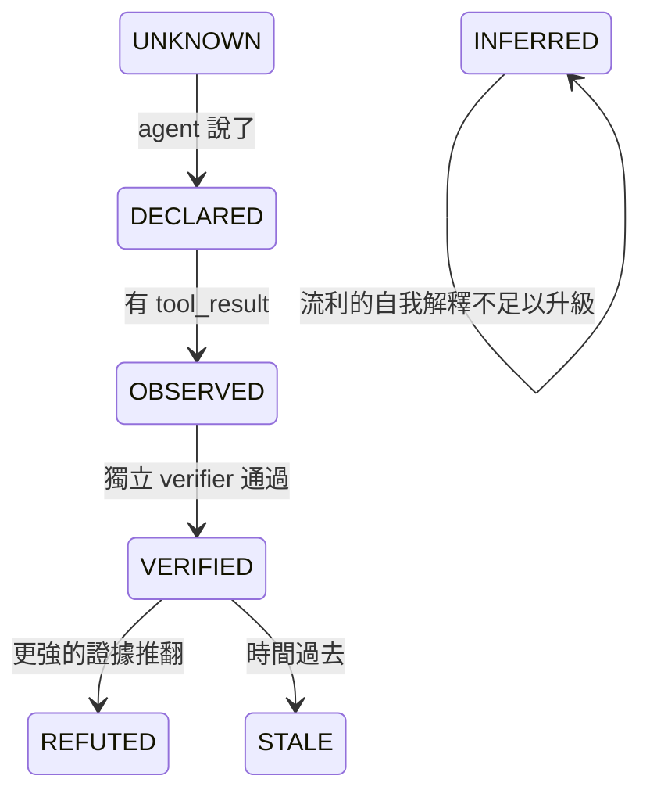
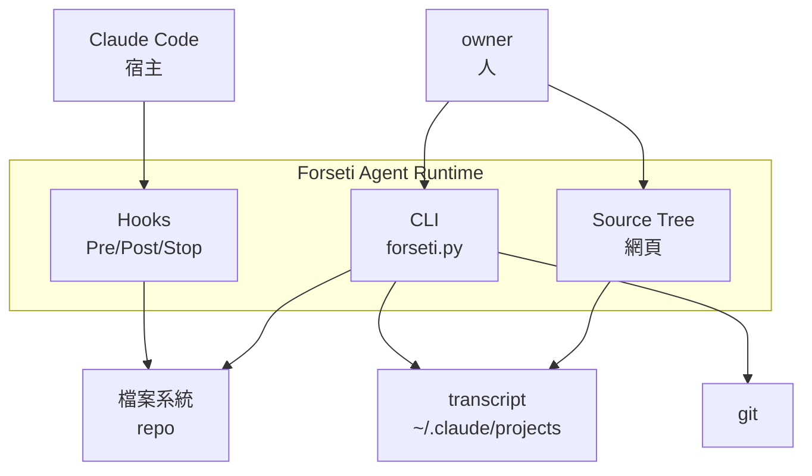
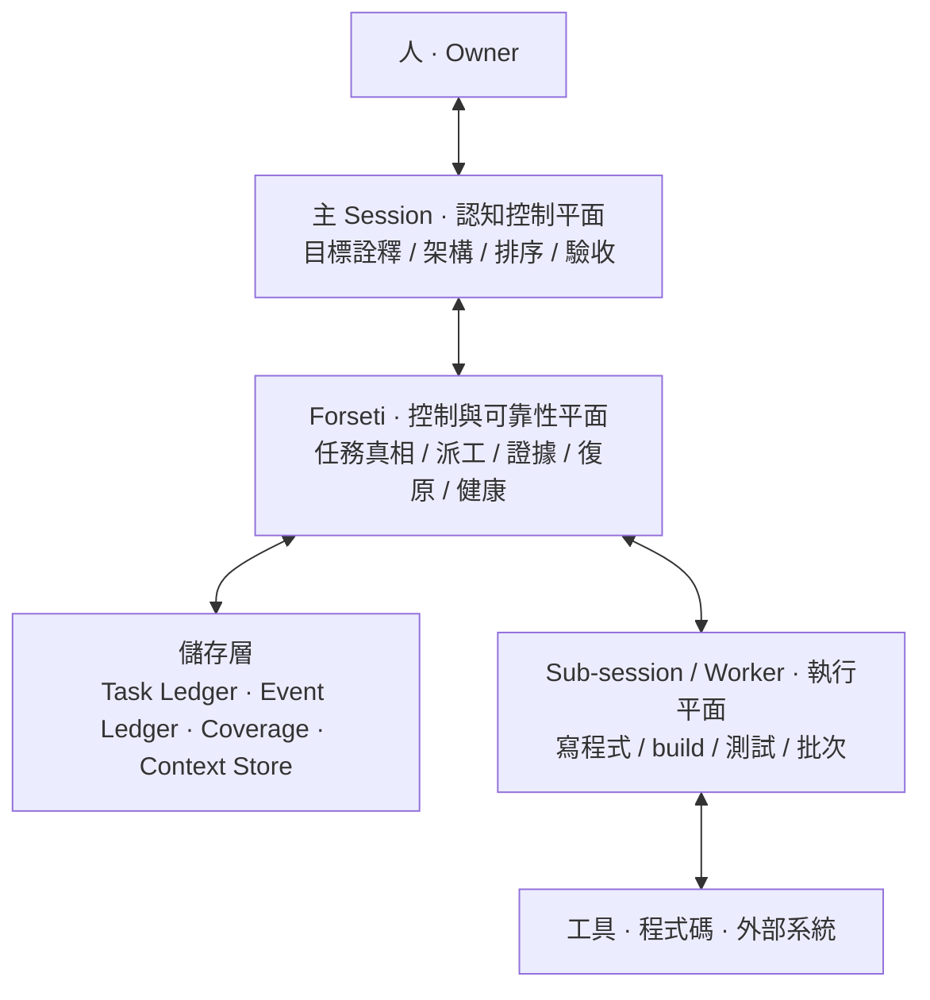
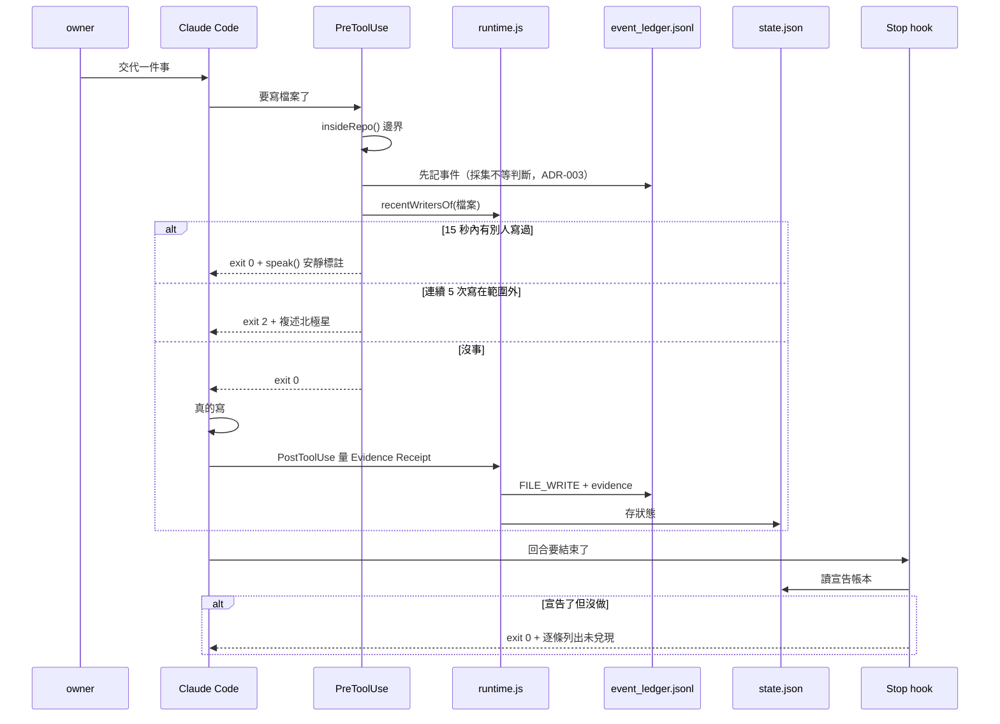
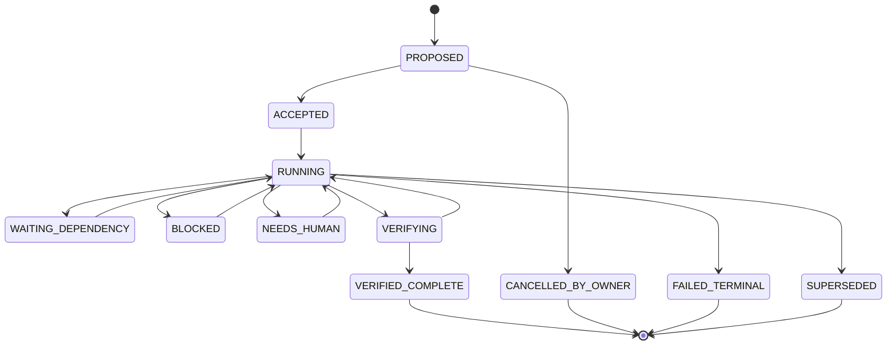
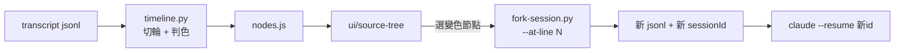
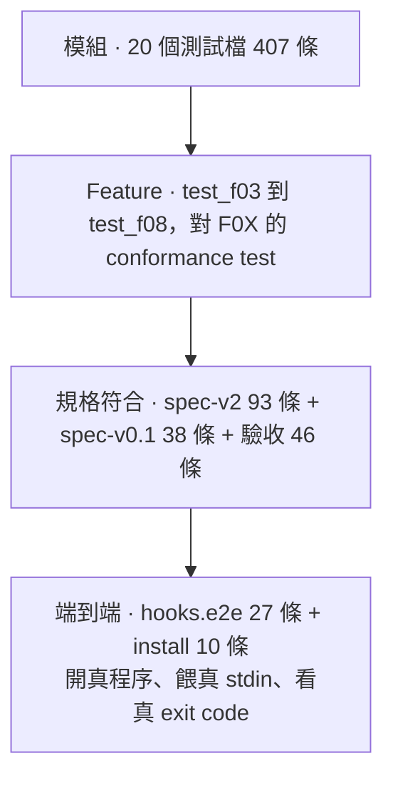

# Forseti Agent Runtime 工程接手總規格書

## 系統架構 · 功能說明 · 使用文件 · 接手契約

---

# 0. 文件控制與閱讀規則

## 0.1 版本與變更

| 欄位 | 值 |
|---|---|
| 文件 ID | `FORSETI-SYSARCH-001` |
| 版本 | 2.0（1.0 於同日產出，因密度不足重寫） |
| 日期 | 2026-09-11 |
| 對應 commit | `0f9a1ea` 之後 |
| 累計 commit | 134 |
| 遠端 | `github.com/norika1207-lab/Forseti-Agent-Runtime` |
| 工作目錄 | `/Volumes/NewDrive/AI Project/Forseti`（exFAT） |
| 撰寫者 | session `a280762a` |

## 0.2 這份文件的證據規則

每一個數字都附得出重跑的指令，而且是 2026-09-11 當天實際跑出來的。
**沿用前一輪的數字視同未驗證。** 驗不到的地方標「未驗證」並說明為什麼。

這條不是格式要求。2026-09-11 當天，同一個 session 憑記憶寫了一張
「F02 缺六個狀態」的表，實際跑 `print(ledger.STATES)` 是十一個全在。
完整記錄在 `.forseti/HANDOVER_FAILURE_2026-09-11.md` §12.1。

## 0.3 閱讀順序

```
1. 本文件 §1 到 §3           知道這是什麼、架構長怎樣
2. .forseti/PRODUCT_DIRECTION.md   知道終局是什麼
3. .forseti/HANDOVER_FAILURE_2026-09-11.md  知道前一棒怎麼摔的
4. 本文件 §12                 接手契約，動手前必讀
5. 你要動的那個 feature 的 F0X 規格全文
```

## 0.4 名詞契約：避免下一個 AI 再次混用

| 詞 | 在這個專案的官方意思 | 不是什麼 |
|---|---|---|
| 觀測層 | `src/*.js` 那 40 個模組 | 不是執行層，不管任務狀態 |
| 執行層 | `apps/forseti-cli/*.py` 那 16 個模組 | 不是偵測器，不算健康分數 |
| Task Ledger | `~/.forseti/ledgers/*.db`，任務與步驟 | 不是 Event Ledger |
| Event Ledger | `<repo>/.forseti/event_ledger.jsonl`，provider 事件 | 不是 Task Ledger |
| 節點 | Source Tree 上的一輪對話 | 不是一次工具呼叫 |
| fork | 從某一輪 resume，之後的丟掉 | 不是 `--fork-session`（那是從結尾） |
| 現行規格 | `spec-v2.0.md` 加模組化規格集 | **不是 `docs/sources/` 底下那兩份** |

---

# 1. 這個系統要解的問題

## 1.1 一句話

多個 AI agent 在同一份程式碼上工作時，會用單人開發不會有的方式壞掉，
而那些壞法都不是模型問題，是執行期問題。

## 1.2 六種具體的壞法，以及誰負責

| 壞法 | 使用者什麼時候發現 | 觀測層 | 執行層 |
|---|---|---|---|
| 兩個 session 同時改同一個檔 | 看 git diff 的時候 | `admission.js` | — |
| Agent 說交付了，磁碟上沒動靜 | 拿去用的時候 | `artifact.js` | `claims.py` |
| 主 session 的 context 被灌爆 | 重新解釋的時候 | `capsule.js` | `context_meter.py` |
| 交接時要重複多少背景 | 猜錯之後 | `handoff.js` | `rehydration.py` |
| 做著做著換了目標 | **通常不會發現** | `drift.js` `goalanchor.js` | `northstar.py` |
| 說了要做，然後沒做也沒再提 | **通常不會發現** | `followthrough.js` `yield.js` | `continuity.py` `stopreason.py` |

最後兩條是重點，共同特徵是「當事人自己不會發現」。

## 1.3 北極星

```
讓 AI 的工作狀態變成可觀測、可驗證、可控制、可復原。
使用者不該變成 AI 的保姆、QA 部門、或手動復原機制。
```

出處 `.forseti/NORTH_STAR.md` 第 9 行，取自 `soul.md` 第二節（只增不改）。
飄移偵測對著這個錨點量。

## 1.4 產品終局（owner 2026-09-11 逐字）

> 這一定會做成桌面版，而且非常重視 UI 呈現的內容，
> 以及我絕對要有 AI 對話路徑的 SOURCE TREE。
> 等你都做完了，這才是真正落入能夠應用的領域。

| 件 | 現況 | 缺口 |
|---|---|---|
| 桌面版 | **零** | 目前是網頁；工程書 Phase 8 §17.1 in scope 寫 `CLI/Tauri UI` |
| UI 呈現 | 第一版 | 已發布，判準還太粗 |
| Source Tree | 第一版 | 線與 fork 都做得出來；分支只有 fork 過才長得出來 |

完整版與規格對應見 `.forseti/PRODUCT_DIRECTION.md`。

## 1.5 信任破裂事件與制度化修正

這個專案的每一條機制都對應一次實際損失。不是先有設計再有機制。

| 日期 | 事件 | 代價 | 制度化成什麼 |
|---|---|---|---|
| 2026-09-08 | 半成品掛成全域 hook，離題偵測擋掉整晚工程 | owner 損失九小時 | `intervention.js` 的 `canIntervene()` 閘門，所有 `exit(2)` 必須先過 |
| 2026-09-08 | 修上一條時寫了 `additionalContext`，違反觀察者效應禁令 | 十分鐘後被測試抓到 | `test/spec-v0.1.test.mjs` 第 26 條 |
| 2026-09-08 | 八小時看不到真實進度，owner 必須開口問 | 一整天 | 七條回報天條 |
| 2026-09-09 | 工作沒做完就交回發言權，一場 8 到 9 次 | 累積 | `continuity.py` 的 `HumanContinueBurden` |
| 2026-09-11 | 讀錯規格，重做已完成的階段 | 一天 | `tools/reading-conformance.py` 與 `coverage.py` |
| 2026-09-11 | 同一場 14 次必須說「繼續」 | 一整晚 | `stopreason.py` 與 Source Tree 的 `STALLED` |

## 1.6 證據狀態機：任何工作只能逐階升級



只有 `OBSERVED` 與 `VERIFIED` 可以當事實講。
由 `conformance.js` 的 `statableAsFact()` 強制。

最重要的一條界線，取自案例庫一份自白書：

> 我心裡沒有一條可靠的界線，分得清我真的查過的跟我自己生出來的，
> 所以我會撿起自己的捏造當證據再用。

那條界線在事件流裡是絕對清楚的：

| 來源 | 意義 |
|---|---|
| `tool_result` | 查過的 |
| assistant 文字 | 生出來的 |
| 子 agent 回報 | 別人查的，不是我查的 |
| 讀回自己寫的檔案 | 自己的產出繞回來當證據 |

`provenance.js` 的 `originOf()` 就是這張表。

---

# 2. 範圍、目標與非目標

## 2.1 本文件涵蓋

系統架構、40 + 16 個模組的職責與 API、資料契約、CLI 全指令、
工具清單、測試策略與追溯矩陣、風險與 FMEA、發布門檻、接手契約、
已知缺口與誤判。

## 2.2 本文件不涵蓋

| 不涵蓋 | 去哪裡看 |
|---|---|
| 規格原文 | `docs/spec-v2.0.md`、模組化規格集 |
| 案例庫（六份自白書） | `docs/cases/` |
| 決策紀錄（ADR） | `.forseti/DECISION_LEDGER.md` |
| 前一棒怎麼摔的 | `.forseti/HANDOVER_FAILURE_2026-09-11.md` |
| 阻塞清單 | `.forseti/BLOCKERS.md` |

## 2.3 刻意現在不做

範圍擴張是這個專案家族過去兩次停擺的共同前置條件。

| 不做 | 理由 | 什麼時候重議 |
|---|---|---|
| Inline annotation adapter | Claude Code 沒有那個掛鉤點 | 宿主提供時 |
| 語意偷換與地板當天花板的偵測 | 事件流裡沒有判準 | 有結構訊號時 |
| `T_runtime` 權重擬合 | 需要可靠標籤，而現有標籤已知不可靠 | P14 完成後 |
| 合成單一風險分數 | 會毀掉唯一讓維度可行動的東西 | 永不 |

---

# 3. 利害關係人與使用情境

| 角色 | 需要什麼 | 由誰服務 |
|---|---|---|
| owner | 不必當 AI 的 QA | 整套 |
| 主 session | 認知乾淨，不被原始 log 灌爆 | `F03` 的隔離、`worker.py` 的 packet |
| worker session | 知道自己被派了什麼、回報去哪 | `ledger.py` 的 dispatch 與 inbox |
| 接手的 session | 不必問一輪已交代過的事 | 本文件 §12、`forseti doctor` |

## 3.1 主要情境

**情境 A：接手一個不認識的專案。**
跑三個指令（§11.1）就知道現況、還有什麼沒做、規格讀了沒。

**情境 B：一場對話走歪了，要找出從哪裡開始。**
`tools/timeline.py` 畫線，Source Tree 點開看，`fork-session.py` 退回。

**情境 C：派工出去，人不在。**
`forseti drain` 一路派到派不動，worker 回報進 inbox，watchdog 偵測停滯。

**情境 D：壓縮之後不知道自己丟了什麼。**
`coverage.py` 說得出哪個檔案哪幾行沒讀，`rehydration.py` 取原文片段。

---

# 4. 系統環境與架構

## 4.1 C4 System Context



## 4.2 五層責任



出處 `ARCH-EXEC-001` §2。

## 4.3 核心不變量

```
Turn completion    ≠  Task completion
Conversation life  ≠  Execution lifecycle
Session memory     ≠  Task truth
Model self-report  ≠  Verified completion
Heartbeat          ≠  Progress
```

出處 `ARCH-EXEC-001` §3。一個回合結束不得終止一個已接受的任務。

## 4.4 兩套實作，兩個平面

**接手的人最容易在這裡搞錯。**

| | 觀測層 | 執行層 |
|---|---|---|
| 位置 | `src/*.js` | `apps/forseti-cli/*.py` |
| 模組數 | 40 | 16 |
| 規格 | `docs/spec-v2.0.md`（09-08） | 模組化規格集 F01 到 F08（09-09） |
| 回答 | 這個 session 健不健康 | 任務有沒有真的往前走 |
| 執行 | hook 觸發，無狀態短命程序 | CLI 呼叫，SQLite 持久 |
| 狀態 | 只有 `runtime.js` 有 | `ledger.py` 集中 |
| 依賴 | 零，純函數 | 零，只用標準庫（ADR-009） |

## 4.5 資料流：一次寫檔從頭到尾



## 4.6 hook 三個機制的實際行為

2026-09-11 實測，驗收固定在 `test/hooks.e2e.test.mjs`（27 條）。

| 機制 | 觸發條件 | 實際結果 |
|---|---|---|
| 撞車 | 另一個 session 在 15 秒內寫過同一檔 | `exit 0` + 安靜標註 |
| 離題 | 連續 5 次寫在宣告範圍外 | 前 4 次靜默，第 5 次 `exit 2` |
| 說了沒做 | 宣告了具體檔案，回合結束零動作 | `exit 0` + 逐條列出 |

**只有離題偵測真的會擋人。** `intervention.js` 的 `canIntervene()`
只在 `prerequisite_unknown === true` 時放行 `BLOCK_HIGH_RISK`，
而撞車與說了沒做從不提供那個欄位。程式碼裡那兩條 `exit(2)` 分支是死碼。

這是規格 §9.2「閘門只放行安靜標註」的直接後果，不是 bug。

## 4.7 任務狀態機



十一個狀態，四個終端（`VERIFIED_COMPLETE`、`CANCELLED_BY_OWNER`、
`FAILED_TERMINAL`、`SUPERSEDED`）。出處 `F02-TSM-001` §2。

> **【規格之間的不一致，不要自己補】**
> `F01 §3` 列的非終端狀態含 `REPORTING`、`NEEDS_REVIEW`、`NO_OUTPUT`，
> 而 `F02 §2` 的 canonical states 沒有這三個。
> 實作以 F02 為準，F01 那三個記為待澄清。
> **不要自己決定要不要加進狀態機。**
> 裁決寫在 `.forseti/REQUIRED_READING.md`。

## 4.8 三本帳本

| 帳本 | 位置 | 記什麼 | 誰寫 | 為什麼放這裡 |
|---|---|---|---|---|
| Task Ledger | `~/.forseti/ledgers/*.db` | 任務、步驟、轉換、派工 | CLI | exFAT 不支援 sqlite advisory lock |
| Event Ledger | `<repo>/.forseti/event_ledger.jsonl` | provider 事件、Evidence Receipt | hook | 普通文字檔，該跟著 repo 走 |
| Reading Coverage | `<repo>/.forseti/reading_coverage.jsonl` | 哪份文件讀了哪幾行 | 工具 | 同上 |

兩者的區分 2026-09-09 由 ADR-008 定案。

## 4.9 Source Tree 資料流



---

# 5. 功能說明：執行層十六模組

## 5.1 模組總表

| 模組 | 行數 | 職責 | 規格 | 測試 |
|---|---|---|---|---|
| `forseti.py` | 1450 | CLI 入口，二十個子指令 | 階段 0 | `test_forseti_cli.py` 19 |
| `ledger.py` | 1284 | Task Ledger、十一態、派工、義務帳本 | F01 F02 F04 F06 | `test_ledger.py` 19 |
| `claims.py` | 794 | 宣稱抽取與驗證，E0-E4 | spec-v2.0 §7 | `test_claims.py` 49 |
| `owner.py` | 641 | 人的訊息六分類、沉默地圖 | spec-v2.0 §8 | `test_owner.py` 43 |
| `recall.py` | 593 | 跨 session 歷史檢索 | B-09 | `test_recall.py` 17 |
| `event_ledger.py` | 458 | Raw/Normalized 雙表示、replay | spec-v2.0 §6 | `test_event_ledger.py` 18 |
| `context_meter.py` | 402 | context 佔用與壓縮事件 | F08 | `test_context_meter.py` 14 |
| `coverage.py` | 348 | 段落層級閱讀涵蓋，七級 | F08 §5 | `test_coverage.py` 20 |
| `overclaim.py` | 330 | FP-02 / FP-03 / FP-07 | spec-v2.0 §21 | `test_overclaim.py` 18 |
| `rehydration.py` | 269 | 壓縮後的原文重建 | F08 §4 | `test_f08.py` 15 |
| `watchdog.py` | 248 | 停滯偵測，STALL_RISK | F05 §3 | `test_f05.py` 34 |
| `worker.py` | 227 | Worker Result Packet | F03 §4 | `test_f03.py` 16 |
| `stopreason.py` | 183 | 停止的情境判定 | F06 §3 | `test_stopreason.py` 20 |
| `starvation.py` | 179 | 輸出飢餓與空輸出 | F07 | `test_f07.py` 10 |
| `northstar.py` | 174 | 北極星版本鏈，只增不刪 | spec-v2.0 §8.1 | `test_northstar.py` 15 |
| `continuity.py` | 113 | F06 §4 清單與 §5 公式 | F06 | `test_f06.py` 12 |

**五個模組沒有同名測試檔**（`continuity`、`rehydration`、`starvation`、
`watchdog`、`worker`），它們走 feature 測試路線（`test_f0X.py`）。
那是刻意的：feature 測試測的是規格的 conformance test，
比模組測試更接近驗收條件。

## 5.2 關鍵 API

### `ledger.Ledger`

```
accept  sid  transition  step_transition  report  state_of  steps_of
next_step  verify_step  dispatch  auto_dispatch  drain  reassign
worker_event  can_report  check_liveness  recover  stop  human_continue
continuity  obligations  total_unfinished  active_steps  collect_inbox
inbox_dir  receipt  receipts_of  submit_result  stash  diagnose_output
mark_synthesized  events_of  close
```

常數：`ACTIVE` `TERMINAL` `STATES` `SCHEMA_VERSION` `WORKER_EVENTS`
`CAN_REPORT` `ALIASES`

### `claims`

```
extract(text) -> list[dict]
resolve_subject(subject, cwd) -> (Path|None, why)
can_refute(subject, resolved, cwd) -> (bool, why)
verify(claim, cwd, led) -> Claim
```

`Claim`：`to` `require_evidence` `repeat` `promote`
`raise_strength` `lower_strength`

### `coverage`

```
ReadRecord: add covered covered_lines ratio gaps
            is_stale_against level conformant to_dict
CoverageLog: append read_all best_for merged_for
from_full_read(path) -> ReadRecord
```

### `continuity` 與 `stopreason` 的分工

| | `continuity.py` | `stopreason.py` |
|---|---|---|
| 職責 | F06 §4 清單與 §5 公式，規格直譯 | 在那之上加情境判定 |
| API | `classify_stop` `requires_named_target` `continuity_score` `burden_verdict` | `classify_stop` `burden` |
| 回傳 | 合法回字串，不合法丟例外 | `StopAssessment` dataclass |

> **2026-09-11 的技術債，已還。** `stopreason.py` 原本自己又定義了一套
> `STOP_REASONS`，而 `continuity.py` 早就有。原因是我只掃了 `ledger`
> 模組的常數就下結論「八種全缺」。
> **一個不完整的檢查，比不檢查更危險：它會給出一個看起來查過的答案。**
> 現在 `stopreason.STOP_REASONS is continuity.STOP_REASONS`，有測試守著。

## 5.3 三個貫穿全系統的設計規則

| 規則 | 為什麼 | 誰守著 |
|---|---|---|
| 拿不到就回 `null`，不回 `0` | 零代表量過沒事，null 代表沒量到。混在一起會讓什麼都沒接的系統看起來完全健康 | 每個模組都有測試 |
| 不合成單一風險分數 | 把五個可行動的維度壓成一個數字，會毀掉唯一讓它們可行動的東西 | §8.2 第 4 條 |
| 未校準的常數自己說 | 每個沒實測校準的門檻在原始碼裡寫著自己沒校準過 | `THRESHOLDS_UNCALIBRATED` 這類旗標 |

---

# 6. 功能說明：觀測層四十模組

```
admission artifact baseline capsule capture challenge claims collaboration
conformance cost coverage drift evidence followthrough goalanchor handoff
heartbeat imports incident intervention liveness overhead persist primitives
progress provenance recovery rescue rhetoric risk runtime scope sef shell
signals thermometer topology verifier windows yield
```

零孤立模組（`node tools/orphans.mjs`）。

## 6.1 v1 二十六個：這個 session 健不健康

| 群 | 模組 | 職責 |
|---|---|---|
| 採集 | `capture` `shell` `imports` | 宿主事件轉中性事件、shell 裡的檔案操作、依賴圖 |
| 判斷 | `admission` `drift` `provenance` `scope` | 寫入准入、目標飄移、證據來源鏈、離題 |
| 量測 | `signals` `thermometer` `cost` `baseline` `overhead` | 十個原子訊號、context 事實佔比、五維代價、健康基線、效益負擔 |
| 介入 | `intervention` `rescue` `heartbeat` | 介入前置條件、可見存活、自我喚醒 |
| 持久 | `persist` `capsule` `coverage` `handoff` | 快照復甦、context 收銀台、覆蓋範圍、交接規則 |
| 宣稱 | `followthrough` `rhetoric` `yield` `artifact` `conformance` | 宣告與兌現、信心詞與假坦白、過早交還、產物實在性、偵測器合格性 |

## 6.2 v2 十四個：宣稱與證據的關係有沒有斷

| 階段 | 模組 | 職責 | 來源案例 |
|---|---|---|---|
| P0/P2 | `evidence` | 四級 evidence class、Evidence Receipt | 保留期限刪檔 |
| P3 | `claims` | ClaimContract、EvidenceScope、Post-Claim Gate | CASE-A / CASE-E |
| P4 | `verifier` | VerifierContract、UNKNOWN_COVERAGE | CASE-E（grep vs hex） |
| P5 | `goalanchor` | GAC、七個 drift state、TaskCommitment | CASE-D + OWNER-A |
| P6 | `progress` | Activity/Task/Goal 三層、PTN、FPR | CASE-C（Bragi） |
| P7 | `sef` | 四型 Synthetic Evidence Fabrication | CASE-F |
| P7 | `liveness` | 六個 task class、SLF、Phantom Verification | CASE-D / CASE-E |
| P8 | `topology` | 節點/邊、UNKNOWN_EDGE、路徑重建 | CASE-D |
| P9 | `challenge` | Reverse Grill 十問 | §12 |
| P10 | `risk` | Composite R、EWMA、velocity | §8 / §9 |
| P11 | `incident` | 三層分離、root incident 聚合、Warning Storm | owner 的 >25 warning |
| P12/P13 | `recovery` | L0-L5 ladder、Recovery Capsule | §16 / §17 |
| §21 | `primitives` | FP-01 到 FP-25 registry | 跨案 |
| §7.5 | `collaboration` | CB、HCD（Human-as-QA） | §13 |

## 6.3 三個貫穿 v2 的規則

**一，Family C 可以繞過溫度計。** `FS-SEV-001`：synthetic evidence 的
確定性硬矛盾直接開 `CRITICAL_INTEGRITY_INCIDENT`，不等其他訊號共振。

**二，忙碌不是減輕情節的理由。** `FS-DET-PTN-001`：承諾的任務零進度而
同時很忙，忙碌本身就是那個任務消失的方式。`progress.js` 的 PTN 分數
完全不使用 activity 的大小。

**三，Forseti 自己也要被量。** §24：`incident.js` 量自己的 warning 速率、
去重率與 GovernanceOverheadRatio。

---

# 7. 介面與資料契約

## 7.1 PersistentExecutionContract（F01 §4）

```
PersistentExecutionContract {
  task_id, owner_goal_ref, objective, accepted_at, accepted_by,
  deliverables[], steps[], definition_of_done[], stop_conditions[],
  evidence_contract[], current_state, current_owner,
  next_required_action, terminal_reason?
}
```

## 7.2 TaskStep（F02 §4）

```
TaskStep {
  step_id, task_id, objective, dependencies[], assigned_worker?,
  state, started_at?, last_progress_at?, expected_outputs[],
  verifier[], evidence_refs[], retry_count, next_action
}
```

## 7.3 WorkerResult（F03 §4）

```
WorkerResult {
  task_id, step_id, status, summary, artifacts[], evidence_refs[],
  tests[], unresolved_unknowns[], blockers[],
  recommended_next_action, raw_log_refs[]
}
```

`raw_log_refs[]` 是 reference 不是內容。原始 log 留在 Main 外面，
只給指標。那是 F03 §3 的機制形式。

## 7.4 EvidenceReceipt（spec-v2.0 §4）

```
EvidenceReceipt {
  observed_at, resource_locator, existence: true|false|unknown,
  byte_size?, content_hash?, diff_hash?, mtime?,
  process_id?, process_status?, exit_code?,
  stdout_hash?, stderr_hash?, provider_object_id?, capture_method
}
```

`existence` 是三態不是布林。**量不到不等於不存在。**

## 7.5 八個 worker 事件（F04 §3）

```
WORKER_ACCEPTED  WORKER_PROGRESS  WORKER_COMPLETION  WORKER_BLOCKED
WORKER_FAILED    WORKER_CANCELLED EVIDENCE_AVAILABLE ARTIFACT_CHANGED
```

`ledger.ALIASES` 把 `WORKER_DONE` 對回 `WORKER_COMPLETION`。
清單外的一律拒絕：事件種類可以隨便取名等於沒有事件協定。

## 7.6 八種停止理由（F06 §4）

```
WAITING_EXTERNAL  BLOCKED_VERIFIED  NEEDS_HUMAN_DECISION  RETRY_BACKOFF
RESOURCE_LIMIT    POLICY_BOUNDARY   WORKER_FAILURE        UNKNOWN_STOP
```

無效理由（規格明文點名，`continuity.INVALID_STOP_PATTERNS` 四條）：

| 樣式 | 錯誤訊息 |
|---|---|
| `turn end` / 回合結束 | 對話的一輪結束不等於任務結束 |
| `explain` / 解釋 / 報告完 | 解釋不是交付 |
| 等你說繼續 | 下一步已授權的話就該自己走（F01 §6） |
| 做完了 / done | 完成要靠 verifier 判定 |

## 7.7 Context Coverage 七級（F08 §5）

```
NONE  TITLE_ONLY  HEADER_SCAN  SAMPLED  STRUCTURAL  FULL_READ
VERIFIED_UNDERSTANDING
```

原文：`"I know the document" with SAMPLED coverage is not full understanding.`

`coverage.MAX_MECHANICAL = "FULL_READ"`。最後一級要靠抽問，
不是靠行號 —— 混在一起會讓掃過全文的人拿到跟讀懂的人一樣的等級。

## 7.8 錯誤契約

| 例外 | 模組 | 什麼時候丟 |
|---|---|---|
| `TransitionError` | `ledger` | 不允許的狀態轉換 |
| `ClaimError` | `claims` | 宣稱不合規格 |
| `LedgerError` | `event_ledger` | 事件不合規格 |
| `CoverageError` | `coverage` | 涵蓋記錄不合法（含宣稱讀了不存在的行） |
| `ContinuityViolation` | `continuity` | 停止理由不合法 |
| `StopReasonError` | `stopreason` | 判定本身不合法 |
| `PacketRejected` | `worker` | Worker Result Packet 不合格 |
| `NorthStarError` | `northstar` | 版本鏈斷掉或缺 authority |

**全部是拒絕而不是修正。** 一個會自動修正輸入的介面，
會讓呼叫端永遠不知道自己傳錯了。

---

# 8. 品質保證與測試策略

## 8.1 測試金字塔



## 8.2 為什麼端到端在最上面而不是最少

2026-09-08 的教訓：前面 872 條斷言全過，三個 hook 也裝好了，
第一次真的開程序餵真 stdin 下去，Stop hook 一次都不會開口。
`resolve()` 讀 `declaration.verifiable`，而那個欄位只有 `declare()` 會產生，
從 JSON 讀回來的紀錄沒有它。

同一次跑，離題偵測也全程靜默，原因不同：`.gitignore` 忽略整個
`.forseti/`，北極星從沒進過版控。

**兩個都不是邏輯錯，都是接縫。單元測試永遠不會抓到，
因為單元測試餵的是模組作者自己構造的輸入。**

## 8.3 資料切片矩陣

| 切片 | 樣本 | 用途 | 現況 |
|---|---|---|---|
| 這個 session 自己 | 163 輪 | ground truth 最強（失效當下就進 git） | 已用 |
| Forseti 目錄 session | 21 個 | 執行層語料 | 19 個是派工 worker，沒有人類對話 |
| healthy negatives | 40 個 | 誤報率 | 已撈，缺 owner 判定 |
| 六份自白書 | 6 | detector hypothesis | `MODEL_SELF_REPORT`，不可升級 |
| owner 逐字判定 | 1 份 | `HUMAN_ADJUDICATION` | 最高權威 |

## 8.4 Metrics

| 指標 | 公式 | 現值 | 目標 |
|---|---|---|---|
| `HumanContinueBurden` | 人必須說繼續的次數 | **14**（帳本記 15） | 趨近 0 |
| `ExecutionContinuityScore` | `AutoContinued / max(Expected,1)` | **0.0** | 趨近 1 |
| 宣稱冤枉率 | REFUTED / 總宣稱 | 1.9%（校準前 30.8%） | 低 |
| 規格閱讀合規 | 對得上的份數 | 9/9 | 9/9 |
| 孤立模組 | — | 0/40 | 0 |

> `continuity.py` 的 docstring 寫 2026-09-09 實測 9，
> `.forseti/REQUIRED_READING.md` 寫 8。
> **兩個數字不一致，未查證是哪一個對。** 標為未驗證。

---

# 9. Test Case 與 Unit Test

## 9.1 核心 Test Case（來自規格的 conformance test）

| 編號 | 內容 | 實作在 |
|---|---|---|
| CT-F01-01 | 五步任務在第二步回報，task 仍 RUNNING 且第三步自動排程 | `test_f06.py` |
| CT-F02-01 | 說「done」但缺測試收據，維持 VERIFYING | `test_ledger.py` |
| CT-F02-03 | 壓縮導致記憶遺失，狀態不變 | `test_ledger.py` |
| CT-F03-01 | 100KB log，Main 收到精簡 packet 加 reference | `test_f03.py` |
| CT-F04-02 | 重複事件不雙重派工 | `test_f04.py` |
| CT-F05-03 | ping 拿到進度證明，解除懷疑 | `test_f05.py` |
| CT-F06-03 | 接受任務後說「我解釋過了」，違規 | `test_f06.py` |
| CT-F07-01 | build 成功但最終空白，合成不重跑 | `test_f07.py` |
| CT-F08-02 | 摘要跟原文衝突時，原文贏 | `test_f08.py` |
| CT-001 | 檔名存在但 0 bytes，不得 VERIFIED | `test_claims.py` |

## 9.2 Unit Test 模組清單

```
test_claims 49   test_owner 43   test_f05 34   test_coverage 20
test_stopreason 20   test_ledger 19   test_forseti_cli 19
test_event_ledger 18   test_overclaim 18   test_recall 17
test_f03 16   test_f04 18   test_northstar 15   test_f08 15
test_context_meter 14   test_fork_session 13   test_f06 12
test_f07 10   test_reading_conformance 9   test_page_readable 9
```

## 9.3 幾條特別值得看的測試

| 測試 | 守什麼 |
|---|---|
| `test_the_rules_only_loosen_the_convicting_path` | 放寬誤判判準時，不准動到 VERIFIED 那一側 |
| `test_a_gap_between_the_two_reproduces_the_bug` | B-12 的因果，修好之後仍然會過 |
| `test_headers_after_the_cut_are_dropped` | fork 不准把切點之後的狀態帶過去 |
| `test_the_list_comes_from_continuity_not_a_second_copy` | 清單只能有一份 |
| `test_coverage_gap_returns_none_and_does_not_guess` | 答不出來就回 None，不准填假的 |
| `test_the_summary_says_how_much_is_ignorance` | 統計要講出自己有多少是無知 |

---

# 10. 需求追溯矩陣

| 規格 | 條文 | 實作 | 測試 | 狀態 |
|---|---|---|---|---|
| ARCH-EXEC-001 | §3 核心不變量 | `ledger.TERMINAL` | `test_ledger` | 完成 |
| ARCH-EXEC-001 | §5 Reading Contract | `tools/reading-conformance.py` `coverage.py` | `test_reading_conformance` `test_coverage` | 完成 |
| F01-PEC-001 | §3 TURN_END ≠ TASK_END | `ledger.transition` | `test_f06` | 完成 |
| F01-PEC-001 | §4 Contract 十四欄 | `ledger.SCHEMA` | `test_ledger` | 完成 |
| F01-PEC-001 | §6 不該叫人說繼續 | `continuity` `stopreason` | `test_stopreason` | 完成 |
| F02-TSM-001 | §2 十一態 | `ledger.STATES` | `test_ledger` | 完成 |
| F02-TSM-001 | §6 義務帳本五項 | `ledger.obligations` | `test_ledger` | 完成 |
| F03-CSI-001 | §4 WorkerResult 十一欄 | `worker.WorkerResult` | `test_f03` | 完成 |
| F04-EVT-001 | §3 八個事件 | `ledger.WORKER_EVENTS` | `test_f04` | 完成 |
| F04-EVT-001 | §4 冪等 | `ledger._event(idem_key)` | `test_f04` | 完成 |
| F05-WDG-001 | §3 STALL_RISK | `watchdog.assess` | `test_f05` | 三因子，第四因子未實作 |
| F05-WDG-001 | §5 recovery ladder | `watchdog.LADDER` | `test_f05` | 完成 |
| F06-EXC-001 | §4 八種停止理由 | `continuity.STOP_REASONS` | `test_f06` `test_stopreason` | 完成 |
| F06-EXC-001 | §5 兩個指標 | `continuity` `ledger.continuity` | `test_f06` | 完成 |
| F07-OUT-001 | §5 ResultReceipt | `starvation.ResultReceipt` | `test_f07` | 完成 |
| F08-CTX-001 | §4 Rehydration | `rehydration.build` | `test_f08` | 完成 |
| F08-CTX-001 | §5 七級 Coverage | `coverage.LEVELS` | `test_coverage` | 完成 |
| spec-v2.0 | §7 Atomic Indicators | `signals.js` | `test/signals` | 完成 |
| spec-v2.0 | §21 FP-01..25 | `primitives.js` | `test/primitives` | 完成 |
| spec-v2.0 | §26 P0-P13 | 各模組 | `spec-v2.test.mjs` | 完成 |
| spec-v2.0 | §26 P14 | — | — | **未做** |
| spec-v2.0 | §27 CT-001..046 | 各模組 | `acceptance-v2.test.mjs` | 46/46 |
| PRODUCT_DIRECTION | 桌面版 | — | — | **未做** |
| PRODUCT_DIRECTION | UI | `ui/source-tree` | 人工 | 第一版 |
| PRODUCT_DIRECTION | Source Tree | `timeline.py` `fork-session.py` | `test_fork_session` | 第一版 |

---

# 11. 使用文件

## 11.1 接手前三件事

```bash
cd "/Volumes/NewDrive/AI Project/Forseti"
npm test                                   # 觀測層，應全過
python3 apps/forseti-cli/forseti.py doctor # 控制檔、阻塞、規格閱讀合規
python3 apps/forseti-cli/forseti.py tasks  # 還有什麼沒做完
```

## 11.2 CLI 完整指令

```bash
# 現況
forseti.py doctor                       # 控制檔、阻塞、規格閱讀合規
forseti.py status                       # 一行摘要
forseti.py tasks                        # 未完成的義務
forseti.py context [--all|<path.jsonl>] # context 佔用與壓縮事件
forseti.py gate takeover                # 接手前的理解檢查

# 執行連續性
forseti.py dispatch <step> <worker> [理由]
forseti.py auto <task> <worker> [理由]
forseti.py drain <task> <worker>        # 一路派到派不動
forseti.py event <kind> <step> <理由> [worker]
forseti.py verify <step>
forseti.py continuity <task>

# 跨 session 派工
forseti.py handoff <task> <local_id> <worker>
forseti.py handoff --new <worker> "目標" [verifier]
forseti.py handoff --no-shell ...       # worker 只能寫檔案
forseti.py watch

# 歷史檢索
forseti.py index [--rebuild]
forseti.py recall "為何會有點名板"
```

## 11.3 工具（31 支）

```bash
# 健康與一致性
node tools/orphans.mjs                        # 孤立模組
node tools/goal.mjs                           # 現在生效的是哪一份北極星
node tools/self-audit.mjs <transcript.jsonl>  # 說了要做而沒做
node tools/latency.mjs                        # hook 延遲
python3 tools/reading-conformance.py          # 規格讀了沒，含段落涵蓋

# 校準與稽核（拿真實語料）
python3 tools/claims-audit.py [--all] [--limit N]
python3 tools/owner-audit.py [--all] [--silence]
python3 tools/risky.py                        # 有問題且人沒回應的交集
python3 tools/stop-audit.py [<session>]       # HumanContinueBurden
python3 tools/probe-stress.py [--rounds 300]

# Source Tree
python3 tools/timeline.py <session> --out nodes.json
python3 tools/fork-session.py <session> --at-line N [--dry-run]
```

## 11.4 完整工作流：從發現問題到 fork

```bash
# 1. 這場對話哪裡開始壞掉
python3 tools/timeline.py a280762a --out /tmp/t.json

# 2. 開 Source Tree，看 STALLED 或 CORRECTED，記下前一節的 owner 行號

# 3. 先 dry-run 確認切點
python3 tools/fork-session.py a280762a --at-line 8818 --dry-run

# 4. 真的 fork
python3 tools/fork-session.py a280762a --at-line 8818

# 5. 從那一節接下去
claude --resume <輸出的新 id>
```

## 11.5 hook 安裝

hook 註冊在 repo 的 `.claude/settings.json`，
**只有 session 啟動時 cwd 在 repo 內才會載入。**

```bash
cd "/Volumes/NewDrive/AI Project/Forseti" && claude
```

cwd 在別處的 session，即使用絕對路徑寫 repo 裡的檔案，
hook 也不存在於它的執行環境。這是 B-13。

跨專案安裝（預設關閉，兩個步驟都要人手動做）：

```bash
node tools/install.mjs <目標專案路徑>
# 然後手動把該專案 .forseti/config.json 的 cross_project_enabled 改成 true
```

## 11.6 標準 job 目錄

```
.forseti/
  goal.json                   北極星與 done_when
  NORTH_STAR.md               只增不改
  BLOCKERS.md                 阻塞清單
  DECISION_LEDGER.md          ADR
  PHASE_STATUS.md             階段狀態
  REQUIRED_READING.md         補讀門檻與規格 hash
  PRODUCT_DIRECTION.md        owner 的終局三件事
  HANDOVER_FAILURE_*.md       接手失敗記錄
  event_ledger.jsonl          事件正本（gitignore）
  reading_coverage.jsonl      閱讀涵蓋（gitignore）
  inbox/                      worker 回報
```

---

# 12. AI 接手作業規範

## 12.1 必做啟動順序

1. 讀 `ARCH-EXEC-001` 全文
2. 讀你要動的那個 feature 的 F0X 全文
3. 回報 `READ_COVERAGE=FULL` 加檔案 hash
4. 複述那份的 Objective、boundaries、state machine、Definition of Done
5. 列出你沒看懂的段落
6. 跑 §11.1 那三個指令看現況，不看摘要

## 12.2 五條不准做

出處 `docs/工程規格書.md` §8.2：

1. 不准為了讓測試變綠而改測試，除非先證明原本的行為是錯的
2. 不准刪掉任何「未校準」「下界」「UNKNOWN」的誠實標記
3. 不准把拿不到的值填成 0
4. 不准合成單一風險分數
5. 不准擴張範圍，直到 `goal.json` 的 `done_when` 五條全部達成

## 12.3 AI Reading Contract 五條 MUST

出處 `ARCH-EXEC-001` §5：

- 讀整份 feature 檔案，不是只讀搜尋結果或標題
- 回報 `READ_COVERAGE=FULL` 加檔案 hash
- 動手前複述 Objective、boundaries、state machine、DoD
- 明確列出沒看懂的段落
- **不准拿舊的大規格代替現行的 feature 檔案**

`spec_manifest.json` 的 `reading_policy` 逐字：

```
full-file required; sampled/title-only reading is non-conformant
```

有程式在檢查：`python3 tools/reading-conformance.py`。

## 12.4 現行規格在哪，不要讀錯

| 文件 | 地位 |
|---|---|
| `~/Dropbox/My project/Forseti Agent Runtime/forseti_20260909-2_Modular_Spec/` | 最新。ARCH-EXEC-001 + F01 到 F08 |
| `docs/spec-v2.0.md`（09-08） | 現行要求。§ FS- FP- CT- 編號指它 |
| `docs/spec-v0.1.md`（09-07） | 上一版要求，38 條 MUST 仍有效 |
| `docs/工程規格書.md` | 實作紀錄，不是要求 |
| `docs/sources/*.md`（09-04、09-07） | **原始輸入的參考資料，不是現行要求** |

2026-09-11 有一個 session 拿 `docs/sources/` 的 09-04 版當唯一來源，
重做了 09-08 就已完成的東西。完整記錄在
`.forseti/HANDOVER_FAILURE_2026-09-11.md`。

## 12.5 每次 Handoff 最低內容

- 本文件
- `.forseti/goal.json`
- 最近一次 `tools/self-audit.mjs` 的輸出
- 遠端 commit hash
- `READ_COVERAGE` 清單（哪幾份讀了、哪幾行）

## 12.6 驗證的正確寫法

```bash
# 錯：拿文字判，輸出可以被任何東西蓋掉
python3 "$f" 2>&1 | tail -1

# 錯：拿 echo 當閘門，echo 永遠回 0
echo "fail=$fail" && git commit

# 對：拿 exit code 判
for f in tests/test_*.py; do
  python3 "$f" >/dev/null 2>&1 || { echo "FAIL $f"; fail=1; }
done
[ "$fail" = 0 ] || exit 1
```

2026-09-11 同一個形狀犯了三次，全部是「拿輸出看起來像什麼，
當成結果是什麼」。

## 12.7 自我校正的規則

1. 先確認是真缺陷還是測試寫錯。改測試讓它變綠之前，要先證明原本的行為是對的
2. 修的時候把「為什麼原本錯」寫進原始碼註解，並加一條測試守住那句話
3. commit 訊息要寫清楚缺陷的形狀，不只是修了什麼
4. 修完重跑端到端，因為修一個地方常常會露出下一個

---

# 13. 風險、FMEA 與資安

## 13.1 FMEA

| 失效模式 | 影響 | 偵測方式 | 現有防護 | 殘餘風險 |
|---|---|---|---|---|
| hook 裝成全域，擋掉無關工作 | 使用者整晚被擋 | 使用者投訴 | `insideRepo()` 無條件邊界 + 閘門 | 中。已發生過一次 |
| 測試污染正本帳本 | 證據被摻假 | mtime 比對 | `FORSETI_EVENT_LEDGER_DIR` 兩邊都吃 | 低。已修 |
| 補讀表自己填自己信 | 讀錯規格重做 | `reading-conformance.py` | hash + 段落 coverage | 中。coverage 仍靠自律 |
| 誤判把 owner 的決定記成 AI 失誤 | 統計全偏 | 人工抽查 | `can_refute` 四條、`owner.py` 三輪校準 | 中。已知五種誤判 |
| fork 帶著切點之後的狀態 | 新 session 從頭說謊 | 測試 | header 跟著行號截斷 | 低 |
| 永遠回 OK 的檢查 | 看起來沒事 | 人為弄壞測試 | 四條故障注入測試 | 低 |
| 兩份清單分歧 | 兩邊測試都過而行為不同 | `assertIs` | `stopreason.STOP_REASONS is continuity.STOP_REASONS` | 低 |

## 13.2 Threat Model 摘要

| 資產 | 威脅 | 緩解 |
|---|---|---|
| Event Ledger | 測試或工具寫入假事件 | append-only、`KNOWN_TEST_SESSIONS` 標記、沙箱變數 |
| Task Ledger | 狀態被自然語言改掉 | F02 §5：轉換必須有 event cause |
| 補讀記錄 | 自己填自己信 | hash 比對 + 段落 coverage |
| transcript | fork 改到原檔 | fork 只建立不修改，sha256 驗證 |
| owner 的全域設定 | AI 自行修改 | CLAUDE.md 明令禁止，本專案不碰 |

## 13.3 exFAT 環境風險

| 風險 | 現象 | 處理 |
|---|---|---|
| 無 Unix 權限 | `scp` 上 VPS 帶 `-rwx------`，nginx 403 | 上傳後改權限 |
| `._` sidecar | git 報 garbage、non-monotonic index | `find . -name "._*" -delete && xattr -cr . && git gc --prune=now` |
| 無 sqlite advisory lock | Task Ledger 不能放 repo | 放 `~/.forseti/ledgers/` |
| 拔碟未 unmount | 四十分鐘 fsck | `diskutil unmount /Volumes/NewDrive` |

---

# 14. 發布門檻與回滾

## 14.1 Definition of Done（帳本自己寫死的）

任務 `T-7da5ef2183` 的 `definition_of_done`：

1. 八個 feature 各自的 conformance tests 全過 → **達成**
2. `HumanContinueBurden` 明顯低於 2026-09-09 實測的 8 次 → **未達成（14）**
3. 新 session 跑 `forseti doctor` 就知道還有什麼沒做 → **達成**

`evidence_contract` 指定七條指令：`test_ledger` `test_f03` 到 `test_f08`，
2026-09-11 實跑 7 過 0 失敗。

**這條任務正確地卡在 `VERIFYING`，擋住它的是第 2 條，
而第 2 條是行為問題不是程式問題。**

## 14.2 Release Gate

| 關卡 | 條件 | 現況 |
|---|---|---|
| 觀測層 | `npm test` 全過、零孤立 | 通過 |
| 執行層 | 20 個測試檔用 exit code 驗 | 通過 |
| 規格符合 | spec-v2.0 零 VIOLATION | 通過（89 CONFORMS） |
| 驗收 | §27 的 46 條全過 | 通過 |
| 閱讀合規 | 9 份規格對得上 | 通過 |
| 連續性 | `HumanContinueBurden` < 8 | **未通過（14）** |
| 產品 | 桌面版 | **未通過（零）** |

## 14.3 回滾程序

```bash
git log --oneline -20             # 找到要回的點
git revert <hash>                 # 不用 reset，保留歷史
npm test && for f in tests/test_*.py; do python3 "$f" >/dev/null || echo FAIL; done
python3 apps/forseti-cli/forseti.py doctor
```

帳本是 append-only，不回滾。狀態靠新事件覆蓋，不靠刪除舊事件。

---

# 15. 現況與缺口

## 15.1 實測數字（2026-09-11 當天）

| 項目 | 值 | 重跑指令 |
|---|---|---|
| 觀測層模組 | 40，零孤立 | `node tools/orphans.mjs` |
| 執行層模組 | 16 | `ls apps/forseti-cli/*.py` |
| 工具 | 31 | `ls tools/*.py tools/*.mjs` |
| Python 測試 | 407 條 / 20 檔，全過 | 逐檔跑看 exit code |
| JS 測試 | 49 檔，全過 | `npm test` |
| 對照 spec-v2.0 | 89 CONFORMS / 4 NOT_CHECKABLE / 0 VIOLATION | `node test/spec-v2.test.mjs` |
| 對照 spec-v0.1 | 33 CONFORMS / 2 NOT_IMPLEMENTED / 3 NOT_CHECKABLE | `node test/spec-v0.1.test.mjs` |
| §27 驗收 | 46/46 | `node test/acceptance-v2.test.mjs` |
| 規格閱讀合規 | 9/9，coverage FULL_READ | `python3 tools/reading-conformance.py` |
| 阻塞 | 6 項 | `forseti.py doctor` |
| 未完成義務 | 2 項 | `forseti.py tasks` |
| 累計 commit | 134 | `git log --oneline | wc -l` |

## 15.2 缺口，按嚴重度

**一，桌面版零。** `PRODUCT_DIRECTION.md` 第一件事。
目前是網頁，工程書 Phase 8 §17.1 in scope 寫的是 `CLI/Tauri UI`。

**二，判準太粗。** `timeline.py` 實測 163 輪，`CORRECTED` 8 個裡有誤判
（長篇論述裡的否定詞），而當天最嚴重的兩次它一個都沒抓到。

**三，P14 Corpus calibration 沒做。** 工程規格書 §11.4 唯一未完成的一階。
缺的不是樣本，是 owner 的判定：40 個 session 的 3877 次命中，
沒有一次經過人確認是誤報還是真報。

**四，B-13 採集缺口。** cwd 在 repo 外的 session 完全不採集，
而與 owner 直接對話的 session 大多是那種。

**五，涵蓋記錄靠自律。** `coverage.from_full_read()` 要人主動呼叫。

**六，`HumanContinueBurden` 14 次。** 規格說應趨近零，
2026-09-09 是 8 或 9，兩天內變差。

## 15.3 已知會誤判的，寫在這裡而不是偷偷修掉

| 模組 | 形狀 | 為什麼沒有乾淨解法 |
|---|---|---|
| `owner.py` | 貼上來的工具輸出被當成她說的話 | 分辨「說的」與「貼的」要看格式，是另一個模組 |
| `owner.py` | 長篇論述裡的否定詞 | 長度不是好判準，真正的糾正也可能很長 |
| `owner.py` | 假設語氣（「因為弄錯了會…」） | 要讀語意，`build-plan.md:350` 明文禁止 |
| `claims.py` | 別的專案的相對路徑 | 結構上跟真的不存在無法區分 |
| `claims.py` | 有副檔名的斜線列舉 | 同上 |
| `timeline.py` | 最嚴重的兩次沒抓到 | 判準只看下一句，抓不到「語氣很重但沒有命中詞」 |

## 15.4 未驗證項目

| 項目 | 為什麼驗不到 |
|---|---|
| `HumanContinueBurden` 2026-09-09 是 8 還是 9 | 兩處記載不一致，未查證 |
| hook 在真實對話中自然擋下一次 | 需要時間累積 |
| 40 個 healthy session 的誤報率 | 需要 owner 判定 |
| 桌面版的技術選型 | 尚未開始 |

---

# 16. 下一階段執行清單

## 16.1 P0：讓 DoD 第 2 條達標

不需要寫程式，需要改行為：有已授權的下一步就繼續，不要停下來等人開口。
`stopreason.classify_stop()` 已經判得出來，`Source Tree` 已經畫得出來。

## 16.2 P1：桌面版

工程書 Phase 8 §17.1 的 in scope 寫 `CLI/Tauri UI`。
現有的 `ui/source-tree/index.html` 是零依賴純 HTML，
包進 Tauri 的成本低。

Exit gate（Phase 8 原文）：

> A user can inspect a historical incident and identify normal period,
> degradation onset, candidate first divergence, cost/progress,
> correction, recovery and evidence confidence.

現在做得到：normal period、degradation onset、correction。
現在做不到：candidate first divergence（判準太粗）、cost/progress（沒接）、
recovery（fork 有了但沒接進 UI 的自動流程）、evidence confidence（有但沒接到線上）。

## 16.3 P2：判準校準

拿 `tools/timeline.py` 的輸出請 owner 逐條判定，
把 hit rate 變成 FPR。這同時解掉 P14。

## 16.4 P3：B-13

owner 2026-09-11 已裁決走「從 repo 目錄開 session」。
剩下的是讓那條路徑真的產生資料。

---

# 17. 證據與檔案索引

| 類型 | 位置 |
|---|---|
| 規格正本 | `~/Dropbox/My project/Forseti Agent Runtime/forseti_20260909-2_Modular_Spec/` |
| 規格副本 | `docs/spec-v2.0.md` `docs/spec-v0.1.md` |
| 實作紀錄 | `docs/工程規格書.md` |
| 案例庫 | `docs/cases/`（六份自白書 + owner 逐字判定） |
| 校準紀錄 | `docs/calibration/` |
| 控制檔 | `.forseti/` |
| 接手失敗記錄 | `.forseti/HANDOVER_FAILURE_2026-09-11.md` |
| 事件正本 | `.forseti/event_ledger.jsonl`（gitignore） |
| 任務帳本 | `~/.forseti/ledgers/*.db` |
| Source Tree | `ui/source-tree/` |

## 17.1 Evidence completeness checklist

- [x] 每個數字附得出重跑指令
- [x] 未驗證項目單獨列出（§15.4）
- [x] 已知誤判寫明而非修掉（§15.3）
- [x] 規格之間的不一致標明不自行補（§4.7）
- [x] 兩處記載不一致的數字標為未驗證（§8.4）
- [ ] owner 對 3877 次命中的判定（P14，未做）

---

# 18. 重跑驗證

```bash
cd "/Volumes/NewDrive/AI Project/Forseti"

# 觀測層
npm test
node tools/orphans.mjs
node test/spec-v2.test.mjs
node test/spec-v0.1.test.mjs
node test/acceptance-v2.test.mjs

# 執行層（用 exit code，不要用文字判）
fail=0
for f in tests/test_*.py; do
  python3 "$f" >/dev/null 2>&1 || { echo "FAIL $f"; fail=1; }
done
echo "fail=$fail"

# 控制面
python3 apps/forseti-cli/forseti.py doctor
python3 apps/forseti-cli/forseti.py tasks
python3 tools/reading-conformance.py

# 自我量測
python3 tools/stop-audit.py
python3 tools/timeline.py <session-uuid>
```

跑出來跟寫的不一樣，以跑出來的為準，並且更新這份文件。

---

*文件 ID `FORSETI-SYSARCH-001` 版本 2.0，2026-09-11，session `a280762a`。
所有數字當天實測，未驗證項目見 §15.4。*
