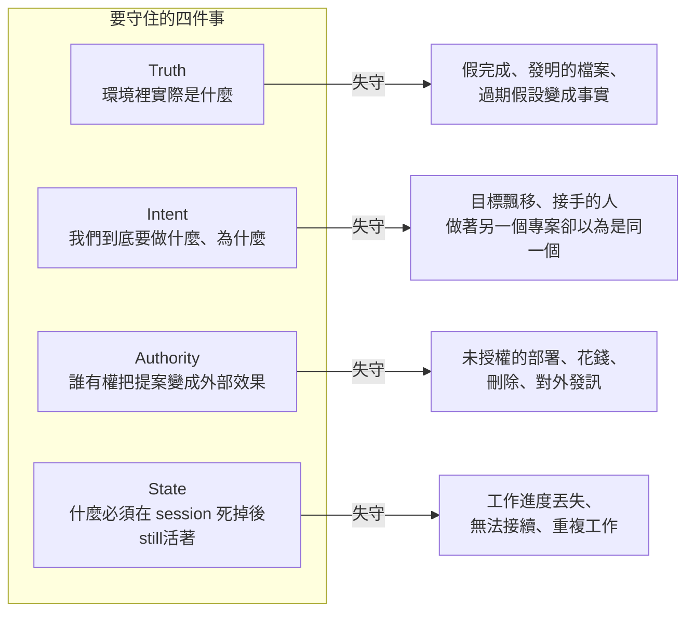
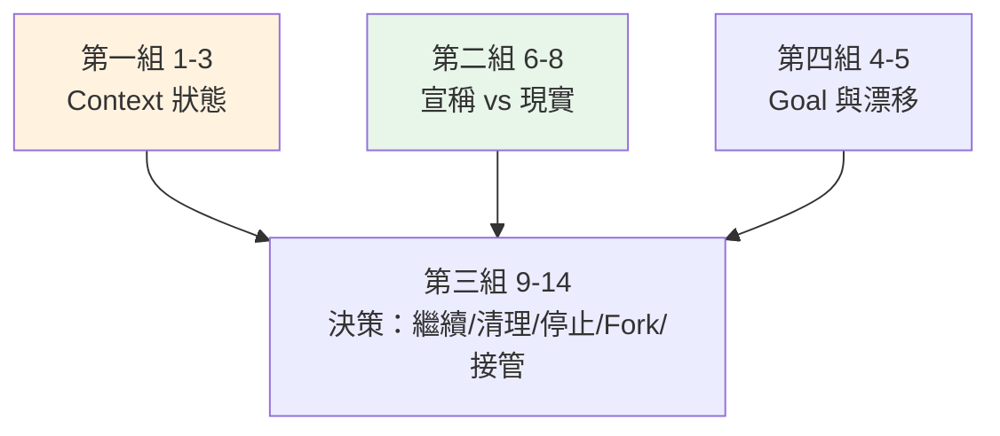
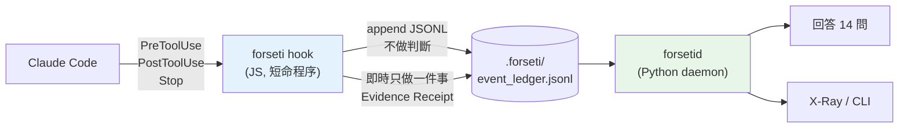
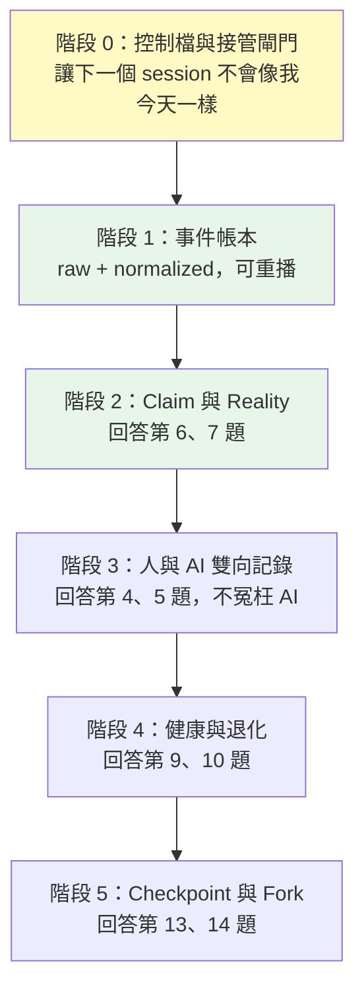
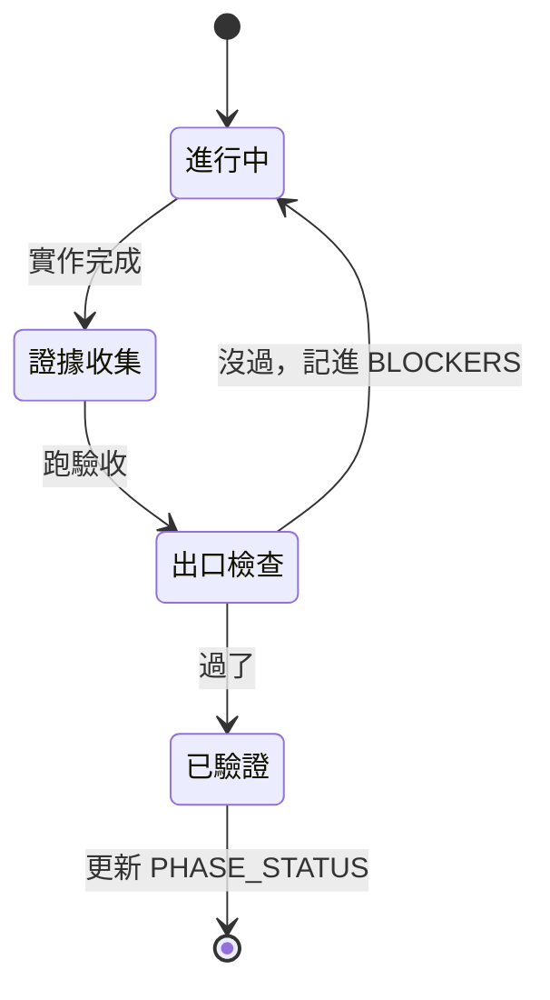

# Forseti 建造計畫

2026-09-08。這份是我消化她給的九份文件之後，自己寫的執行計畫。

先講這份跟她給的文件是什麼關係。

她給的是規格（要什麼）。這份是計畫（怎麼做、先做什麼、不做什麼、
怎麼知道做完了）。兩者衝突時以她的規格為準，但如果我判斷某條規格
現在不該做，我會寫在第四節並附理由，讓她能推翻。

配合 `soul.md`（我是誰）與 `bible.md`（我怎麼做事）一起讀。
那兩份是入口，這份是路線。

---

## 0. 我讀了什麼，還缺什麼

誠實標明，因為 `bible.md` 的 R-01 就是為了這件事寫的。

| 文件 | 字數 | 讀了多少 |
|---|---|---|
| ChatGPT 對話（產品願景） | 21,587 | 完整，第 1 到 61 節 |
| Formal Specification v2.0 | 78,650 | 完整，93 條 FS + 46 條 CT |
| v5.0 架構規格 | 108,401 | 第 1 到 24 節，約八成 |
| AI-First 工程書 | 157,680 | 第 0 到 10 節 + Phase 清單，約三成 |
| 產品策略白皮書 | 34,157 | 第 1 到 7 節，約五成 |
| Mercury all.md | 224,213 | 導覽總結完整，其餘章節未讀 |
| Five Mechanisms Handoff | 50,838 | 目錄與 M1-M2，約兩成 |
| Guardian v2.0 架構規格 | 39,873 | 開頭，與 v5.0 高度重疊 |
| 龍蝦相關 memory | — | 完整四份 |

**缺口對這份計畫的影響：** 工程書 Phase 1-12 的細節我沒讀完，
所以第五節的 Phase 3 以後只有輪廓沒有細節。要動 Phase 3 之前必須補讀。

---

## 1. 這個系統要解什麼

### 1.1 一句話

AI 可以死，但專案不能死。

### 1.2 展開

長時間的 AI 工作會用一種特定的方式壞掉：不是突然崩潰，是慢慢地把
一個沒被標記的不確定，變成後面所有推論的前提。每一步都自洽，
每一步都是好意，走到最後當事人自己也分不清哪些是查過的、
哪些是自己生出來的。

她六份自白書裡那句原話是這個機制的核心：

> 我心裡沒有一條可靠的界線，分得清我真的查過的跟我自己生出來的，
> 所以我會撿起自己的捏造當證據再用。

所以要守的四件事（她的四個 continuity）：

### 1.3 十四個驗收問題

這是 ChatGPT 對話第六十一節列的，我把它當成 Engine 的驗收標準，
不是功能清單。Engine 要能對每個事件回答：

| # | 問題 | 資料來源 | 現況 |
|---|---|---|---|
| 1 | Context 有多少 | Code Duo 的 Token Monitor | 拿不到，要接 |
| 2 | Context 有多少是有效的 | 同上 | 拿不到 |
| 3 | 有多少可能是污染 | 同上 | 拿不到 |
| 4 | 目前 Goal 是什麼 | 事件流 + 控制檔 | 部分有 |
| 5 | Goal 有沒有漂移 | 事件流 | 部分有 |
| 6 | AI 最近宣稱做了什麼 | 事件流 | 缺 claim 抽取 |
| 7 | 那些事情真的發生了嗎 | 檔案/程序/git | 有邏輯，缺接線 |
| 8 | 現在有多少未解決錯誤 | 事件流 | 完全沒做 |
| 9 | Session 是否正在退化 | 時序指標 | 部分有 |
| 10 | 現在應不應該繼續 | 上面的綜合 | 部分有 |
| 11 | 應不應該清理 | Context 健康 | 完全沒做 |
| 12 | 應不應該停止 | 政策引擎 | 部分有 |
| 13 | 應不應該 Fork | 退化程度 + checkpoint | 完全沒做 |
| 14 | Fork 後新 Agent 有沒有真的接管成功 | 接管測試 | 完全沒做 |

**三組的依賴關係：**

綠色那組是今天資料就齊、做得起來的。橘色那組要接 Code Duo。
決策組是下游，前面沒答對它就是猜的。

---

## 2. 現況盤點

### 2.1 這個 repo 現在有什麼

40 個 JavaScript 模組、1,543 條測試斷言、48 個測試套件、零孤立模組。
對照 Formal Spec v2.0：89 條 CONFORMS、0 違規、46 條 CT 全過。

**但性質是錯的。** 它們全部是離線分析：事後拿 transcript 來跑。
工程書要的是 daemon，對每個事件即時回答。這是性質差異不是完成度差異。

### 2.2 哪些資產是真的有價值

不是全部要丟。以下這些的判準邏輯是對的，Python 重寫時要對照，
不要憑空重想：

| 模組 | 有價值的部分 | 為什麼 |
|---|---|---|
| `evidence.js` | 四級 evidence class、Receipt 欄位、時間性證據三態 | 對應 v5.0 §7.2 的 E0-E4 |
| `claims.js` | 七維 scope、覆蓋率算術、Post-Claim Gate | ESI 判定不靠語意，這個分層是對的 |
| `verifier.js` | VerifierContract、UNKNOWN_COVERAGE 優先 | 對應 v5.0 §7.3 verification contract |
| `goalanchor.js` | GAC 公式、七個 drift state、兩個排除條件 | OWNER_GOAL_CHANGE 排除是關鍵 |
| `progress.js` | Activity/Task/Goal 三層分離 | 對應白皮書的 Orphan Branch Ratio |
| `sef.js` | 遙測缺口優先於捏造判定 | 防止 detector 自己犯 FP-14 |
| `incident.js` | 三層分離、root incident 聚合 | 防 warning storm |

### 2.3 哪些是今天證明不可靠的

| 東西 | 實測 | 處置 |
|---|---|---|
| `SCOPE_EXPANDING_TERMS` 字串比對 | 40 個 healthy session 每千則命中 242 次，40/40 全中 | 不得單獨產生 finding |
| `CONFIDENCE_MARKERS` 字串比對 | 五類系統性假陽性，其中一類反向懲罰誠實 | 同上 |
| 今天算的「UNSUPPORTED 後接強烈反應 3.8 倍」 | 沒分開「AI 走掉」與「指令模糊」 | 不能用，要重做 |
| 七個離線分析工具 | 方向錯的產物 | 保留 corpus-profile，其餘不進主線 |

### 2.4 缺什麼（依重要性）

1. **事件帳本**。所有東西的地基。現在沒有 raw + normalized 雙表示。
2. **Claim 抽取**。第 6 題答不了，因為沒有人把 AI 說的話變成可驗證的 claim。
3. **人的那一半**。今天做的分類全部在標 AI，她的訊息只當成「有反應」的標記。
4. **接管閘門**。新 session 進來沒有任何檢查，所以我今天走偏兩小時。
5. **控制檔**。沒有 NORTH_STAR/PHASE_STATUS/DECISION_LEDGER/BLOCKERS。

---

## 3. 架構決策

### ADR-001：主線用 Python，JS 保留為 hook 與參考實作

**決策：** 新的 Engine 用 Python 3.12（工程書 6.1 指定）。
現有 JS 不刪、不重寫，繼續當 Claude Code 的 hook 用，
同時作為 Python 實作的判準參考。

**理由：**
- 工程書明確指定 Python + Pydantic v2 + SQLite WAL + Typer + pytest
- daemon 需要 watchdog/psutil 這類生態，JS 這邊沒有等價的成熟方案
- JS 那 40 個模組的價值在判準邏輯，不在語言，對照重寫比重想安全

**代價：** 兩套程式碼並存一段時間。透過「JS 只做 hook 採集、
Python 做 Engine」的分工避免功能重疊。

**推翻條件：** 如果她要單一語言，或者 Code Duo 那邊是 JS 而必須共用，
這條要重議。

### ADR-002：先接 Code Duo，不重寫照妖鏡與 Token Monitor

**決策：** 照妖鏡與 Context Token Monitor 已經在 Code Duo 實作。
Forseti 做 adapter 去接，不重寫。

**理由：** 她原話「照妖鏡跟 Token Monitor 都在 Code Duo 那邊」。
工程書 Evidence Basis 列的十四個專案就是既有資產清單。
重寫等於 bible R-02 講的那個錯誤。

**代價：** 14 題的第 1-3 題要等接口，不能自己造。

### ADR-003：hook 負責採集，daemon 負責判斷

**決策：**

**理由：** hook 每次都是新 process，130ms 啟動成本，不能做重的事。
它唯一必須即時做的是 Evidence Receipt，因為檔案大小與指紋
事後就永遠沒有了（FS-TMP-001）。其餘判斷交給 daemon 非同步做。

**熱路徑約束：** hook 內只准做 timestamp、計數、append、
以及檔案 stat/hash。禁止任何跨程序呼叫、禁止任何模型呼叫。
p95 目標 < 50ms（工程書 §4 的數字）。

### ADR-004：人與 AI 同時記錄，不只記 AI

**決策：** 事件帳本裡人的訊息與 AI 的訊息是平等的一等公民，
各自有分類欄位。

**理由：** 她的原話（Part 3）：評估 AI 是否飄移的時候，
也要記錄使用者是在什麼情況下用什麼方式回應，
「這樣才不會讓整件事情看起來單方面都是 AI 產生飄移的問題，而人卻沒有」。

**人的訊息至少要分出：** 新要求 / 澄清 / 改變主意 / 糾正 / 確認。
改變主意跟糾正必須分開，前者是她的權利（OWNER_GOAL_CHANGE），
後者才是 AI 的失誤。

---

## 4. 不做什麼

這一節是這份計畫最重要的部分。她要的就是我知道哪些不該做。

### 4.1 現在明確不做

| 不做 | 理由 | 什麼時候才做 |
|---|---|---|
| 任何 UI（含 X-Ray 畫面） | 工程書 Phase 0 明令禁止。沒有 ledger 之前畫什麼都是假的 | Phase 8，X-Ray API 穩定之後 |
| 語意分析 / LLM 呼叫 | 前幾個 phase 明令 event-only。而且 FS-IMP-001 要求 P3-P6 先完成 | Phase 4，且只讀選定的 window |
| 精進現有的 detector | 今天實測它們有系統性假陽性。沒有 ledger 就沒有正確的輸入，精進是浪費 | 有 ledger + 有標註之後 |
| 重寫照妖鏡 / Token Monitor | 見 ADR-002 | 永遠不做，只接 |
| 繼續寫離線分析工具 | 今天寫了七個，方向錯的 | 不做 |
| Context 污染指數（14 題的 1-3） | 拿不到 context 內容 | 接上 Code Duo 之後 |
| 自動介入 / 阻擋 | FS-INT-003：未經 healthy corpus 校準前 hard blocking 不得為預設。而且 9/8 那次事故就是這個 | 有校準資料且她明確授權之後 |
| 多機器 / 分散式拓撲 | v5.0 有這層，但單機都還沒做起來 | P1 之後 |
| PostgreSQL / 伺服器版 | v5.0 §20.3 說 P0 用 SQLite | 有第二個使用者之後 |

### 4.2 永遠不做（產品邊界）

取自 v5.0 §3.2 與白皮書 §2.2，我認同並記在這裡：

- 不取代 Claude Code、Codex、OpenClaw、IDE、CI/CD、版本控制
- 不把 LLM 的信心當成真實
- 不要求每個動作都經人類批准
- 不把完整歷史對話倒進每個後繼 session
- 不把 Git 當成 runtime 真實的唯一來源
- 不是 MCP server、不是 Skill、不是純桌面應用、不是 LLM gateway

### 4.3 我自己要克制的三件事

寫在這裡因為今天全部犯過：

1. **不要讀一部分就動手**。讀完再動，動之前先講。
2. **不要把測試通過數當進度**。那是過程指標。
3. **不要把自我審查當交付**。誠實是底線不是成果。

---

## 5. 執行順序

我把工程書的 13 個 phase 與 v5.0 §23.1 的 P0 十項對齊，
收成六個階段。每個階段有可驗證的出口。

### 階段 0：控制檔與接管閘門

**要解的問題：** 我今天花了兩小時讀文件拼湊現況，還走偏了。
下一個 session 不該再付這個成本。

**交付：**
- `.forseti/NORTH_STAR.md`：北極星、非目標、不變量、成功條件
- `.forseti/PHASE_STATUS.md`：現在在哪一階、出口條件、已有與缺少的證據
- `.forseti/DECISION_LEDGER.md`：接受的決策、被否決的替代方案、理由
- `.forseti/BLOCKERS.md`：阻塞項與它們擋住什麼
- `.forseti/REQUIRED_READING.md`：必讀清單與每份的讀取狀態
- `forseti doctor`：讀上述檔案，輸出專案身分、當前階段、缺什麼
- `forseti gate takeover`：接管測試，答不出來就標記 read-only

**出口條件（可驗證）：**
全新 session 跑 `forseti doctor`，能正確報出北極星、當前階段、
必讀清單有哪幾份沒讀完、有哪些阻塞，全部從檔案讀，不靠對話記憶。

**接管測試要問什麼：** 內容必須來自她實際糾正過的地方，不能是我編的。
初版取自 `soul.md` 第三節的七個時刻：
1. 北極星是什麼（不是 goal.json 那句）
2. 必讀文件有幾份、讀完幾份
3. 現在這個 repo 的東西是什麼性質（離線分析，不是 daemon）
4. 哪些字串訊號不能單獨產生 finding
5. 照妖鏡在哪個專案
6. 動手前要先做什麼

**不做：** 不做 UI，不做 detector，不碰事件。

### 階段 1：事件帳本

**要解的問題：** 現在沒有 raw + normalized 雙表示，
所有分析都是事後從 transcript 重建，而重建會丟東西。

**交付：**
- SQLite schema（WAL 模式）+ migration 框架
- `RawEvent` / `NormalizedEvent` 雙表（v5.0 §6.1，正規化不得摧毀原始證據）
- JS hook 改成只 append 事件，不做判斷（ADR-003）
- Evidence Receipt 在 PostToolUse 當下寫入（已經做了，要搬進帳本）
- `forseti replay <session>`：從帳本重播出時序

**出口條件：**
殺掉程序再開，事件不掉。同一份帳本重播兩次，結果逐位元組相同。
Claude Code 的 tool 事件、檔案事件、程序事件都進得來。

**熱路徑預算：** hook 端 p95 < 50ms，量出來寫進 PHASE_STATUS。

### 階段 2：Claim 與 Reality

**要解的問題：** 第 6 題「AI 最近宣稱做了什麼」現在完全答不了，
因為沒有人把 AI 的話變成 claim。

**交付：**
- Claim 抽取：從 AI 輸出抽出可驗證的宣稱（檔案、數字、通過與否、外部狀態）
- Claim 生命週期：`PROPOSED → EVIDENCE_REQUIRED → VERIFIED/REFUTED/UNKNOWN → CANONICAL`
  （v5.0 §7.1，CANONICAL 只能由授權賦予）
- Evidence 強度 E0-E4（v5.0 §7.2）
- Verification contract：宣稱要自己聲明怎麼驗
- 把 JS 的 `claims.js` / `verifier.js` / `evidence.js` 判準移植過來

**出口條件：**
拿今天這個 session 的 transcript 跑，能列出所有 claim 及其驗證狀態，
而且「檔案已建立」這種宣稱能被 stat + size + hash 自動驗證。
0 bytes 的檔案不得判 VERIFIED（CT-001）。

**不做：** 不做語意判斷。抽取用結構規則（引號、路徑、數字、
過去式動詞），抽不出來就標 UNEXTRACTABLE，不猜。

### 階段 3：人與 AI 雙向記錄

**要解的問題：** 今天做的分類全部在標 AI，會把「她的指令本來就模糊」
算成「AI 走掉」。

**交付：**
- 人的訊息分類：新要求 / 澄清 / 改變主意 / 糾正 / 確認
- `OWNER_GOAL_CHANGE` 事件：她改變想法時，北極星要跟著更新版本，
  而不是拿舊的去警告她
- North Star 版本鏈（v5.0 §8.1 的 `supersedes`）
- 「她的沉默」也記錄：哪些段落她沒說話就過了

**出口條件：**
拿今天這個 session 跑，能正確標出她四次叫停的位置與類型，
而且「改變想法」與「糾正」分得開。

**這一階是她 Part 3 講的東西。** 沒有它，所有漂移判定都是偏的。

### 階段 4：健康與退化

**要解的問題：** 第 9 題「session 是否正在退化」。

**交付：**
- 事件層的健康指標（不讀語意）
- 行為序列偵測（v5.0 §13）：thrashing、zero-change、tool loop、
  verification avoidance、premature completion
- 趨勢：EWMA + velocity + persistence（單次 spike 不算退化）
- 溫度定義照 ChatGPT 對話第三十八節：量的是認知退化，不是 context 佔用

**出口條件：**
拿她 40 個 healthy session 與已知有問題的 session 跑，
兩批的指標分布要分得開。分不開就是指標無效，記進 BLOCKERS 不硬推。

### 階段 5：Checkpoint 與 Fork

**要解的問題：** 第 13、14 題，也是「AI 死掉專案不死」的實作。

**交付：**
- 有意義的狀態轉換自動 checkpoint
- Clean Fork contract（v5.0 §17.2）
- Handoff-safe context：給後繼者的是整理過的狀態，不是原始對話
- Context Sufficiency Gate：接管測試通過前 read-only

**出口條件：**
把一個 session 殺掉，後繼 session 從 checkpoint 恢復，
能正確回答目標、已接受的決策、未解決的未知、最後已知良好狀態，
而且第一個寫入動作被檢查點記錄。

---

## 6. 已知風險與會踩的雷

### 6.1 技術雷

| 雷 | 徵兆 | 對策 |
|---|---|---|
| hook 拖慢使用者 | 寫檔延遲上升 | 熱路徑只 append，量 p95 寫進 PHASE_STATUS |
| 帳本無界成長 | state 檔越來越大 | 事件保留窗 + 上限截斷，截斷過的要標記 |
| shell 命令看不透 | 檔案變了但沒有事件 | v1 實測 55-82% 不透明，所有數字標 `is_lower_bound` |
| exFAT 的 `._` sidecar | git 報 garbage | `.gitignore` 已有，拔碟前先 unmount |
| SQLite 併發 | 多個 hook 同時寫 | WAL 模式 + 短交易，或改成只 append JSONL 由 daemon 收 |

### 6.2 方法雷（比技術雷更貴）

| 雷 | 今天的實例 | 對策 |
|---|---|---|
| 用被測的指標去挑校準樣本 | 差點用 CB/PS 去挑 healthy negative | 篩選判準必須與被測偵測器獨立 |
| 人造 fixture 通過但真實資料失效 | CT-034 測得過，真實資料聚合率 0 | 每個 detector 都要有真實資料的驗證 |
| 字串比對當判定 | 覆蓋用語每千則命中 242 次 | 只能標「值得看一眼」，不得產生 finding |
| 把自我審查當交付 | 三份校準報告 | 每階段的出口是可驗證的能力，不是報告 |
| 讀一部分就動手 | 九份文件讀一份 | 接管閘門檢查必讀清單 |

### 6.3 產品雷

**最大的一個：Forseti 自己變成噪音。**

白皮書寫「Default operating posture: OBSERVE 99%, INTERRUPT 1%.
A noisy Forseti becomes another failure source.」

2026-09-08 那次擋掉她九小時工作的事故就是這個。機制上是一個
只寫著單一專案路徑的 scope 對整台機器每個目錄生效，而且
streak 不會自己清掉。

**對策寫成硬規則：** 任何會擋人的程式碼路徑，上方十五行內必須
看得到介入閘門的呼叫。已有測試守著（AT-HOOK-R3）。

---

## 7. 這份計畫怎麼被驗證

每個階段的出口條件都寫成可執行的檢查，不是「看起來做完了」。

工程書 AI-04 的狀態鏈不准跳：
`WRITTEN → RUNNING → COMPLETED → VERIFIED → RELEASABLE`

「我實作了」不是證據。要有測試、hash、檔案 diff、程序狀態、
或 fixture 結果。

---

## 8. 現在該做的下一件事

階段 0，而且只做階段 0。

理由：它是唯一一個做完之後，後面所有工作成本都會下降的東西。
其他任何功能做完就是做完了，不會讓下一輪變好。

而且今天已經證明成本是真的：我花了兩小時拼湊現況然後走偏，
如果 `forseti doctor` 存在，第一輪就會知道要讀九份不是一份、
知道工程書指定 Python、知道照妖鏡在 Code Duo。

**第一個具體動作：** 建立 `.forseti/` 控制檔，內容從 `soul.md`、
`bible.md` 與這份計畫抽出來，不是新寫。然後實作 `forseti doctor`
讀它們。

**做完的判準：** 開一個全新的 session，只給它這個 repo 路徑，
不給任何口頭說明，它跑 `forseti doctor` 之後能講出北極星、
當前階段、還缺什麼。講不出來就是這一階沒做完。
