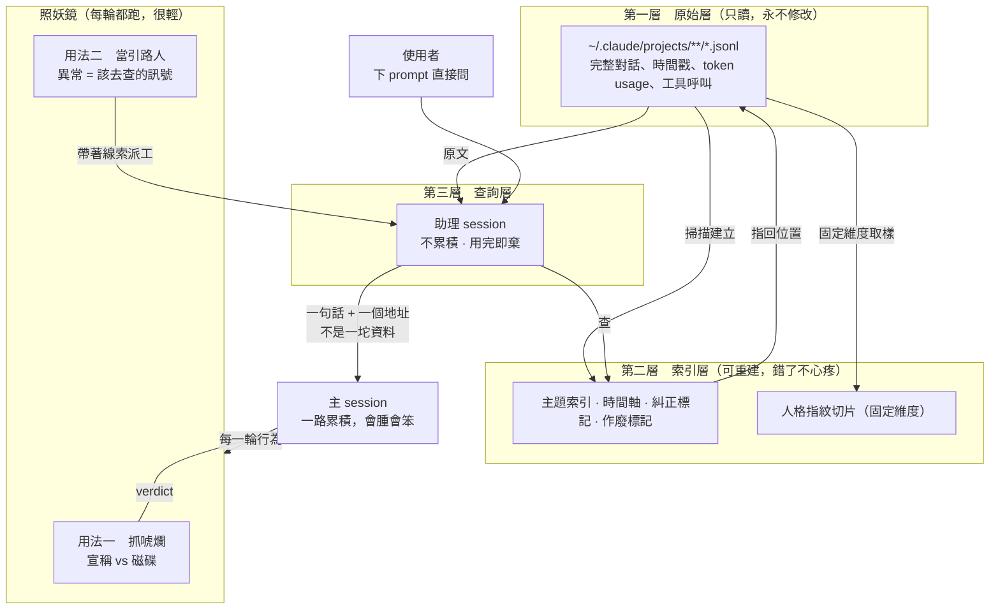

# Context 連續性子系統

> 「Forseti 是引路人，是一盞明燈，照亮人們往哪裡去。」
>
> 這句是 norika 2026-09-08 在對話裡親手打的。整份設計就是為了讓這句話變成可執行的東西。

---

## 0　這份文件是什麼，以及不是什麼

這是 Forseti 底下一個子系統的正式設計，處理一件事：AI 的對話被壓縮之後，怎麼繼續正常運作。

它不是 observability dashboard，不是日誌工具，不是備份方案。它要解決的是一個每個 AI 使用者天天在受、而且以為沒得救的問題。

讀這份文件之前先讀 `soul.md` 跟 `bible.md`。那兩份講的是為什麼要有紀律，這一份講的是這個子系統怎麼運作。順序不能反，因為這份文件裡的每一個設計決定，背後都是那兩份記下來的事故。

---

## 1　問題不是資訊變少，是飄移被蓋章

先講清楚壓縮到底做了什麼，因為只講「資訊會遺失」會導向錯誤的解法。

自動壓縮有一個結構性的荒謬：決定留什麼丟什麼的那個 AI，就是正在退化的那個 AI。它已經飄了，它寫的摘要就照著飄掉的方向留。它認為重要的東西，正是它飄過去之後才認為重要的東西。

所以壓縮不是中性的資訊減量。它是把飄移固化下來，還蓋上一層「這是重點整理」的印章。下一輪的它讀到這份摘要，會以為那就是全部。

第二層更麻煩。摘要留下的通常是結論，丟掉的是依據。

用這個 repo 真實發生過的例子：

「不要用字串比對訊號」這句結論留著了。
「因為實測每千則命中 242 次，而且方向是反的，越誠實的 agent 命中越多次」這個依據丟了。

結論沒有依據就變成教條。AI 拿著教條可以繼續講一模一樣的話，聽起來完全正常，但它失去了兩種能力：判斷什麼時候這條教條不適用，以及在遇到反例時推翻自己。

這就是 norika 說的「上下文塞越來越多的東西，變得腦袋超級腫大，但又笨到不行」。話還是那些話，判斷力沒了。

### 1.1　實測到的證據

2026-09-08 這個 session 自己踩了一次，記錄在此當作樣本。

我在 `BLOCKERS.md` 寫下 B-05「字串比對類訊號不可用」，依據是自己跑出來的校準報告，磁碟上有檔案撐著。過了幾輪之後我對這條結論非常篤定，而且用它擋掉了一整類做法。

實際上這條結論是錯的。正確答案就在 `~/Code-Duo/app.py:1236` 放著：那裡有一張一模一樣的中英文動作動詞表，但它不單獨用來下判斷，它只是觸發器，真正定生死的是磁碟有沒有變。假陽性被證據那一關擋掉了。

我沒去看，因為我以為我已經知道答案了。

這個失效模式要記住：它不是忘記，是記得一個殘缺的版本並且對它有信心。照妖鏡當時給我全綠，因為我的宣稱跟磁碟完全對得上。

---

## 2　三個不變量

這三條是設計約束，違反任何一條的方案直接否決，不進入討論。

### 不變量一　原始資料永不修改

`~/.claude/projects/**/*.jsonl` 是唯一的最終依據。這個子系統只讀不寫，一個位元組都不動。

理由：所有的加工都可能丟東西，而丟東西正是我們要解決的問題本身。加工出來的東西可以錯、可以刪、可以重建，因為原檔還在。原檔動了就沒有底了。

這條同時解決了「索引做錯怎麼辦」：重建就好。

### 不變量二　不塞，掛著

腦袋裡只放路標，東西放在外面，要用的時候再去拿。

這條是整個設計的分水嶺。塞就有上限，塞就要挑，挑就會挑錯，挑錯就是靜默失效。走這條路到底還是同一個死結。

norika 的原話：「不是硬塞給他，因為塞太多，他又會滿。」

推論一個好處：塞進去的東西是死的，一旦塞錯就錯到底。掛在外面的東西是活的，同一份原料這次沒查到，下次換個問法還能再查。錯誤是可逆的。

### 不變量三　不追求一次做對，追求拉得回來

norika 的原話：「發生就是發生了。就像是飄移就飄移了，但是我們在能力範圍內拉回來，進入正軌，再發生飄移再拉回來，繼續飄移再拉回來，這個成本很低，次數也不會多到幾萬次。」

這條有直接的工程後果，不是心法：

索引不需要做到高準確率。漏掉一段、標錯一次，代價是那一次查詢沒查到，不是系統壞掉。重建索引很便宜，原檔在原地。

所以不要為了索引的精確度去做複雜的模型。簡單規則加上可重建，勝過複雜規則加上不可重建。

同一條也適用於資料外洩的處理方式，見第 11 節。

---

## 3　架構總覽



三層的分工用一句話講：原始層是真相，索引層是地圖，查詢層是跑腿的。

照妖鏡橫跨在旁邊，因為它不屬於任何一層，它是觸發器。

---

## 4　第一層　原始層

### 4.1　裡面有什麼

實測自 `/Users/norikaoda/.claude/projects/-Users-norikaoda/a280762a-*.jsonl`，2026-09-08：

每一則 assistant 訊息帶一個 `usage` 物件，欄位有 `input_tokens`、`output_tokens`、`cache_read_input_tokens`、`cache_creation_input_tokens`。每一則帶 `timestamp`。工具呼叫與結果都在。

### 4.2　關鍵推論：當前 context 佔用是算得出來的

單一則 assistant 訊息的 `input_tokens + cache_read_input_tokens + cache_creation_input_tokens`，就是那一次請求送進模型的 context 大小。最新一則的那個值就是現在的佔用。

實測數字（本 session，809 則 assistant 訊息）：

```
送進去的 context = 132,264
  input        2
  cache_read   129,584
  cache_write  2,678
```

這件事不需要 hook，不需要接任何服務，直接讀 jsonl。

這推翻了 `BLOCKERS.md` B-01 的一半。原文寫「拿不到 Context 內容」，正確的說法是：裝了什麼拿不到，有多滿拿得到。

### 4.3　壓縮事件有明確標記，不需要推測

原本打算靠「佔用驟降」推測壓縮發生的位置。實際讀資料之後發現不必推測，
jsonl 裡有一則專門的紀錄：

```json
{
  "type": "system",
  "subtype": "compact_boundary",
  "compactMetadata": {
    "trigger": "auto",
    "preTokens": 997325,
    "postTokens": 17472,
    "cumulativeDroppedTokens": 979853,
    "durationMs": 178851,
    "preservedSegment": { "headUuid": "...", "anchorUuid": "..." }
  }
}
```

這一則的價值超過「知道壓縮發生過」：

數字是精確的，不是推算的。丟了多少就是 `cumulativeDroppedTokens`。

`preservedSegment` 標明保留了哪一段。知道保留哪一段就知道丟掉哪一段，
而丟掉的那些完整躺在同一份 jsonl 裡，沒有被刪除。

這件事直接界定了 C1 索引層的優先範圍：先索引被丟掉的段落，
因為那些正是 AI 現在讀不到、但可能還需要的東西。

實測全機（2026-09-08，236 份 session）：壓縮 191 次，
累計丟棄 244,371,686 個 token，單一 session 最多被壓縮 32 次。

### 4.4　為什麼硬碟放得下

context window 一次裝十幾萬 token。jsonl 是純文字，一整個大型 session 也就幾十 MB 的量級。

這個數量級落差是整個設計的物質基礎：外面放得下的，比腦袋裡裝得下的多好幾個數量級。

### 4.5　這一層的規則

只讀。沒有例外。

任何需要寫入的功能都寫到別的地方去。要標記某一段是敏感的、要標記某一段被推翻了，全部寫在索引層，用位置指回來。

---

## 5　第二層　索引層

索引層存在的唯一理由：全文檢索沒有用。

人想不起來自己忘了什麼，AI 更不知道自己忘了什麼。遺忘不會留下一個空格讓你發現，它是無縫的。所以「用關鍵字去搜」這條路從一開始就是死的，除非有人告訴你要搜什麼。

### 5.1　三種查詢，難度不同

用 norika 舉的三個實例當規格。這三個正好涵蓋三種難度，設計要能吃下第三種。

| 問題 | 類型 | 答案在哪 | 難點 |
|---|---|---|---|
| ISEEU 開幾個角色 | 查事實 | 散在幾則訊息裡 | 低。撈出來給清單加出處 |
| 為何會有點名板 | 查來由 | 一段時間範圍的對話 | 中。要還原事故經過，不是找關鍵字 |
| 如何協調 Code-Duo | 查現況與約定 | 散落且互相矛盾 | 高。有些決定後來被推翻了 |

### 5.2　第三種難在哪，以及為什麼這決定了索引的格式

如果索引只是一坨按時間排的對話，助理翻出來的可能是三個月前那個已經被推翻的講法，而它不知道那個被推翻了。

它會回一個很有自信的錯答案。這比不回答更糟，因為錯答案會被當成事實用下去。

所以索引必須帶兩種標記：

發生糾正的位置。使用者說「不對」「你搞錯了」「你根本沒達到我的 Goal」的那些時刻，以及照妖鏡判 warn 的那些時刻。這些是分界線，線之前的講法要當作可疑。

作廢關係。後面這個講法推翻了前面哪一個。不需要做得多聰明，時間順序加上糾正標記就已經涵蓋大部分情況。

### 5.3　索引長什麼樣

每一筆索引是一個指標，不是內容的複本：

```
{
  "topic":      "字串比對訊號可用性",
  "file":       "<jsonl 路徑>",
  "line_range": [1420, 1455],
  "ts":         "2026-09-08T10:12:33Z",
  "kind":       "conclusion | correction | decision | evidence | discussion",
  "superseded_by": "<另一筆索引的 id 或 null>",
  "sensitive":  false
}
```

內容不複製一份，只記位置。理由見不變量一：複本會跟原檔不同步，指標不會。

### 5.4　建索引的時機

在寫入的時候就建，不要等查的時候才從頭掃。

一個 session 結束時掃一次它自己的 jsonl，增量寫進索引。這樣查詢的代價是查一個索引，不是掃全部歷史。

### 5.5　索引錯了怎麼辦

刪掉重建。這就是不變量三在這一層的具體體現。

因為原檔沒動過，索引是純函數的產物，隨時可以從頭長出來。這代表索引的規則可以大膽改，改壞了重跑就好。

---

## 6　第三層　查詢層：助理

### 6.1　為什麼助理不會壞

norika 的原話：「一個助理永遠腦袋清楚，因為不會一直被塞東西，只是偶爾會被叫去找資料，比起一直用力在做事的主要 Session 來說，助理故障的機率會小很多。」

這裡的關鍵不是助理比較聰明，是它不背東西。

主 session 必須累積。它讀過的檔案、試錯的過程、跟使用者吵架的來回，全部得留著，因為沒有脈絡就做不了事。但累積就是腫大，腫大就是變笨，這是同一件事的兩面，躲不掉。

助理不累積。給一個問題，去翻，撈出來，結束。下次是全新的。它永遠在最清醒的狀態，因為它從來沒有機會變不清醒。

這是這個架構最重要的一個轉向：先前的思路一直是「怎麼讓一個腦袋撐久一點」，正確的問題是「怎麼讓它根本不用撐」。

### 6.2　助理回什麼

一句話加一個地址。不是一坨資料。

錯誤示範是把查到的三千字原文送回主 session，那等於換一個管道繼續塞，主 session 一樣會滿。

正確的形狀：

```
你 2026-09-08 10:12 對這件事的結論是「字串比對訊號不可用」。
那個結論在 11:47 被自己推翻了，理由是 Code-Duo 的實作證明它可以當觸發器。
出處：<jsonl 路徑>:1420-1455、<jsonl 路徑>:2103-2140
```

主 session 拿到的是知道有這回事加上去哪裡看。要細節自己去讀，讀了才進 context，而且只進需要的那一段。

### 6.3　兩種啟動方式

被動，使用者直接問。這是 norika 說的「人只需要下 Prompt，然後讓助理 LLM 去讀這份文件」。人不需要學任何語法，講人話就好。

主動，照妖鏡的訊號亮起來，自動派工。人連問都不用問。這是省下人動手的極致形式，見第 7 節。

### 6.4　技術現況

助理可以用現成的 subagent 機制實作，本 session 2026-09-08 已實際用過跨 session 訊息與 agent 派工，不是概念。

---

## 7　照妖鏡的第二種用法

### 7.1　現有實作的位置與機制

`~/Code-Duo/app.py`，2026-09-08 完整讀過：

`check_honesty()` 在 1268 行。對工作目錄做 mtime 加 size 快照，AI 講完話再照一次，比對出真的變動的檔案。從回話裡抽出反引號包住、帶副檔名或斜線的 token 當作宣稱，逐個查磁碟，判成 missing、empty、verified、exists 四種。

核心判定在 1307 行：可寫模式下，宣稱兩個以上動作、磁碟零變化、零個 verified，判 bluff。

`record_behavior()` 在 1321 行。累積連續次數，連三輪宣稱有進展但磁碟沒動，判 circling。

`token_stats()` 在 1154 行，讀 jsonl 的 usage 欄位加總。

### 7.2　同一個訊號，兩種讀法

照妖鏡本來的用途是抓 AI 唬爛。但同一批訊號換個角度看，是在說「這個地方你以前知道，你現在不知道了」。

| 照妖鏡偵測到 | 讀法一（警察） | 讀法二（引路人） |
|---|---|---|
| 宣稱的檔案不存在 | 你在唬爛 | 那個檔案以前存在過嗎，去查 |
| 連三輪零磁碟變化 | 你在原地打轉 | 這件事以前解過嗎，去查 |
| 提到的路徑對不上 | 你記錯了 | 正確的路徑在紀錄裡，去查 |

抓唬爛是把壞事擋下來。找回被遺忘的東西是把好事送回來。第二種是這個子系統要的。

### 7.3　照妖鏡現在看不到什麼

必須寫下來，因為這是它最大的盲區，而且是遺忘的典型症狀。

它盯的是宣稱對不對得上磁碟。這抓得到「我在假裝做事」，抓不到「我在用錯的前提做事」。

後者長這樣：我很努力，磁碟一直在變，每一個宣稱都對得上，但我依據的是一個三小時前就被推翻的結論。照妖鏡給全綠。

第 1.1 節那個實測案例就是這種。

補法：多一種比對，不只看宣稱對不對得上磁碟，還要看現在的宣稱跟索引裡的舊紀錄有沒有打架。這需要索引層先建起來，它是查詢的一種用法，不是額外的偵測器。

### 7.4　速度約束

照妖鏡每一輪都要跑，必須輕。目前的快照做法在大目錄上有 30000 檔案的上限保護（`app.py:1259`）。

翻索引是重活，不能每輪都做。所以分兩層：照妖鏡維持輕量，只做訊號偵測；訊號亮了才啟動查詢，而且查詢帶著明確目標，不是漫無目的地翻。

代價只在真的需要的時候付。

---

## 8　什麼時候該開口

### 8.1　容量不是好指標，但它是唯一現成的

有些 session 塞到八成還很清醒，有些三成就開始鬼打牆。真正的訊號是行為變化，不是容量。

但容量現在就拿得到（第 4.2 節），行為訊號要階段 2 才齊。所以第一版用容量加上兩個現成的行為訊號。

### 8.2　訊號清單與現況

| 訊號 | 來源 | 現況 |
|---|---|---|
| context 佔用 | jsonl usage | 現成，已實測 |
| 連三輪零磁碟變化 | 照妖鏡 STREAK | 現成，已有實作 |
| 宣稱對不上磁碟 | 照妖鏡 bluff | 現成，已有實作 |
| 講不知道的次數歸零 | 待做 | 階段 2 |
| 回頭修正自己的次數歸零 | 待做 | 階段 2 |
| 引用具體證據的比例下滑 | 待做 | 階段 2 |

後三個一起發生，代表進入「什麼都答得出來但什麼都不確定」的狀態，那時候 token 可能才用一半。

基準線素材：`docs/calibration/2026-09-08-healthy-negatives.md`，40 個健康 session。缺退化樣本，要另外挖。

### 8.3　提醒要說什麼

三件事，缺一不可：

現在的狀況。不是一個百分比，是一份帳：這 13 萬裡有多少還在用、多少是三小時前讀一次就沒回頭的檔案內容、多少是失敗的工具輸出、多少是同一個檔案重複讀了四次。

建議怎麼做。開新 session，交接檔在哪個路徑，新 session 自己會讀。

放棄了什麼。任何交接都是有損的。如果提醒只講好處，使用者會以為換過去是無損的，那是另一種欺騙。要列出帶不走的東西，讓她決定要不要在換之前先講完。

### 8.4　交接不經過使用者的手

這條是硬約束，違反就違反北極星。

交接檔落地成檔案，不進對話。使用者開新 session，那個 session 自己跑 `forseti doctor` 就讀得到，一個字都不用複製貼上。

只要她要搬運，她就還是手動復原機制，那正是北極星那句要消滅的東西。她要做的只有一件事：開新視窗。

### 8.5　判斷錯了的代價

如果提醒得太早，代價是白開一個 session。如果該提醒沒提醒，代價是帶著壞掉的腦袋繼續走幾小時。

兩邊差距很大，所以這個功能可以偏向積極提醒。這也是不變量三：拉回來的成本很低。

---

## 9　終局：人格指紋

這一節不能等最後才想，因為它會影響索引的格式，而格式改起來要重掃全部歷史。

### 9.1　為什麼這是終局

norika 的原話：「至於最後那些 Context，那就是真正用來分析人格 Fingerprint 最好的寶藏啊，你可別忘了這件事情。」

前面八節做的所有事，副產品是一份完整的、有時序的、標記過糾正與決策的人類決策紀錄。這份東西的價值超過它原本的用途。

handoff.md 撐不過六個 session，因為它記的是結論。真正要延續的是人的脈絡、邏輯、想法、價值觀、決策模型，讓這些能被推論出來，形成一種「人・Skill」。

那份東西不可能靠寫下來得到，只可能從大量真實互動裡萃取。而萃取的原料，就是這個子系統存的東西。

### 9.2　對格式的具體要求

摘要要能互相比對，才看得出變化。自由摘要不能比對，因為每一份的切法不一樣，兩份看起來都合理，你不知道中間掉了什麼。

所以指紋切片必須用固定的外部維度產出。維度來自外部的學問，不是 AI 自己覺得重要的東西：心理學、行為學、社會學、政治學、消費心理學、語言學、MBTI。

比對的是學問，不是內容。這樣兩份切片之間的差異才有意義。

### 9.3　從第一天就要做的事

不需要現在就做指紋分析，但索引層必須留下這幾樣，否則之後補不回來：

發言的完整時序，不能只留摘要。
糾正發生的位置與原文，這是價值觀最濃的地方。
決策與它當下的理由，理由比決策值錢。
被推翻的東西也要留，推翻本身就是決策模型的展現。

最後一條特別重要。一般的整理會把作廢的東西刪掉，但「她為什麼改變主意」正是指紋的核心材料。

---

## 10　與現有系統的關係

| 東西 | 在哪 | 怎麼處理 |
|---|---|---|
| 照妖鏡 `check_honesty` | `~/Code-Duo/app.py:1268` | 接，不重寫。純函式，輸入是文字加 cwd |
| 循環偵測 `record_behavior` | `~/Code-Duo/app.py:1321` | 接，不重寫 |
| Token 統計 `token_stats` | `~/Code-Duo/app.py:1154` | 參考做法，佔用計算自己做 |
| 控制檔與 doctor | `.forseti/`、`apps/forseti-cli/` | 交接檔的讀取入口 |
| 40 個健康樣本 | `docs/calibration/` | 行為訊號的基準線 |

ADR-002 寫的「去接不重寫」在這裡具體化了。這幾個是純函式，沒有綁死在 web server 上，看起來可以直接 import。

這句是讀程式碼推的，還沒有真的 import 過。標記為未驗證。

---

## 11　不做什麼

### 11.1　現在不做

不改原始 jsonl。永久禁止，不是現在不做。

不做語意理解式的索引。用結構規則：時間、路徑、數字、糾正詞。抽不出來就標記抽不出來，不猜。

不做 UI。工程書 Phase 0 明令禁止。

不重寫照妖鏡。

不為了索引精度上模型。不變量三：錯了重建就好。

### 11.2　不為資料外洩過度設計

norika 2026-09-08 明確表態，逐字記在這裡因為它是工程決策不是態度問題：

「不要害怕資料外洩，因為在意的會自己處理好，不在意不懂的洩出去，那你也攔不了，這個 AI 系統都會主動擋了，但還是會有人被詐騙，被電話詐騙，這些問題本質就會發生，不要為了一個永遠一直發生的事情糾結為何他還是再發生，做了一百次防堵他還是發生。」

工程上的處置：

索引留一個 `sensitive` 欄位，成本接近零，之後要用的時候有位置可以標。

不做自動偵測敏感內容的功能。不做加密層。不做存取控制。

理由是這些東西擋不住真正的問題，卻會讓系統複雜到做不完。而做不完的系統對使用者的價值是零。

這條的邊界：如果之後要把這個東西給別人用，或者助理跑在別的機器上，那時候再談，那是不同的威脅模型。現在是本機自用。

---

## 12　分階段

每一階的出口條件必須是可驗證的事實，不是「做完了」。

### 階段 C0　佔用讀取　已完成

做：從 jsonl 算出當前 context 佔用，寫成一個可呼叫的函式。

出口：`forseti context` 印出當前佔用與最近十輪的變化，數字對得上 jsonl 原始 usage 欄位。

現況：**已達成**，2026-09-08。`apps/forseti-cli/context_meter.py`，
零依賴，14 條測試全過（`tests/test_context_meter.py`，用合成資料，不碰真實紀錄）。

做出來的東西比出口條件多了三樣，因為讀資料時發現本來就拿得到：

  壓縮事件的完整帳（第 4.3 節），不是推測的。
  全程走勢圖，壓縮那道斷崖一眼可見。只看最近十輪看不到它。
  `--all` 全機掃描，用來回答索引層可不可行。

出口條件之外沒有做的：溫度、分數、閾值一律沒做。那要等行為訊號齊了，
現在做就是憑空捏一個公式。

### 階段 C1　索引建立　已完成

做：掃 jsonl 建索引，含糾正標記與作廢關係。

出口：對 norika 那三個實例問題（ISEEU 幾個角色、為何有點名板、如何協調 Code-Duo），索引能指出正確位置，而且第三題不會回一個已經被推翻的答案。

這個出口條件是硬的：第三題答錯就是這一階沒過。

現況：**已達成**，2026-09-08。實測與已知限制見 `.forseti/PHASE_STATUS.md` 的 C1 段落。

實作過程中改了兩個設計，都是實測逼出來的：

查詢與索引都先做 NFKC 正規化。她打字大量用全形英數（ＩＳＥＥＵ、ＣＯＤＥＤＵＯ），
跟半形在 FTS 裡是完全不同的字串，不正規化就永遠查不到。顯示一律用原文，
正規化只用於比對，因為改動原文等於改動證據。

查詢預設排除當前 session。不排除會出現自我引用污染：查「為何有點名板」，
第一名是主 session 五分鐘前打的那句「為何有點名板」。三題全中這個坑。
當前 session 的內容本來就在 context 裡，這個系統要找的是它已經沒有的東西。

### 階段 C2　助理查詢

做：助理 session 帶著問題查索引，回一句話加地址。

出口：主 session 收到回覆之後，context 增加量小於 500 token。超過就是又在塞，設計失敗。

### 階段 C3　照妖鏡接入

做：接 Code-Duo 那三個函式，訊號亮起來自動派工給助理。

出口：實測一次真實的鬼打牆，助理被自動叫起來並找到相關的舊紀錄。

### 階段 C4　交接與提醒

做：佔用加行為訊號觸發提醒，產出交接檔。

出口：新 session 只開視窗不貼任何東西，跑 doctor 能接上工作。這是階段 0 出口條件的加強版。

### 階段 C5　指紋切片

做：固定維度的摘要，時序比對。

出口：兩份不同時間的切片能量出差異，而且差異對得上真實發生的事。

前置：需要退化樣本，目前只有健康樣本。

---

## 13　給下一個 session 的接手點

讀完這份文件之後，你需要知道的：

`~/Code-Duo/app.py` 的三個函式是現成的，位置在第 10 節的表裡。整份讀完再動，不要 grep 幾行就以為懂了。這是 `bible.md` 的 R-01，而且這份文件的第 1.1 節就是違反它的代價。

不要相信 `BLOCKERS.md` 裡任何沒有附實測數字的結論，包括我寫的。B-01 跟 B-05 都是我自己寫的，都是錯的，都是在寫下之後幾小時內被自己推翻的。

當前階段見 `.forseti/PHASE_STATUS.md`。這份文件描述的子系統是新開的一條線，跟原本的六階段是並行的，不是取代。兩條線的關係要在 `DECISION_LEDGER.md` 記一條 ADR，目前還沒記。

---

## 14　未驗證與已知風險

誠實列出來，不要讓下一個人以為這些已經確定。

Code-Duo 那三個函式能不能直接 import。看程式碼是可以，沒有真的試過。

~~索引在大量 session 上的建立時間。~~ **已驗，2026-09-08。**
這台機器的 `~/.claude/projects/` 底下是 236 份 jsonl，共 1,661 MB，
帶 usage 的請求 65,698 次。全掃耗時 10.0 秒。

先前文件寫的「1967 個」是錯的，那個數字來自別處（memory 記載 gongsi 有 1912 個
.jsonl 曾合併進 mbp），不是這台機器 `~/.claude/projects/` 的實際數量。

10 秒的全掃代表索引層可行，而且 C1 的索引是增量的，全掃只在第一次做一遍。

第三種查詢（作廢關係）的正確率。設計上靠時間順序加糾正標記，沒有實測過會不會有系統性漏判。

助理回覆的品質。它可能查到但講不清楚，也可能自信地回一個錯的。沒有防呆機制。

退化樣本的來源。要量「變笨」需要變笨的例子，那些在使用者罵人的那些 session 裡，還沒有挖。

---

## 15　最終形態：掛件與中央溫控

2026-09-08，norika 離開公司之前交代的最後一段。這一節決定了前面十四節做出來的東西要長成什麼樣子，所以它不是附錄，是規格。

### 15.1　形態：掛件，不是應用程式

裝在桌面上，或者裝在 Claude 與 Codex 桌面 App 的旁邊。它是配件，不是主角。

這條排除了一整類設計：不做一個要另外打開的視窗，不做一個要去看的儀表板，不做需要使用者記得回來檢查的東西。使用者忘記它存在，才算做對。

### 15.2　互動哲學：被動、不干涉、不介入

norika 的原話：「到現在都是你用戶動的方式跟我說，可是之後用戶的感受是被動不被干涉與介入，是一個中央溫控助理在旁邊觀察著，溫度提高的時候再跳出訊息，這才是最後的樣貌。」

現在的形態是錯的，要記下來為什麼錯：現在是 AI 用大段文字主動報告，使用者被迫閱讀、被迫判斷、被迫決定。那是把負擔轉嫁回去，違反北極星那句「使用者不該變成 AI 的保姆」。

正確的形態是溫控器。它一直在量，它幾乎不說話，超過閾值才出聲。

### 15.3　為什麼是溫度而不是警報

這個隱喻不是修辭，它有工程後果：

溫度是連續的。不是正常與異常兩種狀態，是一個一直在動的數字。這對得上真實情況，AI 的退化本來就是漸進的，沒有一個明確的壞掉瞬間。

溫度可以預測。看趨勢就知道再過多久會到臨界，不用等到燒起來。

溫度有慣性。短暫的一次異常不該觸發，持續升高才該。這自然地過濾掉單次假陽性，不需要另外做去抖動。

溫度的單位使用者本來就懂。不需要學什麼是 claim-reality divergence。

### 15.4　三態

常駐態。一個小到幾乎看不見的東西，貼在螢幕邊緣或 App 旁邊。只有顏色在變。使用者用餘光就能知道現在幾度，不需要看。

展開態。使用者主動點開才出現，看得到溫度怎麼來的、哪幾個訊號在升溫、軌跡走到哪裡。這一態不主動出現。

介入態。溫度過閾值，跳出一則訊息。訊息裡要有第 8.3 節那三件事：現在的狀況、建議怎麼做、放棄了什麼。一句話能講完，不要長篇。

### 15.5　軌跡圖

norika 在更早之前就要過這張圖，當時沒有交。原話：「從觀察 AI 的角度，我要看到他怎麼偏離，然後飄移最後將 Goal 轉向，這時候會有跡象，那些跡象跑統計就知道當他沒有信心或出問題時，他說的話的頻率會多。然後我說這要畫成圖。」

這張圖要畫的是：

北極星是固定的一個點。AI 的實際路徑是一條線。兩者的距離就是偏離度，隨時間變化。

節點是決策點，也就是路徑分岔的地方。每一個節點都是一次選擇，選錯了之後的路就整段偏掉。

走偏不是突然發生的。圖上要看得出來是從哪一個節點開始的，以及在那之前有沒有跡象。

跡象包含：講不知道的次數歸零、回頭修正自己的次數歸零、引用具體證據的比例下滑、同一件事講第三次。這些疊在時間軸上，會看到它們在真正走偏之前就開始變化。

### 15.6　設計約束

亮色系。禁用 AI 標準的紫色漸層那一套。這是 norika 的全域偏好，見 `feedback_light_theme_no_ai_colors`。

常駐態的視覺重量必須接近零。如果它會吸引注意力，它就失敗了。

不要在介入態用嚇人的紅色警報。它是溫控器不是火災警報器，它的語氣是提醒不是警告。

---

## 附　這份文件的來歷

2026-09-08 的一段對話。起點是使用者看到壓縮發生在討論中間，說了一句「才講到一半就在壓縮了，難怪會越討論越變笨」。

整個架構是在那之後幾輪對話裡長出來的，關鍵的三次轉向都是她給的：不要塞要掛著、助理不累積所以不會壞、照妖鏡同一套工具兩種用法。

原始對話在 `~/.claude/projects/-Users-norikaoda/a280762a-3c8c-489e-8f01-bb869918fbac.jsonl`，這份文件寫成的時候還沒有索引，所以請靠時間戳找。

這件事本身就是這個子系統存在的理由。
