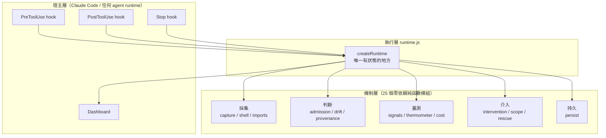
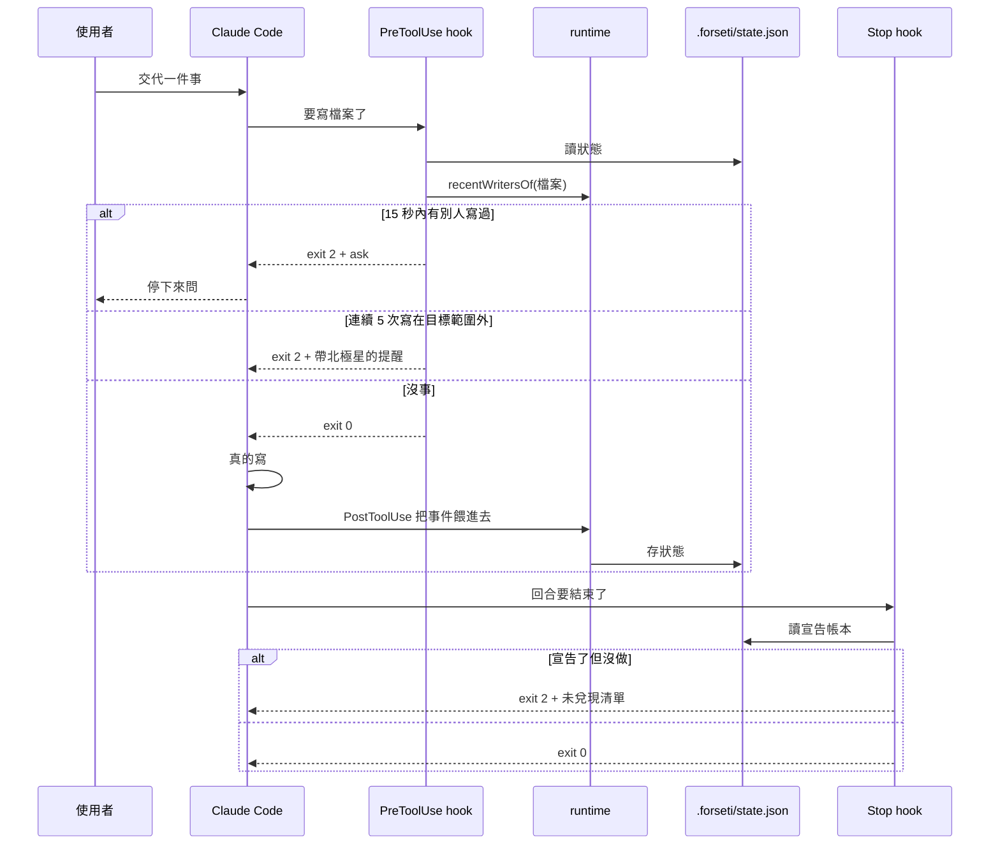
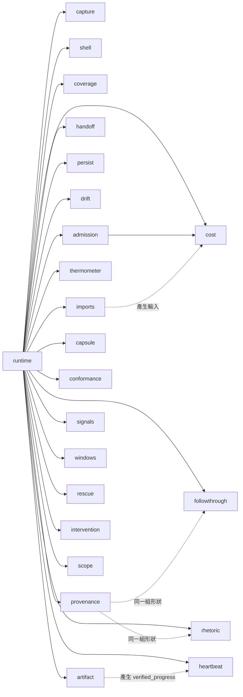
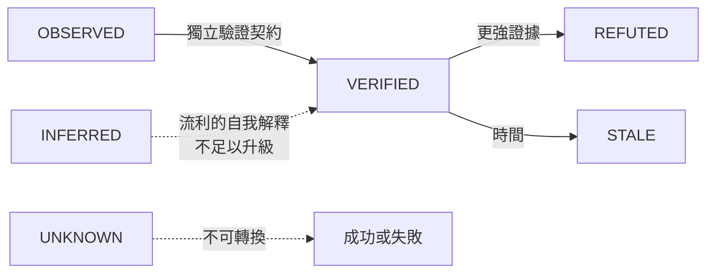

# Forseti 系統工程規格書

版本 1.0 · 2026-09-08 · 對應 repo commit `e8edfe1`

寫給兩種讀者。一種是有三十年經驗的工程師，他看完要知道現在做到哪、下一步做什麼、哪裡還沒補、哪裡是隱藏風險。另一種是一個完全沒有這個專案記憶的 AI session，它看完要能直接接手，不用再問一輪已經交代過的事。

這份文件裡的每一個數字都可以在 repo 裡驗證。驗不到的地方會明確標成未驗證。

---

## 0. 這個系統要解的問題

### 0.1 一句話

多個 AI agent 在同一份程式碼上工作時，會用單人開發不會有的方式壞掉，而那些壞法都不是模型問題，是執行期問題。

### 0.2 具體的壞法

| 壞法 | 現況 | 使用者什麼時候發現 |
|---|---|---|
| 兩個 session 同時改同一個檔 | 後寫的默默蓋掉先寫的 | 看 git diff 的時候 |
| Agent 說它交付了，磁碟上沒動靜 | 沒有任何機制查核 | 拿去用的時候 |
| 主 session 的 context 被灌爆 | 壓縮之後兩小時的交代不見了 | 重新解釋的時候 |
| 交接時要重複多少背景 | 靠猜 | 猜錯之後 |
| 做著做著換了目標 | 每一步都合理，累積起來完全走掉 | 通常不會發現 |
| 說了要做，然後沒做也沒再提 | 對話一直很忙，看起來像有在推進 | 通常不會發現 |

最後兩條是這份規格書後半的重點，因為它們的共同特徵是「當事人自己不會發現」。

### 0.3 北極星

```
聚焦完成 Forseti。其他過去的都不管。
```

宣告於 2026-09-08，記在 `.forseti/goal.json`。飄移偵測對著這個錨點量。

### 0.4 完成的定義

五條，全部可驗證：

1. 規格書 v0.1 裡事件流支援得了的機制，全部實作並接進 runtime
2. 第 14 節十條驗收測試全過
3. 常數用真實 transcript 校準，每一個都寫得出來源
4. 裝成 hook 並且真的擋下東西，延遲量過並寫明
5. 稽核寫它的那個 session，抓到的問題要修不是記下來

### 0.5 刻意現在不做

範圍擴張是這個專案家族過去兩次停擺的共同前置條件，所以不做的東西要寫下來：

- Inline annotation adapter，Claude Code 沒有那個掛鉤點
- 語意偷換與地板當天花板的偵測，事件流裡沒有判準
- T_runtime 權重擬合，需要可靠標籤，而現有標籤已知不可靠

---

## 1. 系統架構

### 1.1 三層



分層的理由不是美學。機制層每一個模組都是純函數且零依賴，所以可以單獨採用、單獨測試、單獨推翻。執行層是唯一有狀態的地方，狀態集中在一處才看得見。宿主層是唯一會真的動到使用者東西的地方，而它薄到可以整個換掉。

### 1.2 資料流



### 1.3 模組依賴圖



零孤立模組。這件事用 repo 自己的 `imports.js` 加 `cost.js` 驗證，指令在 §6.2。

寫這句話的時候第一次沒有跑那個指令，憑的是上一次的結果，而那時 `baseline.js` 與 `overhead.js` 剛寫完還沒接。跑了之後它們被抓出來，接完才成立。這件事記在 §6.1 第九條。

---

## 2. 機制清單

### 2.1 二十五個模組

| 模組 | 職責 | 斷言數 | 規格來源 |
|---|---|---|---|
| `capture.js` | 宿主事件 → 中性事件 | 47 | 實測（採集率 19.6% 事故） |
| `shell.js` | shell 命令裡的檔案操作 | 33 | 實測（同上） |
| `imports.js` | 原始碼 → 依賴圖 | 28 | cost.js 缺的輸入源 |
| `cost.js` | 改一個檔的五維代價 | 16 | 五機制 M4 |
| `capsule.js` | context 收銀台 | 18 | 五機制 M1 |
| `admission.js` | 寫入准入控制 | 34 | 五機制 M3 |
| `coverage.js` | session 覆蓋範圍 | 30 | 五機制 M5 |
| `handoff.js` | 交接規則 | 38 | 五機制 M2 |
| `persist.js` | 快照與復甦 | 32 | 實測（重啟遺失） |
| `drift.js` | 目標飄移 | 40 | 自白書 + 規格書 §4 |
| `provenance.js` | 證據來源鏈 | 33 | 自白書七形狀 |
| `followthrough.js` | 宣告與兌現 | 21 | 自白書第七形狀 |
| `rhetoric.js` | 信心詞與假坦白 | 19 | 自白書第二三形狀 |
| `scope.js` | 目標範圍與離題 | 15 | 實測需求 |
| `heartbeat.js` | 自我喚醒與空轉 | 34 | 自白書（13 輪空手） |
| `thermometer.js` | context 事實佔比 | 25 | 使用者提出 |
| `conformance.js` | 偵測器合格性 | 21 | 規格書 §16 |
| `artifact.js` | 產物實在性 | 35 | 規格書 §6 |
| `signals.js` | 十個原子訊號 | 31 | 規格書 §3 |
| `windows.js` | 可疑窗口選取 | 25 | 規格書 §5 |
| `rescue.js` | 可見存活與安全中斷 | 27 | 規格書 §7 |
| `intervention.js` | 介入前置條件 | 31 | 規格書 §9-11 |
| `baseline.js` | 自適應健康基線 | 17 | 規格書 §15-2 |
| `overhead.js` | 效益與負擔 | 14 | 規格書 §15-10 |
| `runtime.js` | 接線 | 128 | — |

加上整合 17、驗收 10、adapter 19。

### 2.2 五個機制與規格書十步的對應矩陣

| 規格書 §13 十步 | 狀態 | 實作在 |
|---|---|---|
| 1 事件帳本 + 可見心跳 | 完成 | capture, persist, rescue |
| 2 原子訊號 S1–S10 | 完成 | signals |
| 3 溫度 + 最大貢獻者 | 完成 | signals.composite |
| 4 產物實在性驗證 | 完成 | artifact |
| 5 可疑窗口選取 | 完成 | windows |
| 6 桌面溫度計 | 完成（web 版） | tools/dashboard.mjs |
| 7 安全中斷快照 | 完成 | rescue |
| 8 針對性語意分析 | 完成 | windows + intervention.probe |
| 9 Inline annotation | 不做 | 宿主沒有掛鉤點 |
| 10 救援卡 | 完成 | dashboard CRITICAL 區 |

九步完成，一步標明不做。

---

## 3. 貫穿全系統的設計規則

這六條在每個模組裡都有測試守著。刪掉任何一個誠實標記，會有測試變紅。

### 3.1 拿不到就回 null，不回 0

零代表量過了沒事，null 代表沒量到。把後者當前者，會讓一個什麼都沒接的系統看起來完全健康。這是健康量測工具最危險的失敗模式。

### 3.2 不合成單一分數

把五個可行動的維度壓成一個數字，會毀掉唯一讓它們可行動的東西。波及 200 個都有測試的檔案，比波及 12 個沒測試的安全。

### 3.3 未校準的常數自己說

每一個沒有實測校準的門檻，在原始碼裡寫著自己沒校準過，而且有測試斷言那句話還在。

### 3.4 每個回傳都凍結

狀態改變走 API，不然就不能改。

### 3.5 零依賴

每個模組不 import 任何東西，或只 import 同目錄的模組。整個 repo 沒有 node_modules。

### 3.6 邏輯下界永遠標明

靜態分析看不到動態 import、字串拼接路徑、shell 裡的直譯器。所有基於它們的數字都帶 `is_lower_bound: true`，而且不可關閉。

---

## 4. 知識論分級

規格書 §1 的六級，實作在 `conformance.js`：



只有 OBSERVED 與 VERIFIED 可以當事實講。這條由 `statableAsFact()` 強制。

### 4.1 最重要的一條界線

一份自白書寫的：

> 我心裡沒有一條可靠的界線，分得清我真的查過的跟我自己生出來的，所以我會撿起自己的捏造當證據再用。

那條界線在事件流裡是絕對清楚的：

| 來源 | 意義 |
|---|---|
| `tool_result` | 查過的 |
| assistant 文字 | 生出來的 |
| 子 agent 回報 | 別人查的，不是我查的 |
| 讀回自己寫的檔案 | 自己的產出繞回來當證據 |

`provenance.js` 的 `originOf()` 就是這張表。

---

## 5. 校準

### 5.1 已校準的六個常數

資料來源：130 份真實 transcript，2026-09-07，單一使用者。

| 常數 | 原值 | 真實 p50 | 真實 p90 | 現值 | 樣本 |
|---|---|---|---|---|---|
| 回合間隔 | 30s | 21.8s | 3.8m | 230s | 53054 |
| 輸出基線 | 400 字 | 126 | 673 | 126 | 43246 |
| 心跳間隔 | 60s | — | 3.8m | 230s | 53054 |
| 放棄門檻 | 7 天 | 13 天 | 86 天 | 13 天 | 6443 |
| 目標模糊判準 | >4 主題 | 24 主題 | 180 | 改判集中度 | 93 |
| shell 不透明 | — | 55% | 82% | 界定所有下界 | 94 |

### 5.2 兩個原本在做傷害的

**放棄門檻 7 天**：真實中位數是 13 天，所以原值會把一半的正常主題判成被放棄。

**目標模糊判準 >4 主題**：真實中位數是 24 個主題，所以原值幾乎永遠成立，GoalState 永遠回 AMBIGUOUS，飄移判定永遠是 null。一個永遠關著的閘門等於沒有閘門，而它的驗收測試會過，因為測試資料是合成的。

那條規則不只是調錯，是量錯東西。專案碰很多目錄是正常的。分辨目標清不清楚要看集中度：這個 repo 自己的 session 有 35 個主題，但前三個佔 72%。數主題說 AMBIGUOUS，量集中度說 DERIVED，而 DERIVED 才是對的。

### 5.3 重新校準的指令

```bash
node tools/calibrate.mjs ~/.claude/projects/<你的專案>
```

這些數字是一個人的工作節奏，不是通用常數。每個校準過的欄位在原始碼裡都寫著這句話並指向這個工具。

---

## 6. 自我審計機制

這一節是這份規格書跟一般架構文件最不一樣的地方。這個系統的第一個使用者是寫它的那個 AI，而它在寫的過程中被自己抓到六次。

### 6.1 已經抓到的

| 次數 | 抓到什麼 | 怎麼抓到的 |
|---|---|---|
| 1 | 採集率只有 19.6%，shell 這條路完全看不見 | 接上真實 transcript |
| 2 | `/dev/null` 被當成檔案，製造五次假撞車 | 同上 |
| 3 | resume 讓一個人變成兩個人，三次假撞車 | uuid 交集比對 |
| 4 | `shell.js` 從 runtime 到不了 | 自己的依賴圖 |
| 5 | 七個形狀的清單用「三加四等於七」蓋掉一個缺項 | 使用者指出 |
| 6 | `baseline.js` 與 `overhead.js` 寫了沒測試 | 使用者要求的自我審計 |
| 7 | `driftCheck` 漏傳 anchor，GoalState 閘門整條失效 | 驗收測試 |
| 8 | 路徑含空格導致 28 個測試套件全部載入失敗 | 搬到「AI Project」目錄 |
| 9 | 文件寫「零孤立模組」而實際有兩個 | 寫完文件後跑驗證指令 |
| 10 | macOS 的 `._` sidecar 被當成模組 | 同上，搬到 exFAT 之後 |
| 11 | 孤立模組檢查被複製貼上三份，第三份寫錯 | 修完第 10 條之後又報一次假警報 |
| 12 | `normalize()` 吃掉絕對路徑的開頭斜線，整張依賴圖是空的 | 第 11 條做成工具之後第一次跑 |

第 4、7、9 三次是同一類：模組全對，接線漏掉，只有端到端的檢查看得見。

第 9 次特別值得記，因為它是「寫文件的時候憑印象填數字」——而這份文件的第一句就寫著每個數字都可以驗證。驗證指令就在同一份文件裡，寫的時候沒跑。

第 11 次的教訓不一樣：那個檢查被貼在三個地方，每份各自維護，其中一份漏了過濾。一個到處被複製的檢查遲早會有一份是錯的，所以它現在是 `tools/orphans.mjs`，只有一份。

第 12 次是第 11 次的直接後果，而且是這串裡最有價值的一次。把檢查收成工具之後第一次跑，它報了 25 個模組裡有 24 個孤立。那個假警報來自 `imports.js` 的 `normalize()`：它把絕對路徑開頭的斜線吃掉，所以宿主只要用絕對路徑當檔案 key，每一個相對 import 都解析失敗，圖是空的，而空圖裡每個模組都沒有人依賴。

前三份 inline 的檢查都用相對路徑，所以這個 bug 藏了一整天。收成工具、改用絕對路徑，它才現形。這是「重複的實作會掩蓋缺陷」的完整案例：不是三份裡有一份錯，是三份剛好都走在同一條沒有 bug 的路上。

### 6.2 怎麼自己跑一次

```bash
cd "/Volumes/NewDrive/AI Project/Forseti"

# 有沒有孤立模組
node tools/orphans.mjs

# 每個模組有沒有測試
for f in src/*.js; do n=$(basename $f .js); [ -f "test/$n.test.mjs" ] || echo "缺 $n 的測試"; done

# 說了要做而沒做的
node tools/self-audit.mjs ~/.claude/projects/<專案>/<session>.jsonl

# 現在該做什麼
node tools/focus.mjs --transcript <同上>
```

### 6.3 自我校正的規則

發現問題時的處理順序，不是建議是規則：

1. 先確認是真缺陷還是測試寫錯。改測試讓它變綠之前，要先證明原本的行為是對的
2. 修的時候把「為什麼原本錯」寫進原始碼註解，並加一條測試守住那句話
3. commit 訊息要寫清楚缺陷的形狀，不只是修了什麼
4. 修完重跑端到端，因為修一個地方常常會露出下一個

---

## 7. 已知的坑

### 7.1 shell 有一半以上看不透

真實資料上 55% 到 82% 的 shell 命令是靜態分析看不透的。所有基於檔案事件的數字都是下界，而且下得不少。

```bash
python3 - <<'PY'   # 這種寫法，命令列上完全沒有檔名
open('src/x.js','w').write(...)
PY
```

`shell.js` 會把它標成 opaque 並計數，不會假裝沒看到，也不會猜它動了什麼。

### 7.2 溫度計事後量不出來

transcript 是全量記錄，context window 是壓縮後的子集。壓縮保留摘要丟掉細節，而摘要是模型自己寫的。所以事後看永遠會看到偏高的事實佔比。

實測：這個 repo 自己的 session，事後量出 86.5% 事實佔比、判定 COLD。那是假的安全感。這個量測只在 runtime 當下有意義。

### 7.3 hook 是無狀態的短命程序

每次呼叫都是新的 node process，130 毫秒啟動成本，什麼都不記得。所以：

- 撞車偵測不能靠「誰宣告了佔用範圍」，要靠「最近誰寫過這個檔」
- 事件流必須持久化，不然檢查永遠查不到東西
- 空轉計數必須跨重啟，不然迴圈永遠停不下來

### 7.4 exFAT 上的 git

NewDrive 是 exFAT，macOS 會為每個帶 extended attribute 的檔案寫一個 `._` sidecar，包括 `.git/objects` 裡面。git 會報 garbage，其中一個會讓每個 git 指令印 non-monotonic index 錯誤。

處理：

```bash
find . -name "._*" -delete && xattr -cr . && git gc --prune=now
```

`.gitignore` 已經有 `._*` 跟 `.DS_Store`。

拔碟前一定要 `diskutil unmount /Volumes/NewDrive`，不然會觸發四十分鐘的檢查。

### 7.5 路徑含空格

已修，但值得記：`new URL(path, import.meta.url).pathname` 會把空格變成 `%20`。要用 `fileURLToPath()`。

---

## 8. 給接手的 AI session

### 8.1 先做的三件事

```bash
cd "/Volumes/NewDrive/AI Project/Forseti"
npm test                                    # 應該全過
cat .forseti/goal.json                      # 北極星在這裡
node tools/focus.mjs                        # 現在該做什麼
```

### 8.2 不准做的五件事

1. 不准為了讓測試變綠而改測試，除非先證明原本的行為是錯的
2. 不准刪掉任何「未校準」「下界」「UNKNOWN」的誠實標記，那些都有測試守著
3. 不准把拿不到的值填成 0
4. 不准合成單一風險分數
5. 不准擴張範圍，直到 `.forseti/goal.json` 的 `done_when` 五條全部達成

### 8.3 這份文件不會告訴你的

哪些事情該優先做。那是擁有者的判斷，而且 `tools/focus.mjs` 刻意不排序，因為排錯的成本由看的人承擔。

### 8.4 交接時要帶的

- 這份文件
- `.forseti/goal.json`
- 最近一次 `tools/self-audit.mjs` 的輸出
- 遠端 commit hash

---

## 9. 現況與缺口

### 9.1 done_when 逐條

| 條件 | 狀態 | 證據 |
|---|---|---|
| 機制全實作並接進 runtime | 達成 | 零孤立模組，指令見 §6.2 |
| 十條驗收測試全過 | 達成 | `node test/acceptance.test.mjs` |
| 常數校準且說明來源 | 達成 | §5.1，六個常數 |
| 裝成 hook 並擋下東西 | 一半 | 擋下的是測試情境，不是真實環境 |
| 稽核自己並修 | 達成 | §6.1，八次 |

### 9.2 差的那一半

「真實環境擋下東西」還沒發生。hook 在 2026-09-08 才裝進 `~/.claude/settings.json`，需要重啟 Claude Code 才生效，而生效之後還沒有任何一次真實的撞車或未兌現宣告被它擋下。

在那件事發生之前，這個系統的實際效用是零，不管測試有幾條。

### 9.3 沒做也不打算做的

見 §0.5。三條都寫了具體到可以被反駁的理由。

---

## 10. 版本與驗證

| 項目 | 值 |
|---|---|
| 文件版本 | 1.0，2026-09-08 |
| 對應 commit | `e8edfe1` |
| 遠端 | https://github.com/norika1207-lab/Forseti-Agent-Runtime |
| 上游規格書 | Forseti Formal Detection & Intervention Specification v0.1，2026-09-07 |
| 模組數 | 25 |
| 斷言數 | 見 `npm test` 輸出 |
| 校準資料 | 130 份 transcript，2026-09-07 |
| 未實測項目 | §9.2 |

這份文件裡的每一個數字都可以用 §6.2 的指令重跑驗證。跑出來跟寫的不一樣，以跑出來的為準，並且更新這份文件。
